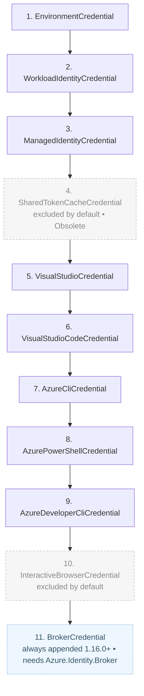

# Credentials in the Azure SDK (Azure.Identity)

> **Doc 1 — foundational reference.** This document describes *what credential types the Azure SDK
> for .NET exposes and what each one is for*. It is intentionally scoped to **credentials only** —
> no Proof-of-Possession (PoP), no mTLS, no token-binding story. Those build on top of this and are
> covered in later docs.

**Audience:** engineers who need a precise mental model of `Azure.Identity`'s credential surface.
**Source of truth:** `Azure/azure-sdk-for-net` @ `main`, `Azure.Identity 1.22.0-beta.1`
(implementations consolidated into `Azure.Core`). Verified against source 2026-07-09.

---

## 1. The model in one minute

- The Azure SDK authenticates every client (Storage, Key Vault, etc.) through a single abstraction:
  **`Azure.Core.TokenCredential`** — an abstract class with `GetToken` / `GetTokenAsync` that returns
  an `AccessToken`.
- **`Azure.Identity`** provides the concrete implementations of `TokenCredential` — the "credentials"
  in this doc. You pick one, hand it to a client constructor, and the client asks it for tokens.
- **Assembly note (current `main`):** `Azure.Identity` is now a thin facade. Its `src/` contains only
  `Azure.Identity.csproj` and `TypeForwarders.cs`; every public type is `[TypeForwardedTo]` the
  implementation now living in **`Azure.Core`** (`sdk/core/Azure.Core/src/Identity/...`). This move
  landed in **1.21.0** and is transparent to callers — you still reference and use `Azure.Identity`
  exactly as before.
- All credentials are **thread-safe**; one instance can be shared across many clients. Most support
  **in-memory token caching**.

```csharp
// The pattern is always the same: choose a credential, pass it to a client.
var credential = new DefaultAzureCredential();
var client = new SecretClient(new Uri("https://myvault.vault.azure.net"), credential);
```

### Relationship to MSAL (credential abstraction only)

MSAL (the underlying auth library) has **no public "credential" abstraction** — an app configures a
secret/certificate on the application object and MSAL uses it internally. The Azure SDK's
`TokenCredential` family **is** that public seam: it wraps MSAL (and the various dev-tool / IMDS
sources) and presents one uniform, swappable credential interface to every Azure client.

---

## 2. Catalog at a glance

Azure.Identity exposes **20 public credential types** (verified: exactly 20 `*Credential`
type-forwards in `TypeForwarders.cs`, from `AuthorizationCodeCredential` through
`WorkloadIdentityCredential`).

The `DefaultAzureCredential` chain is assembled from these 20, **plus a small number of non-public
chain legs that have no public credential class**:

- an internal **`BrokerCredential`** (Windows/macOS WAM broker, backed by the `Azure.Identity.Broker`
  package), and
- a config-only **`ManagedIdentityAsFederatedIdentityCredential`** source.

(Two further internal sources — an **`ApiKeyCredential`** and a **configuration-driven
`ChainedTokenCredential`** — exist for the `Microsoft.Extensions.Configuration` integration but are
not part of the default chain.) None of these are among the 20 public types.

The **"In `DefaultAzureCredential`?"** column below reflects the **full default chain** (see §4). It
does **not** reflect the `dev` / `prod` subsets selectable via `AZURE_TOKEN_CREDENTIALS` — e.g. with
`AZURE_TOKEN_CREDENTIALS=dev` the first leg is `VisualStudioCredential`, not `EnvironmentCredential`.

| Credential | Category | Identity | Material / how it proves identity | Interactive | Typical environment | In `DefaultAzureCredential`? |
|---|---|---|---|:--:|---|:--:|
| `DefaultAzureCredential` | Chain | — | Tries an ordered set of the below | No¹ | Everywhere | *(is the chain)* |
| `ChainedTokenCredential` | Chain | — | Your custom ordered set | No¹ | Everywhere | — |
| `ManagedIdentityCredential` | Azure-hosted | Managed identity | Platform-issued (IMDS / MSI endpoint) | No | Azure host (VM, App Service, AKS, …) | ✅ |
| `WorkloadIdentityCredential` | Azure-hosted | Workload (federated) | k8s service-account token → FIC exchange | No | AKS / Kubernetes | ✅ |
| `EnvironmentCredential` | Azure-hosted | SP or user | Read from environment variables | No | CI / containers / config-driven | ✅ |
| `ClientSecretCredential` | Service principal | App (SP) | Client secret | No | Server-to-server | — |
| `ClientCertificateCredential` | Service principal | App (SP) | Certificate (signed assertion; `SendX5C`) | No | Server-to-server | — |
| `ClientAssertionCredential` | Service principal | App (SP) | Caller-supplied signed JWT assertion | No | Federation / custom | — |
| `AzurePipelinesCredential` | Service principal | Workload (federated) | ADO service-connection federation | No | Azure DevOps Pipelines | — |
| `InteractiveBrowserCredential` | User | User | System browser (auth code + PKCE) | Yes | Desktop / local dev | ⚙️ opt-in |
| `DeviceCodeCredential` | User | User | Device-code flow | Yes | Headless / limited-UI devices | — |
| `AuthorizationCodeCredential` | User | User | Pre-obtained authorization code | No² | Web apps | — |
| `OnBehalfOfCredential` | User (delegated) | User via API | Incoming user token → downstream token | No | Middle-tier APIs | — |
| `AzureCliCredential` | Dev tool | User/SP | Reuses `az login` session | No | Local dev | ✅ |
| `AzureDeveloperCliCredential` | Dev tool | User/SP | Reuses `azd auth login` | No | Local dev | ✅ |
| `AzurePowerShellCredential` | Dev tool | User/SP | Reuses `Connect-AzAccount` | No | Local dev | ✅ |
| `VisualStudioCredential` | Dev tool | User | Reuses Visual Studio sign-in | No | Local dev (VS) | ✅ |
| `VisualStudioCodeCredential` | Dev tool | User | Reuses VS Code Azure sign-in | No | Local dev (VS Code) | ✅ |
| `SharedTokenCacheCredential` | Legacy (`[Obsolete]`) | User | Local shared token cache (SSO) | No | Windows SSO (legacy) | ⚙️ opt-in |
| `UsernamePasswordCredential` | Legacy | User | Raw username + password (ROPC) | No | **Avoid** | — |

¹ May become interactive only if the chain falls through to an interactive credential you enabled.
² Non-interactive itself; the authorization code is obtained by a separate interactive step beforehand.
⚙️ Present in the chain code but **excluded by default** (see §4).

> **Not shown (non-public chain legs):** `BrokerCredential` is **on by default** in the chain as of
> 1.16.0 (see §4), but it is internal and package-gated, so it is not a row above.
> `ManagedIdentityAsFederatedIdentityCredential`, `ApiKeyCredential`, and the config-driven
> `ChainedTokenCredential` are also non-public.

### Taxonomy

```mermaid
flowchart TD
    TC[TokenCredential<br/>Azure.Core]

    TC --> CH[Chains]
    TC --> HOST[Azure-hosted apps]
    TC --> SP[Service principals]
    TC --> USER[Users]
    TC --> DEV[Developer tools]

    CH --> DAC[DefaultAzureCredential]
    CH --> CTC[ChainedTokenCredential]

    HOST --> MI[ManagedIdentityCredential]
    HOST --> WI[WorkloadIdentityCredential]
    HOST --> ENV[EnvironmentCredential]

    SP --> CS[ClientSecretCredential]
    SP --> CC[ClientCertificateCredential]
    SP --> CA[ClientAssertionCredential]
    SP --> AP[AzurePipelinesCredential]

    USER --> IB[InteractiveBrowserCredential]
    USER --> DC[DeviceCodeCredential]
    USER --> AC[AuthorizationCodeCredential]
    USER --> OBO[OnBehalfOfCredential]
    USER --> UP["UsernamePasswordCredential ⚠ legacy"]

    DEV --> CLI[AzureCliCredential]
    DEV --> AZD[AzureDeveloperCliCredential]
    DEV --> PS[AzurePowerShellCredential]
    DEV --> VS[VisualStudioCredential]
    DEV --> VSC[VisualStudioCodeCredential]
    DEV --> STC["SharedTokenCacheCredential ⚠ [Obsolete]"]
```



---

## 3. Detailed reference

### 3.1 Credential chains (composites)

**`DefaultAzureCredential` (DAC)** — The recommended starting point. It combines credentials used in
Azure hosting environments with credentials used during local development and tries them in a fixed
order until one produces a token. The intent is that the **same code** authenticates correctly on a
developer's machine and in production without changes. Configure a user-assigned managed identity via
`ManagedIdentityClientId` / `ManagedIdentityResourceId`. Detailed behavior in §4.

**`ChainedTokenCredential`** — Compose your **own** ordered fallback list of credentials when you need
an order or set that `DefaultAzureCredential` doesn't provide (for example, "managed identity, then a
specific CLI, and nothing else"). You control exactly which credentials are attempted and in what order.

### 3.2 Authenticate Azure-hosted apps (production / workloads)

**`ManagedIdentityCredential`** — Authenticates the **managed identity** of an Azure resource, so no
secret ever lives in your code or config. Supports **system-assigned** (one per resource, lifecycle
tied to it) and **user-assigned** (standalone identity you can attach to many resources) identities.
Works across App Service/Functions, Azure Arc, Cloud Shell, AKS, Service Fabric, VMs, and VMSS. This
is the primary production credential for code running **in** Azure.

**`WorkloadIdentityCredential`** — Implements **Microsoft Entra Workload ID** federation on Kubernetes
(AKS). A projected Kubernetes service-account token is exchanged (via a federated identity credential)
for an Entra token — no stored secret. Also offers an opt-in *identity binding mode*
(`IsAzureProxyEnabled`, currently marked experimental) that routes the exchange through an AKS-provided
proxy to work around Entra's FIC-per-identity limits.

**`EnvironmentCredential`** — Reads a **service principal or user** from environment variables and
authenticates accordingly. Recognized variables include `AZURE_TENANT_ID`, `AZURE_CLIENT_ID`, plus one
of: `AZURE_CLIENT_SECRET` (secret), `AZURE_CLIENT_CERTIFICATE_PATH` (certificate), or username/password.
Intent: inject identity purely through configuration with no code change. It is also the first leg of
the **full** DAC chain.

### 3.3 Authenticate service principals (application identity)

**`ClientSecretCredential`** — Service principal authentication with a **client secret**. Simplest to
set up and the least secure (a shared string); rotate regularly and prefer certificates where possible.

**`ClientCertificateCredential`** — Service principal authentication with a **certificate**. MSAL signs
a client assertion with the certificate's private key; supports sending the public cert (`SendX5C`) for
subject-name/issuer (SN/I) scenarios. Stronger than a secret because the private key never leaves the
holder.

**`ClientAssertionCredential`** — Service principal authentication using a **caller-supplied signed JWT
assertion**. The escape hatch for advanced/federated scenarios: you provide a callback that returns the
assertion, so the token material can come from another identity provider, an HSM, or a workload
federation source.

**`AzurePipelinesCredential`** — Service principal authentication via **Workload Identity federation in
Azure DevOps Pipelines** (an ADO service connection). Lets pipelines authenticate to Azure without a
stored secret.

### 3.4 Authenticate users (interactive / delegated)

**`InteractiveBrowserCredential`** — Opens the **default system browser** for an interactive user sign-in
(authorization code + PKCE). For desktop apps and local development where a human is present. Excluded
from DAC by default (opt-in via the `includeInteractiveCredentials` constructor parameter, or by setting
`ExcludeInteractiveBrowserCredential = false`).

**`DeviceCodeCredential`** — Interactive sign-in for **devices with limited or no UI**: the user is
shown a code and a URL to complete authentication on another device. For CLIs, IoT, and SSH sessions.

**`AuthorizationCodeCredential`** — Completes authentication using an **authorization code your app has
already obtained** through a browser redirect. Typical in web apps that implement the redirect leg
themselves and then hand the code to MSAL for token exchange.

**`OnBehalfOfCredential`** — Implements the **On-Behalf-Of (OBO)** flow. A middle-tier API receives a
user's access token and exchanges it to call downstream APIs **as that user**, propagating the delegated
identity and permissions through the call chain.

### 3.5 Authenticate via developer tools (local development)

These reuse the identity you're already signed in with locally; they carry no secret and are meant for
**development machines only** (they are the local-dev legs of DAC).

- **`AzureCliCredential`** — reuses your **`az login`** session.
- **`AzureDeveloperCliCredential`** — reuses **`azd auth login`** (Azure Developer CLI).
- **`AzurePowerShellCredential`** — reuses **`Connect-AzAccount`** (Az PowerShell).
- **`VisualStudioCredential`** — reuses the account signed into **Visual Studio**.
- **`VisualStudioCodeCredential`** — reuses the account from the **VS Code** Azure sign-in.

### 3.6 Legacy / discouraged

- **`SharedTokenCacheCredential`** — Reads tokens from a local **shared token cache** (older Windows/VS
  SSO mechanism). Now formally **`[Obsolete]`** (deprecated as of 1.15.0) and superseded by
  `VisualStudioCredential` and broker-based sign-in. Excluded from DAC by default.
- **`UsernamePasswordCredential`** — Resource Owner Password Credentials (raw username + password).
  **Deprecated / avoid** — incompatible with MFA and Conditional Access, and requires handling user
  passwords directly.

---

## 4. `DefaultAzureCredential` in depth

The default (no-selection) chain is built by `DefaultAzureCredentialFactory.CreateFullDefaultCredentialChain`
in this **source order**:



**On by default:** Environment → Workload Identity → Managed Identity → Visual Studio →
Visual Studio Code → Azure CLI → Azure PowerShell → Azure Developer CLI → **Broker**.

`ExcludeBrokerCredential` has no default value, so it defaults to `false` — i.e. `BrokerCredential` is
**always appended** to the chain (verified in `CreateFullDefaultCredentialChain`; see the 1.16.0
changelog: *"The `BrokerCredential` is now always included in the `DefaultAzureCredential` chain."*).
Within the chain it only **produces a token** if the app references the **`Azure.Identity.Broker`**
package; the factory resolves the broker options via reflection (`TryCreateDevelopmentBrokerOptions`),
and if the package is absent that leg reports itself unavailable and the chain moves on. `BrokerCredential`
is internal and is **not** one of the 20 public credential types.

**Off by default (opt-in):**
- `SharedTokenCacheCredential` — `ExcludeSharedTokenCacheCredential` defaults to `true`. The credential
  is also `[Obsolete]` as of 1.15.0.
- `InteractiveBrowserCredential` — `ExcludeInteractiveBrowserCredential` defaults to `true` (DAC stays
  non-interactive unless you opt in via the `includeInteractiveCredentials` constructor parameter or by
  setting the exclude property to `false`).

**Selecting a subset.** You don't have to accept the full chain:
- Config / env var **`AZURE_TOKEN_CREDENTIALS`** (or `DefaultAzureCredentialOptions.CredentialSource`)
  can narrow DAC to a **group** (`dev` or `prod`) or to a **single named credential**; configuration
  takes precedence over the environment variable (`CredentialSource` is evaluated before
  `AZURE_TOKEN_CREDENTIALS`).
  - The **`dev`** group (`CreateDevelopmentCredentialChain`) is:
    Visual Studio → Visual Studio Code → Azure CLI → Azure PowerShell → Azure Developer CLI → Broker (1.16.0+).
  - The **`prod`** group (`CreateProductionCredentialChain`) is:
    Environment → Workload Identity → Managed Identity.
  - A single named credential is built by `CreateSpecificCredentialChain`.
  - **Caveat:** a few sources **cannot** be selected through the environment variable and will **throw**
    (`InvalidOperationException`) if you try — notably **`AzurePipelinesCredential`** and
    **`ManagedIdentityAsFederatedIdentityCredential`**, because they require properties (client ID,
    service-connection ID, system access token, etc.) that can only be supplied via `IConfiguration` /
    `DefaultAzureCredentialOptions`.
- Per-credential `Exclude*` options on `DefaultAzureCredentialOptions` toggle individual legs.

**Continuation vs. failure policy.** DAC's chain logic is deliberately simple
(`DefaultAzureCredential.GetTokenFromSourcesAsync`): it walks the sources in order and **skips** any
credential that throws `CredentialUnavailableException` (collecting those into an aggregate exception);
it **stops immediately and rethrows** if a credential throws **any other** exception (e.g.
`AuthenticationFailedException`). Whether a given credential "skips" or "stops" is therefore governed by
its `IsChainedCredential` flag: when a credential is part of a chain, the factory sets this flag so the
credential surfaces expected/unavailable conditions as `CredentialUnavailableException` (skip) rather
than `AuthenticationFailedException` (stop).

In practice this means **developer-tool credentials fall through on any failure** (that "fall through on
any failure" behavior for dev credentials shipped in **1.10.0-beta.1 (2023-07-17)** / GA **1.10.0**, with
follow-up fixes through **1.13.2** and **1.14.x** — *not* a "1.10.1+" policy), while a **deployed-service**
credential such as Managed Identity that reaches the service and gets a genuine authentication error will
**halt** the chain. Net effect: *"try everything locally, but fail fast and predictably in production."*

---

## 5. Choosing a credential (quick guidance)

| Situation | Use |
|---|---|
| I just want it to work locally *and* in Azure | `DefaultAzureCredential` |
| Code runs inside an Azure resource | `ManagedIdentityCredential` (or DAC) |
| Running on AKS with federation | `WorkloadIdentityCredential` |
| Azure DevOps pipeline, no secrets | `AzurePipelinesCredential` |
| App identity with a cert / secret | `ClientCertificateCredential` / `ClientSecretCredential` |
| App identity, custom/federated token source | `ClientAssertionCredential` |
| I need a specific, explicit fallback order | `ChainedTokenCredential` |
| Interactive user on a desktop | `InteractiveBrowserCredential` |
| Interactive user on a headless device | `DeviceCodeCredential` |
| Middle-tier API calling downstream as the user | `OnBehalfOfCredential` |
| Purely local dev off my signed-in tools | `AzureCliCredential` / `AzurePowerShellCredential` / `AzureDeveloperCliCredential` / VS / VS Code |

**Rule of thumb:** prefer **managed / federated** identities (no secrets) for anything hosted; use
**dev-tool** credentials for local development; reserve **secret/cert** service-principal credentials
for cases where a managed identity isn't available.

---

## 6. Source references

All paths in `Azure/azure-sdk-for-net` @ `main` (verified 2026-07-09):

- Public surface / enumeration (20 credential type-forwards): `sdk/identity/Azure.Identity/src/TypeForwarders.cs`
- Consolidated implementations: `sdk/core/Azure.Core/src/Identity/Credentials/*.cs`
- DAC chain order, dev/prod groups, always-appended Broker leg, and env-var selection/throws:
  `sdk/core/Azure.Core/src/Identity/DefaultAzureCredentialFactory.cs`
  (`CreateFullDefaultCredentialChain`, `CreateProductionCredentialChain`,
  `CreateDevelopmentCredentialChain`, `CreateSpecificCredentialChain`)
- Chain walk / continuation-vs-failure logic:
  `sdk/core/Azure.Core/src/Identity/Credentials/DefaultAzureCredential.cs` (`GetTokenFromSourcesAsync`)
- DAC option defaults (`ExcludeSharedTokenCacheCredential = true`,
  `ExcludeInteractiveBrowserCredential = true`, `ExcludeBrokerCredential` → `false`):
  `sdk/core/Azure.Core/src/Identity/Credentials/DefaultAzureCredentialOptions.cs`
- Config-driven `ChainedTokenCredential` source construction:
  `sdk/core/Azure.Core/src/Identity/ChainedTokenCredentialFactory.cs`
- Credential-source name/enum mapping (incl. `dev`, `prod`, `apikeycredential`, `chainedtokencredential`,
  `managedidentityasfederatedidentitycredential`): `sdk/core/Azure.Core/src/Identity/Constants.cs`
- Overview & credential tables: `sdk/identity/Azure.Identity/README.md`
- Assembly consolidation notes: `sdk/identity/Azure.Identity/MigrationGuide.md`
