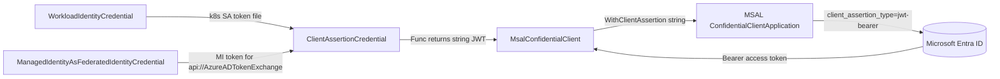

# FIC credentials in Azure.Identity — how they work today

> **Doc 2 — understanding the credentials.** This document explains how the three
> **Federated Identity Credential (FIC)** capable credentials in `Azure.Identity` actually work today:
> `ClientAssertionCredential`, `WorkloadIdentityCredential`, and the internal
> `ManagedIdentityAsFederatedIdentityCredential`. It is deliberately descriptive — *what exists now*.
> The mTLS Proof-of-Possession (PoP) gap and how to close it are covered in **Doc 3**.

**Audience:** engineers who need to understand exactly how Azure.Identity's FIC credentials obtain
tokens, what they hand to MSAL, and what shape of token comes back.
**Source of truth:** `Azure/azure-sdk-for-net` @ `main` (credentials consolidated into `Azure.Core`,
`sdk/core/Azure.Core/src/Identity/...`). Verified against source 2026-07-09.

---

## 1. What "FIC" means here

A **Federated Identity Credential (FIC)** lets an application authenticate to Microsoft Entra ID
**without a stored secret or certificate of its own** by presenting a **signed JWT assertion** issued
by a trusted identity provider. Entra validates the assertion against a configured federated-credential
trust and issues an app token.

In `Azure.Identity`, every FIC flow is ultimately expressed as a **client assertion**: the credential
supplies a JWT string as the `client_assertion`, MSAL posts it to the token endpoint with
`client_assertion_type = urn:ietf:params:oauth:client-assertion-type:jwt-bearer`, and Entra returns a
**Bearer** access token. The three credentials below differ only in **where the assertion JWT comes
from**:

| Credential | Where the assertion JWT comes from |
|---|---|
| `ClientAssertionCredential` | A caller-supplied callback returns the JWT (any source: HSM, another IdP, custom signer). |
| `WorkloadIdentityCredential` | The projected Kubernetes service-account token file (`AZURE_FEDERATED_TOKEN_FILE`). |
| `ManagedIdentityAsFederatedIdentityCredential` | A managed-identity token for the token-exchange audience (`api://AzureADTokenExchange`). |

**They all converge on the same primitive:** `ClientAssertionCredential` → `MsalConfidentialClient`
→ MSAL `WithClientAssertion(<string>)` → `AcquireTokenForClient` → **Bearer** token. Keep this
convergence in mind — it is the reason the mTLS-PoP gap (Doc 3) applies uniformly to all three.



---

## 2. `ClientAssertionCredential` — the base FIC primitive

The most general FIC credential. You give it a **callback that returns a signed JWT string**, and it
authenticates a service principal with that assertion.

**Public constructors** (`sdk/core/Azure.Core/src/Identity/Credentials/ClientAssertionCredential.cs`):

```csharp
// Synchronous callback
public ClientAssertionCredential(
    string tenantId, string clientId,
    Func<string> assertionCallback,
    ClientAssertionCredentialOptions options = default)

// Asynchronous callback (cancellation-aware)
public ClientAssertionCredential(
    string tenantId, string clientId,
    Func<CancellationToken, Task<string>> assertionCallback,
    ClientAssertionCredentialOptions options = default)
```

**Key characteristic:** the callback return type is **`string`** (or `Task<string>`). The assertion is
an opaque JWT — there is **no** parameter for a binding certificate, PoP, or any token-shape control.

**`GetToken` path** — it resolves the effective tenant, then calls the MSAL wrapper:

```csharp
AuthenticationResult result = Client.AcquireTokenForClientAsync(
    requestContext.Scopes, tenantId, requestContext.Claims,
    requestContext.IsCaeEnabled, /* ... */, cancellationToken).EnsureCompleted();
return scope.Succeeded(result.ToAccessToken());
```

Note it forwards `Scopes`, `Claims`, and `IsCaeEnabled` — but **not** any PoP intent. The result is
always a **Bearer** `AccessToken`.

**Options** (`ClientAssertionCredentialOptions`): standard knobs such as
`AdditionallyAllowedTenants`, `MsalClient`, `Pipeline`, `Transport`. Nothing PoP/mTLS related.

---

## 3. `WorkloadIdentityCredential` — FIC from a Kubernetes token file

Implements **Microsoft Entra Workload ID** on AKS/Kubernetes. It is a thin wrapper that turns a
projected service-account token into a client assertion.

**How it works** (`sdk/core/Azure.Core/src/Identity/Credentials/WorkloadIdentityCredential.cs`):

1. Requires `TenantId`, `ClientId`, and `TokenFilePath` (env fallbacks: `AZURE_TENANT_ID`,
   `AZURE_CLIENT_ID`, `AZURE_FEDERATED_TOKEN_FILE`).
2. Wraps the token file in a `FileContentsCache`.
3. Constructs a **`ClientAssertionCredential`** whose callback is the file-reading delegate:

```csharp
_tokenFileCache = new FileContentsCache(options.TokenFilePath);
// ...
_clientAssertionCredential = new ClientAssertionCredential(
    options.TenantId, options.ClientId,
    _tokenFileCache.GetTokenFileContentsAsync,   // returns the projected k8s SA token (a string JWT)
    clientAssertionCredentialOptions);
```

So the assertion JWT **is** the Kubernetes service-account token; `GetToken` just delegates to the
inner `ClientAssertionCredential`. Same Bearer result.

**Extra:** an opt-in experimental *identity-binding proxy mode* (`IsAzureProxyEnabled`) routes the
exchange through an AKS-provided proxy (`KubernetesProxyConfig` / `KubernetesProxyHttpHandler`) to work
around Entra's FIC-per-identity limits. This changes the **transport**, not the token shape — still a
Bearer assertion flow.

---

## 4. `ManagedIdentityAsFederatedIdentityCredential` — MSI-as-FIC

An **internal** credential (not one of the 20 public types; selectable only through
`DefaultAzureCredentialOptions` / config — see Doc 1 §4). It uses a **managed-identity token as the
federated assertion** ("MSI-as-FIC"): the MI proves the workload's identity, and that MI token is
exchanged for an app token.

**How it works** (`sdk/core/Azure.Core/src/Identity/DefaultAzureCredentialFactory.cs`,
`CreateManagedIdentityAsFederatedIdentityCredential`):

1. Builds a `ManagedIdentityCredential` (system- or user-assigned per `ManagedIdentityId*` options).
2. Picks the **token-exchange audience** for the cloud:
   `api://AzureADTokenExchange/.default` (public), `…USGov`, `…China`.
3. Returns a **`ClientAssertionCredential`** whose callback acquires the MI token for that audience and
   returns its raw string as the assertion:

```csharp
return new ClientAssertionCredential(
    Options.TenantId,
    Options.ClientId,
    async () => (await managedIdentityCredential.GetTokenAsync(tokenContext).ConfigureAwait(false)).Token,
    assertionOptions);
```

Again: MI token → **string** assertion → `ClientAssertionCredential` → Bearer app token.

> **Selection caveat (from Doc 1 §4):** this source **throws** if selected via the
> `AZURE_TOKEN_CREDENTIALS` environment variable — it requires properties (`ClientId`, `AzureCloud`,
> `ManagedIdentityIdKind`, `ManagedIdentityId`) that can only be supplied via `IConfiguration` /
> `DefaultAzureCredentialOptions`.

---

## 5. The MSAL wrapper — `MsalConfidentialClient`

All three credentials share one wrapper (`sdk/core/Azure.Core/src/Identity/MsalConfidentialClient.cs`).
It stores the assertion callback and wires it onto the MSAL builder:

```csharp
private readonly Func<string> _clientAssertionCallback;                       // sync string
private readonly Func<CancellationToken, Task<string>> _clientAssertionCallbackAsync; // async string
// ...
if (_clientAssertionCallback != null)
    confClientBuilder.WithClientAssertion(_clientAssertionCallback);
if (_clientAssertionCallbackAsync != null)
    confClientBuilder.WithClientAssertion(_clientAssertionCallbackAsync);
```

**This is the whole story of the gap in one place:** for the **assertion** flow, the wrapper only knows
the **string** overloads of MSAL's `WithClientAssertion`. It never touches MSAL's cert-bound
`ClientSignedAssertion` overload and never calls `WithMtlsProofOfPossession()`. (Verified: **zero**
occurrences of `mtls`, `ProofOfPossession`, `BindingCertificate`, `ClientSignedAssertion`, or
`TokenBindingCertificate` in `ClientAssertionCredential.cs`, `WorkloadIdentityCredential.cs`, or
`MsalConfidentialClient.cs`.)

> **Don't over-read this as "the wrapper has no certificate support."** `MsalConfidentialClient` *does*
> have a separate **certificate branch** — a `_certificateProvider` that calls MSAL's `WithCertificate`
> — used by the cert-based credentials (`ClientCertificateCredential`, `EnvironmentCredential`). That
> branch is unrelated to the assertion flow and, like the assertion branch, **does not request mTLS
> PoP**. So the "string-only" observation is scoped precisely to the **assertion** path; the wrapper
> handles certificates elsewhere, just not as a binding certificate for a PoP token. (This is why the
> file legitimately imports `X509Certificates` and references `WithCertificate` even though none of the
> mTLS/PoP terms above appear.)

---

## 6. The token abstraction (`Azure.Core`)

Understanding the gap requires knowing what the abstraction can already carry.

**`AccessToken`** (`sdk/core/Azure.Core/src/AccessToken.cs`) — **already** has binding support:

```csharp
public string TokenType { get; }                    // defaults to "Bearer"
public X509Certificate2? BindingCertificate { get; } // the binding certificate for the access token
// constructor overload:
public AccessToken(string accessToken, DateTimeOffset expiresOn, DateTimeOffset? refreshOn,
                   string tokenType, X509Certificate2 bindingCertificate)
```

So the **return path** for an mTLS-bound token exists: a credential *can* hand back a `TokenType`
(e.g. `mtls_pop`) and a `BindingCertificate` for the resource client's transport to use.

**`TokenRequestContext`** (`sdk/core/Azure.Core/src/TokenRequestContext.cs`) — its PoP surface is
**request-signature (SHR) PoP**, not mTLS:

```csharp
public bool IsProofOfPossessionEnabled { get; }
public string? ProofOfPossessionNonce { get; }
public Uri? ResourceRequestUri { get; }
public string? ResourceRequestMethod { get; }
```

There is **no** dedicated "request an mTLS-PoP token" flag and **no** way to pass a client binding
certificate *into* a request.

---

## 7. Important contrast — the *direct* `ManagedIdentityCredential` already does mTLS PoP

The FIC credentials above are **confidential-client** flows and produce Bearer tokens only. But the
**direct** `ManagedIdentityCredential` (IMDSv2) is a different path and **does** support mTLS PoP today
(`sdk/core/Azure.Core/src/Identity/MsalManagedIdentityClient.cs`):

```csharp
private bool ShouldAttemptMtlsPop(TokenRequestContext requestContext, bool isTokenBindingAvailable) =>
    !_disableMtlsProofOfPossession &&
    requestContext.IsProofOfPossessionEnabled &&
    isTokenBindingAvailable;
// ...
if (ShouldAttemptMtlsPop(requestContext, isTokenBindingAvailable))
{
    builder.WithMtlsProofOfPossession();              // MSAL MI mTLS PoP
    builder = withAttestationSupport(builder);        // optional KeyGuard attestation
}
```

Notes:
- mTLS-PoP intent is signaled by **reusing** `TokenRequestContext.IsProofOfPossessionEnabled`, and can
  be turned off via `DisableMtlsProofOfPossession`.
- When binding is active, **MSAL manages its own HTTP client** to perform the mTLS handshake with the
  platform's bound certificate; the Azure.Core pipeline transport does not carry those mTLS credentials.
- Host capability is surfaced one layer up: `ManagedIdentityClient` reads
  `ManagedIdentityCapabilities.IsMtlsPopSupportedByHost` and threads it into
  `MsalManagedIdentityClient.ShouldAttemptMtlsPop` as the `isTokenBindingAvailable` argument (the
  `MsalManagedIdentityClient` snippet above resolves that capability through its caller, not inline).

**Takeaway:** Azure.Identity is not "mTLS-unaware" — the *managed-identity* path already wires MSAL's
mTLS PoP. The missing piece is the **confidential-client / client-assertion (FIC) path**. That path is
the whole subject of Doc 3.

---

## 8. Summary

| Credential | Assertion source | Sent to MSAL as | Token shape today |
|---|---|---|---|
| `ClientAssertionCredential` | caller callback (`Func<string>`) | `WithClientAssertion(string)` | **Bearer** |
| `WorkloadIdentityCredential` | k8s SA token file | inner `ClientAssertionCredential` → `WithClientAssertion(string)` | **Bearer** |
| `ManagedIdentityAsFederatedIdentityCredential` | MI token for `api://AzureADTokenExchange` | inner `ClientAssertionCredential` → `WithClientAssertion(string)` | **Bearer** |
| *(contrast)* `ManagedIdentityCredential` (direct, IMDSv2) | platform | `WithMtlsProofOfPossession()` on MI builder | **Bearer or `mtls_pop`** |

All three FIC credentials produce Bearer tokens via a **plain-string** assertion and share one wrapper
that only knows MSAL's string `WithClientAssertion` overloads. That is the surface Doc 3 proposes to
extend.

---

## 9. Source references

All paths in `Azure/azure-sdk-for-net` @ `main` (verified 2026-07-09):

- `sdk/core/Azure.Core/src/Identity/Credentials/ClientAssertionCredential.cs` — base FIC primitive; string callbacks; `GetToken`.
- `sdk/core/Azure.Core/src/Identity/Credentials/WorkloadIdentityCredential.cs` — k8s token-file → `ClientAssertionCredential`; `IsAzureProxyEnabled`.
- `sdk/core/Azure.Core/src/Identity/DefaultAzureCredentialFactory.cs` — `CreateManagedIdentityAsFederatedIdentityCredential`; token-exchange audiences.
- `sdk/core/Azure.Core/src/Identity/MsalConfidentialClient.cs` — `WithClientAssertion(string / Func<CT,Task<string>>)` wiring.
- `sdk/core/Azure.Core/src/AccessToken.cs` — `TokenType`, `BindingCertificate` (return-path binding support already present).
- `sdk/core/Azure.Core/src/TokenRequestContext.cs` — SHR-PoP fields (`IsProofOfPossessionEnabled`, `ProofOfPossessionNonce`, `ResourceRequestUri/Method`).
- `sdk/core/Azure.Core/src/Identity/MsalManagedIdentityClient.cs` — the *existing* MI mTLS-PoP plumbing (`ShouldAttemptMtlsPop`, `GetManagedIdentityCapabilitiesAsync`; contrast / template for Doc 3).
- `sdk/core/Azure.Core/src/Identity/ManagedIdentityClient.cs` — host-capability check (`ManagedIdentityCapabilities.IsMtlsPopSupportedByHost`) consumed by `MsalManagedIdentityClient`.
