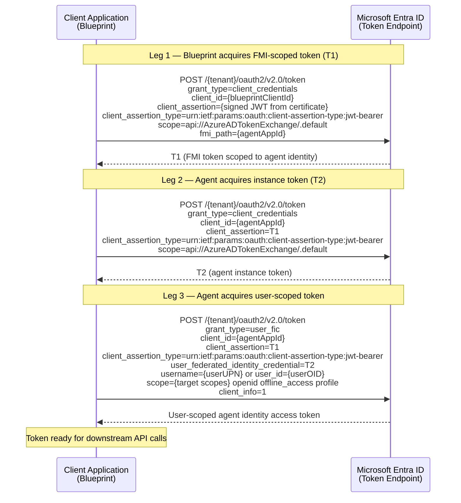

# Agent Identity Token Acquisition — Raw HTTP Examples (.NET)

This document shows how to acquire agent identity tokens using direct HTTP calls in .NET, without relying on MSAL's agent identity APIs. Useful for getting started while native SDK support is being improved.

All three legs POST to the same token endpoint:

```
POST https://login.microsoftonline.com/{tenantId}/oauth2/v2.0/token
Content-Type: application/x-www-form-urlencoded
```

---

## Table of Contents

1. [Prerequisites](#prerequisites)
2. [The Three-Leg Flow](#the-three-leg-flow)
3. [Sequence Diagram](#sequence-diagram)
4. [Complete Example](#complete-example)
5. [BuildClientAssertion Helper](#buildclientassertion-helper)
6. [Identifying Users by OID Instead of UPN](#identifying-users-by-oid-instead-of-upn)
7. [Caching Considerations](#caching-considerations)

---

## Prerequisites

You need the following values from your Entra ID configuration:

| Value | Description | Example |
|-------|-------------|---------|
| `tenantId` | Your Azure AD tenant ID | `contoso.onmicrosoft.com` or a GUID |
| `blueprintClientId` | The blueprint app registration's client ID | `00000000-1111-2222-3333-444444444444` |
| `certificate` | An X.509 certificate registered on the blueprint app | Loaded from key vault, cert store, or file |
| `agentAppId` | The agent's own app registration client ID | `aaaaaaaa-bbbb-cccc-dddd-eeeeeeeeeeee` |
| `userUpn` | The target user's UPN (or OID — see [alternatives](#identifying-users-by-oid-instead-of-upn)) | `user@contoso.com` |
| `targetScopes` | The scopes for the downstream API | `https://graph.microsoft.com/.default` |

> **Note:** These examples use certificate credentials (a signed JWT `client_assertion`) for the blueprint in Leg 1. This is the recommended approach. If your blueprint uses a client secret instead, you can replace the `client_assertion` / `client_assertion_type` parameters with a single `client_secret` parameter — see [Microsoft's documentation on client secrets](https://learn.microsoft.com/en-us/entra/identity-platform/v2-oauth2-client-creds-grant-flow#first-case-access-token-request-with-a-shared-secret).

---

## The Three-Leg Flow

```
Leg 1: Blueprint → Entra ID
  grant_type            = client_credentials
  client_id             = {blueprintClientId}
  client_assertion      = {signed JWT from certificate}
  client_assertion_type = urn:ietf:params:oauth:client-assertion-type:jwt-bearer
  scope                 = api://AzureADTokenExchange/.default
  fmi_path              = {agentAppId}
  → Returns T1 (FMI-scoped token)

Leg 2: Agent → Entra ID
  grant_type            = client_credentials
  client_id             = {agentAppId}
  client_assertion      = T1
  client_assertion_type = urn:ietf:params:oauth:client-assertion-type:jwt-bearer
  scope                 = api://AzureADTokenExchange/.default
  → Returns T2 (agent instance token)

Leg 3: Agent → Entra ID
  grant_type                         = user_fic
  client_id                          = {agentAppId}
  client_assertion                   = T1
  client_assertion_type              = urn:ietf:params:oauth:client-assertion-type:jwt-bearer
  user_federated_identity_credential = T2
  username                           = {userUPN}
  scope                              = {targetScopes} openid offline_access profile
  client_info                        = 1
  → Returns user-scoped agent identity access token
```

---

## Sequence Diagram



---

## Complete Example

```csharp
using System.Security.Cryptography;
using System.Security.Cryptography.X509Certificates;
using System.Text;
using System.Text.Json;

// --- Configuration ---
string tenantId          = "YOUR_TENANT_ID";
string blueprintClientId = "YOUR_BLUEPRINT_CLIENT_ID";
string agentAppId        = "YOUR_AGENT_APP_ID";
string userUpn           = "user@contoso.com";
string targetScopes      = "https://graph.microsoft.com/.default";

string tokenEndpoint = $"https://login.microsoftonline.com/{tenantId}/oauth2/v2.0/token";

// Load your certificate (from cert store, Key Vault, PFX file, etc.)
X509Certificate2 certificate = /* your certificate loading logic */;

using var httpClient = new HttpClient();

// =============================================
// Leg 1 — Blueprint acquires FMI-scoped token
// =============================================
string blueprintAssertion = BuildClientAssertion(blueprintClientId, tokenEndpoint, certificate);

var leg1Body = new Dictionary<string, string>
{
    ["grant_type"]            = "client_credentials",
    ["client_id"]             = blueprintClientId,
    ["client_assertion"]      = blueprintAssertion,
    ["client_assertion_type"] = "urn:ietf:params:oauth:client-assertion-type:jwt-bearer",
    ["scope"]                 = "api://AzureADTokenExchange/.default",
    ["fmi_path"]              = agentAppId
};

var leg1Response = await httpClient.PostAsync(tokenEndpoint, new FormUrlEncodedContent(leg1Body));
leg1Response.EnsureSuccessStatusCode();

var leg1Json = JsonDocument.Parse(await leg1Response.Content.ReadAsStringAsync());
string t1 = leg1Json.RootElement.GetProperty("access_token").GetString()!;

Console.WriteLine("Leg 1 complete — got FMI token (T1)");

// =============================================
// Leg 2 — Agent acquires instance token
// =============================================
var leg2Body = new Dictionary<string, string>
{
    ["grant_type"]            = "client_credentials",
    ["client_id"]             = agentAppId,
    ["client_assertion"]      = t1,
    ["client_assertion_type"] = "urn:ietf:params:oauth:client-assertion-type:jwt-bearer",
    ["scope"]                 = "api://AzureADTokenExchange/.default"
};

var leg2Response = await httpClient.PostAsync(tokenEndpoint, new FormUrlEncodedContent(leg2Body));
leg2Response.EnsureSuccessStatusCode();

var leg2Json = JsonDocument.Parse(await leg2Response.Content.ReadAsStringAsync());
string t2 = leg2Json.RootElement.GetProperty("access_token").GetString()!;

Console.WriteLine("Leg 2 complete — got instance token (T2)");

// =============================================
// Leg 3 — Agent acquires user-scoped token
// =============================================
var leg3Body = new Dictionary<string, string>
{
    ["grant_type"]                         = "user_fic",
    ["client_id"]                          = agentAppId,
    ["client_assertion"]                   = t1,
    ["client_assertion_type"]              = "urn:ietf:params:oauth:client-assertion-type:jwt-bearer",
    ["user_federated_identity_credential"] = t2,
    ["username"]                           = userUpn,
    ["scope"]                              = $"{targetScopes} openid offline_access profile",
    ["client_info"]                        = "1"
};

var leg3Response = await httpClient.PostAsync(tokenEndpoint, new FormUrlEncodedContent(leg3Body));
leg3Response.EnsureSuccessStatusCode();

var leg3Json = JsonDocument.Parse(await leg3Response.Content.ReadAsStringAsync());
string accessToken = leg3Json.RootElement.GetProperty("access_token").GetString()!;

Console.WriteLine("Leg 3 complete — got user-scoped agent identity token");

// =============================================
// Use the token to call a downstream API
// =============================================
using var graphRequest = new HttpRequestMessage(HttpMethod.Get, "https://graph.microsoft.com/v1.0/me");
graphRequest.Headers.Authorization =
    new System.Net.Http.Headers.AuthenticationHeaderValue("Bearer", accessToken);

var graphResponse = await httpClient.SendAsync(graphRequest);
Console.WriteLine($"Graph response: {graphResponse.StatusCode}");
```

---

## `BuildClientAssertion` Helper

The `BuildClientAssertion` method creates a signed JWT for the `client_assertion` parameter. The JWT must have:

- **Header**: `alg` = RS256, `x5t#S256` = Base64URL-encoded SHA-256 thumbprint of the certificate, `x5c` = certificate chain (for SN+I)
- **Payload**: `aud` = token endpoint URL, `iss` = `sub` = client ID, `jti` = random GUID, `nbf` = now, `exp` = now + 600s
- **Signature**: RS256 (RSASSA-PKCS1-v1_5 with SHA-256) using the certificate's private key

See [Microsoft's certificate credentials documentation](https://learn.microsoft.com/en-us/entra/identity-platform/certificate-credentials) for the full specification.

---

## Identifying Users by OID Instead of UPN

Replace the `username` parameter in Leg 3 with `user_id`:

```csharp
// Instead of:
["username"] = userUpn,

// Use:
["user_id"] = userObjectId,
```

---

## Caching Considerations

If you are making these calls directly (without MSAL), you should cache tokens yourself to avoid unnecessary network calls:

| Token | Cache Key | Reusable Across |
|-------|-----------|-----------------|
| T1 (FMI token) | `blueprintClientId` + `agentAppId` + `tenantId` | All users of the same agent |
| T2 (Instance token) | `agentAppId` + `tenantId` | All users of the same agent |
| Final token | `agentAppId` + `userUpn` (or OID) + `scopes` | Only the same user + scopes |

- **T1 and T2 are user-independent** — acquire them once per agent and reuse across all user requests until they expire.
- Check the `expires_in` field in each token response (seconds until expiry). Refresh proactively before expiration.
- The final user-scoped token varies per user and per set of requested scopes.
