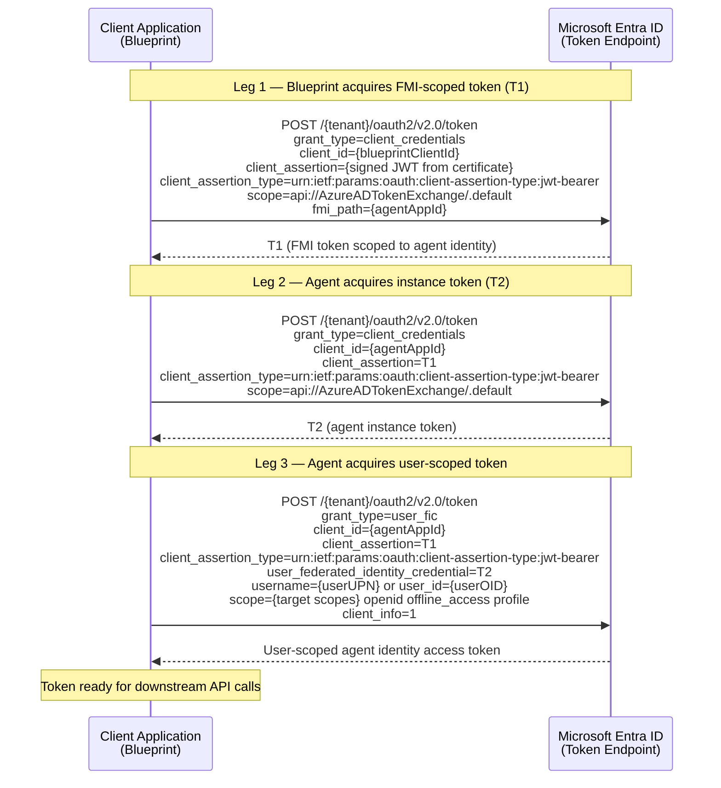

# Agent Identity Token Acquisition — Raw HTTP Examples (Java)

This document shows how to acquire agent identity tokens using direct HTTP calls in Java, without relying on MSAL's agent identity APIs. Useful for getting started while native SDK support is being improved.

All three legs POST to the same token endpoint:

```
POST https://login.microsoftonline.com/{tenantId}/oauth2/v2.0/token
Content-Type: application/x-www-form-urlencoded
```

---

## Table of Contents

1. [Prerequisites](#prerequisites)
2. [The Three-Leg Flow](#the-three-leg-flow)
3. [Sequence Diagram](#sequence-diagram)
4. [Complete Example](#complete-example)
5. [Building the Client Assertion](#building-the-client-assertion)
6. [Identifying Users by OID Instead of UPN](#identifying-users-by-oid-instead-of-upn)
7. [Caching Considerations](#caching-considerations)

---

## Prerequisites

You need the following values from your Entra ID configuration:

| Value | Description | Example |
|-------|-------------|---------|
| `tenantId` | Your Azure AD tenant ID | `contoso.onmicrosoft.com` or a GUID |
| `blueprintClientId` | The blueprint app registration's client ID | `00000000-1111-2222-3333-444444444444` |
| `certificate` | An X.509 certificate registered on the blueprint app | Loaded from key store, Key Vault, or file |
| `agentAppId` | The agent's own app registration client ID | `aaaaaaaa-bbbb-cccc-dddd-eeeeeeeeeeee` |
| `userUpn` | The target user's UPN (or OID — see [alternatives](#identifying-users-by-oid-instead-of-upn)) | `user@contoso.com` |
| `targetScopes` | The scopes for the downstream API | `https://graph.microsoft.com/.default` |

> **Note:** These examples use certificate credentials (a signed JWT `client_assertion`) for the blueprint in Leg 1. This is the recommended approach. If your blueprint uses a client secret instead, you can replace the `client_assertion` / `client_assertion_type` parameters with a single `client_secret` parameter — see [Microsoft's documentation on client secrets](https://learn.microsoft.com/en-us/entra/identity-platform/v2-oauth2-client-creds-grant-flow#first-case-access-token-request-with-a-shared-secret).

> **Compatibility:** This example uses `HttpURLConnection` and is compatible with Java 8+.

---

## The Three-Leg Flow

```
Leg 1: Blueprint → Entra ID
  grant_type            = client_credentials
  client_id             = {blueprintClientId}
  client_assertion      = {signed JWT from certificate}
  client_assertion_type = urn:ietf:params:oauth:client-assertion-type:jwt-bearer
  scope                 = api://AzureADTokenExchange/.default
  fmi_path              = {agentAppId}
  → Returns T1 (FMI-scoped token)

Leg 2: Agent → Entra ID
  grant_type            = client_credentials
  client_id             = {agentAppId}
  client_assertion      = T1
  client_assertion_type = urn:ietf:params:oauth:client-assertion-type:jwt-bearer
  scope                 = api://AzureADTokenExchange/.default
  → Returns T2 (agent instance token)

Leg 3: Agent → Entra ID
  grant_type                         = user_fic
  client_id                          = {agentAppId}
  client_assertion                   = T1
  client_assertion_type              = urn:ietf:params:oauth:client-assertion-type:jwt-bearer
  user_federated_identity_credential = T2
  username                           = {userUPN}
  scope                              = {targetScopes} openid offline_access profile
  client_info                        = 1
  → Returns user-scoped agent identity access token
```

---

## Sequence Diagram



---

## Complete Example

```java
import com.fasterxml.jackson.databind.JsonNode;
import com.fasterxml.jackson.databind.ObjectMapper;

import java.io.*;
import java.net.HttpURLConnection;
import java.net.URL;
import java.net.URLEncoder;
import java.nio.charset.StandardCharsets;
import java.security.PrivateKey;
import java.security.cert.X509Certificate;
import java.util.LinkedHashMap;
import java.util.Map;

public class AgentIdentityTokenAcquisition {

    public static void main(String[] args) throws Exception {

        // --- Configuration ---
        String tenantId          = "YOUR_TENANT_ID";
        String blueprintClientId = "YOUR_BLUEPRINT_CLIENT_ID";
        String agentAppId        = "YOUR_AGENT_APP_ID";
        String userUpn           = "user@contoso.com";
        String targetScopes      = "https://graph.microsoft.com/.default";

        String tokenEndpoint = "https://login.microsoftonline.com/"
                + tenantId + "/oauth2/v2.0/token";

        // Load your certificate and private key (from key store, Key Vault, PFX, etc.)
        X509Certificate certificate = /* your certificate loading logic */;
        PrivateKey privateKey        = /* your private key loading logic */;

        ObjectMapper mapper = new ObjectMapper();

        // =============================================
        // Leg 1 — Blueprint acquires FMI-scoped token
        // =============================================
        String blueprintAssertion = buildClientAssertion(
                blueprintClientId, tokenEndpoint, certificate, privateKey, mapper);

        Map<String, String> leg1Body = new LinkedHashMap<>();
        leg1Body.put("grant_type",            "client_credentials");
        leg1Body.put("client_id",             blueprintClientId);
        leg1Body.put("client_assertion",      blueprintAssertion);
        leg1Body.put("client_assertion_type", "urn:ietf:params:oauth:client-assertion-type:jwt-bearer");
        leg1Body.put("scope",                 "api://AzureADTokenExchange/.default");
        leg1Body.put("fmi_path",              agentAppId);

        String leg1Response = postForm(tokenEndpoint, leg1Body);
        String t1 = mapper.readTree(leg1Response).get("access_token").asText();
        System.out.println("Leg 1 complete — got FMI token (T1)");

        // =============================================
        // Leg 2 — Agent acquires instance token
        // =============================================
        Map<String, String> leg2Body = new LinkedHashMap<>();
        leg2Body.put("grant_type",            "client_credentials");
        leg2Body.put("client_id",             agentAppId);
        leg2Body.put("client_assertion",      t1);
        leg2Body.put("client_assertion_type", "urn:ietf:params:oauth:client-assertion-type:jwt-bearer");
        leg2Body.put("scope",                 "api://AzureADTokenExchange/.default");

        String leg2Response = postForm(tokenEndpoint, leg2Body);
        String t2 = mapper.readTree(leg2Response).get("access_token").asText();
        System.out.println("Leg 2 complete — got instance token (T2)");

        // =============================================
        // Leg 3 — Agent acquires user-scoped token
        // =============================================
        Map<String, String> leg3Body = new LinkedHashMap<>();
        leg3Body.put("grant_type",                         "user_fic");
        leg3Body.put("client_id",                          agentAppId);
        leg3Body.put("client_assertion",                   t1);
        leg3Body.put("client_assertion_type",              "urn:ietf:params:oauth:client-assertion-type:jwt-bearer");
        leg3Body.put("user_federated_identity_credential", t2);
        leg3Body.put("username",                           userUpn);
        leg3Body.put("scope",                              targetScopes + " openid offline_access profile");
        leg3Body.put("client_info",                        "1");

        String leg3Response = postForm(tokenEndpoint, leg3Body);
        String accessToken = mapper.readTree(leg3Response).get("access_token").asText();
        System.out.println("Leg 3 complete — got user-scoped agent identity token");

        // =============================================
        // Use the token to call a downstream API
        // =============================================
        HttpURLConnection graphConn =
                (HttpURLConnection) new URL("https://graph.microsoft.com/v1.0/me").openConnection();
        graphConn.setRequestMethod("GET");
        graphConn.setRequestProperty("Authorization", "Bearer " + accessToken);

        System.out.println("Graph response: " + graphConn.getResponseCode());
    }

    /** POST form-encoded parameters and return the response body. */
    private static String postForm(String url, Map<String, String> params) throws Exception {
        StringBuilder sb = new StringBuilder();
        for (Map.Entry<String, String> e : params.entrySet()) {
            if (sb.length() > 0) sb.append('&');
            sb.append(URLEncoder.encode(e.getKey(), "UTF-8"));
            sb.append('=');
            sb.append(URLEncoder.encode(e.getValue(), "UTF-8"));
        }
        byte[] body = sb.toString().getBytes(StandardCharsets.UTF_8);

        HttpURLConnection conn = (HttpURLConnection) new URL(url).openConnection();
        conn.setRequestMethod("POST");
        conn.setRequestProperty("Content-Type", "application/x-www-form-urlencoded");
        conn.setDoOutput(true);
        try (OutputStream os = conn.getOutputStream()) { os.write(body); }

        int status = conn.getResponseCode();
        InputStream is = status >= 400 ? conn.getErrorStream() : conn.getInputStream();
        try (BufferedReader r = new BufferedReader(new InputStreamReader(is, StandardCharsets.UTF_8))) {
            StringBuilder resp = new StringBuilder();
            String line;
            while ((line = r.readLine()) != null) resp.append(line);
            if (status >= 400) throw new RuntimeException("HTTP " + status + ": " + resp);
            return resp.toString();
        }
    }

    /** Build a signed JWT client_assertion — see "Building the Client Assertion" section below. */
    private static String buildClientAssertion(
            String clientId, String audience,
            X509Certificate cert, PrivateKey key, ObjectMapper mapper) throws Exception {
        // See "Building the Client Assertion" section below
        throw new UnsupportedOperationException("Implement JWT signing");
    }
}
```

---

## Building the Client Assertion

The `buildClientAssertion` method creates a signed JWT for the `client_assertion` parameter. The JWT must have:

- **Header**: `alg` = RS256, `x5t#S256` = Base64URL-encoded SHA-256 thumbprint of the certificate, `x5c` = certificate chain (for SN+I)
- **Payload**: `aud` = token endpoint URL, `iss` = `sub` = client ID, `jti` = random UUID, `nbf` = now, `exp` = now + 600s
- **Signature**: SHA256withRSA using the certificate's private key

See [Microsoft's certificate credentials documentation](https://learn.microsoft.com/en-us/entra/identity-platform/certificate-credentials) for the full specification.

---

## Identifying Users by OID Instead of UPN

Replace the `username` entry in Leg 3 with `user_id`:

```java
// Instead of:
leg3Body.put("username", userUpn);

// Use:
leg3Body.put("user_id", userObjectId);
```

---

## Caching Considerations

If you are making these calls directly (without MSAL), you should cache tokens yourself to avoid unnecessary network calls:

| Token | Cache Key | Reusable Across |
|-------|-----------|-----------------|
| T1 (FMI token) | `blueprintClientId` + `agentAppId` + `tenantId` | All users of the same agent |
| T2 (Instance token) | `agentAppId` + `tenantId` | All users of the same agent |
| Final token | `agentAppId` + `userUpn` (or OID) + `scopes` | Only the same user + scopes |

- **T1 and T2 are user-independent** — acquire them once per agent and reuse across all user requests until they expire.
- Check the `expires_in` field in each token response (seconds until expiry). Refresh proactively before expiration.
- The final user-scoped token varies per user and per set of requested scopes.
