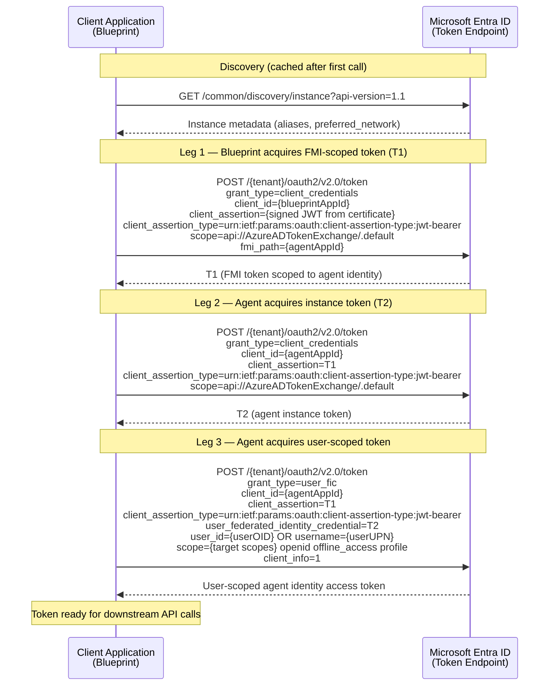
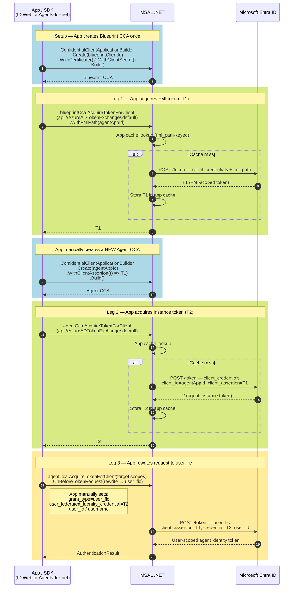
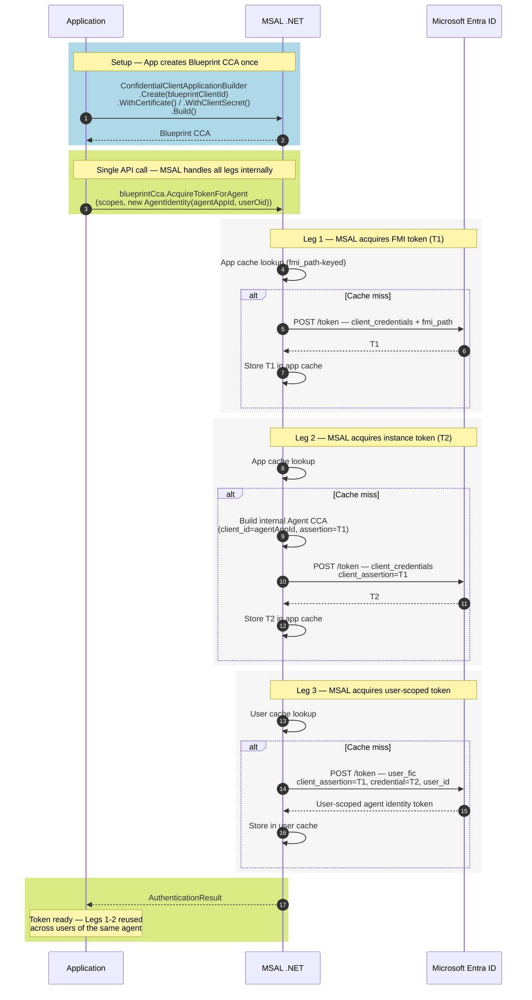

### Required HTTP calls for agent identity flow

```mermaid
sequenceDiagram
    participant App as Client Application<br/>(Blueprint)
    participant Entra as Microsoft Entra ID<br/>(Token Endpoint)

    Note over App,Entra: Discovery (cached after first call)
    App->>Entra: GET /common/discovery/instance?api-version=1.1
    Entra-->>App: Instance metadata (aliases, preferred_network)

    Note over App,Entra: Leg 1 — Blueprint acquires FMI-scoped token (T1)
    App->>Entra: POST /{tenant}/oauth2/v2.0/token<br/>grant_type=client_credentials<br/>client_id={blueprintAppId}<br/>client_assertion={signed JWT from certificate}<br/>client_assertion_type=urn:ietf:params:oauth:client-assertion-type:jwt-bearer<br/>scope=api://AzureADTokenExchange/.default<br/>fmi_path={agentAppId}
    Entra-->>App: T1 (FMI token scoped to agent identity)

    Note over App,Entra: Leg 2 — Agent acquires instance token (T2)
    App->>Entra: POST /{tenant}/oauth2/v2.0/token<br/>grant_type=client_credentials<br/>client_id={agentAppId}<br/>client_assertion=T1<br/>client_assertion_type=urn:ietf:params:oauth:client-assertion-type:jwt-bearer<br/>scope=api://AzureADTokenExchange/.default
    Entra-->>App: T2 (agent instance token)

    Note over App,Entra: Leg 3 — Agent acquires user-scoped token
    App->>Entra: POST /{tenant}/oauth2/v2.0/token<br/>grant_type=user_fic<br/>client_id={agentAppId}<br/>client_assertion=T1<br/>client_assertion_type=urn:ietf:params:oauth:client-assertion-type:jwt-bearer<br/>user_federated_identity_credential=T2<br/>user_id={userOID} OR username={userUPN}<br/>scope={target scopes} openid offline_access profile<br/>client_info=1
    Entra-->>App: User-scoped agent identity access token

    Note over App: Token ready for downstream API calls
```

### Existing support in MSAL .NET 

```mermaid
sequenceDiagram
    autonumber
    participant App as App / SDK<br/>(ID Web or Agents-for-net)
    participant MSAL as MSAL .NET
    participant Entra as Microsoft Entra ID

    rect rgb(173, 216, 230)
        Note over App,MSAL: Setup — App creates Blueprint CCA once
        App->>MSAL: ConfidentialClientApplicationBuilder<br/>.Create(blueprintClientId)<br/>.WithCertificate() / .WithClientSecret()<br/>.Build()
        MSAL-->>App: Blueprint CCA
    end

    rect rgb(215, 234, 132)
        Note over App,Entra: Leg 1 — App acquires FMI token (T1)
        App->>MSAL: blueprintCca.AcquireTokenForClient<br/>(api://AzureADTokenExchange/.default)<br/>.WithFmiPath(agentAppId)
        MSAL->>MSAL: App cache lookup (fmi_path-keyed)
        alt Cache miss
            MSAL->>Entra: POST /token — client_credentials + fmi_path
            Entra-->>MSAL: T1 (FMI-scoped token)
            MSAL->>MSAL: Store T1 in app cache
        end
        MSAL-->>App: T1
    end

    rect rgb(173, 216, 230)
        Note over App,MSAL: App manually creates a NEW Agent CCA
        App->>MSAL: ConfidentialClientApplicationBuilder<br/>.Create(agentAppId)<br/>.WithClientAssertion(() => T1)<br/>.Build()
        MSAL-->>App: Agent CCA
    end

    rect rgb(215, 234, 132)
        Note over App,Entra: Leg 2 — App acquires instance token (T2)
        App->>MSAL: agentCca.AcquireTokenForClient<br/>(api://AzureADTokenExchange/.default)
        MSAL->>MSAL: App cache lookup
        alt Cache miss
            MSAL->>Entra: POST /token — client_credentials<br/>client_id=agentAppId, client_assertion=T1
            Entra-->>MSAL: T2 (agent instance token)
            MSAL->>MSAL: Store T2 in app cache
        end
        MSAL-->>App: T2
    end

    rect rgb(255, 235, 156)
        Note over App,Entra: Leg 3 — App rewrites request to user_fic
        App->>MSAL: agentCca.AcquireTokenForClient(target scopes)<br/>.OnBeforeTokenRequest(rewrite → user_fic)
        Note right of App: App manually sets:<br/>grant_type=user_fic<br/>user_federated_identity_credential=T2<br/>user_id / username
        MSAL->>Entra: POST /token — user_fic<br/>client_assertion=T1, credential=T2, user_id
        Entra-->>MSAL: User-scoped agent identity token
        MSAL-->>App: AuthenticationResult
    end
```

### Proposed developer experience

```mermaid
sequenceDiagram
    autonumber
    participant App as Application
    participant MSAL as MSAL .NET
    participant Entra as Microsoft Entra ID

    rect rgb(173, 216, 230)
        Note over App,MSAL: Setup — App creates Blueprint CCA once
        App->>MSAL: ConfidentialClientApplicationBuilder<br/>.Create(blueprintClientId)<br/>.WithCertificate() / .WithClientSecret()<br/>.Build()
        MSAL-->>App: Blueprint CCA
    end

    rect rgb(215, 234, 132)
        Note over App,MSAL: Single API call — MSAL handles all legs internally
        App->>MSAL: blueprintCca.AcquireTokenForAgent<br/>(scopes, new AgentIdentity(agentAppId, userOid))
    end

    rect rgb(245, 245, 245)
        Note over MSAL,Entra: Leg 1 — MSAL acquires FMI token (T1)
        MSAL->>MSAL: App cache lookup (fmi_path-keyed)
        alt Cache miss
            MSAL->>Entra: POST /token — client_credentials + fmi_path
            Entra-->>MSAL: T1
            MSAL->>MSAL: Store T1 in app cache
        end
    end

    rect rgb(245, 245, 245)
        Note over MSAL,Entra: Leg 2 — MSAL acquires instance token (T2)
        MSAL->>MSAL: App cache lookup
        alt Cache miss
            MSAL->>MSAL: Build internal Agent CCA<br/>(client_id=agentAppId, assertion=T1)
            MSAL->>Entra: POST /token — client_credentials<br/>client_assertion=T1
            Entra-->>MSAL: T2
            MSAL->>MSAL: Store T2 in app cache
        end
    end

    rect rgb(245, 245, 245)
        Note over MSAL,Entra: Leg 3 — MSAL acquires user-scoped token
        MSAL->>MSAL: User cache lookup
        alt Cache miss
            MSAL->>Entra: POST /token — user_fic<br/>client_assertion=T1, credential=T2, user_id
            Entra-->>MSAL: User-scoped agent identity token
            MSAL->>MSAL: Store in user cache
        end
    end

    rect rgb(215, 234, 132)
        MSAL-->>App: AuthenticationResult
        Note over App: Token ready — Legs 1-2 reused<br/>across users of the same agent
    end
```