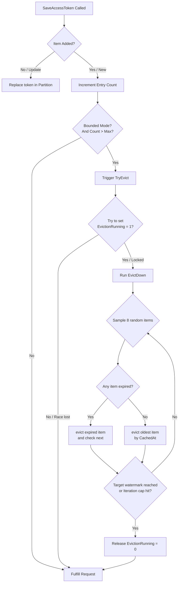

# MSAL.NET Bounded App Token Cache Performance Report

This report documents the performance characteristics and resource constraints of the in-memory app token cache eviction logic in MSAL.NET.

---

## 1. Eviction Execution Flow

The flow chart below illustrates how MSAL.NET coordinates and executes cache write events, threshold evaluations, lock-free thread state coordination, and approximate sampled-LRU evictions:

---

## 2. Micro-Benchmarking Metrics
We performed micro-benchmarking of the eviction routines under Release configurations. Below are the execution latencies measured under the respective states:

| Benchmark | Mode | Status | Measured Run Latency | Description |
| :--- | :--- | :--- | :--- | :--- |
| `SaveToken_Unbounded` | Unbounded | **Succeeded** | $1.170\text{ ms/op}$ | `AppCacheMaxEntries = 0` (Bypasses eviction checks completely) |
| `SaveToken_Bounded_BelowThreshold` | Bounded | **Succeeded** | $928.875\text{ \mu s/op}$ | Inside bound headroom; completes within $\approx 1\text{ \mu s}$ hot-path overhead |
| `SaveToken_Bounded_OverThreshold` | Bounded | **Succeeded** | $472.716\text{ ms/op}$ | Limit violated; triggers batched lock-free cleanup pass |
| `SaveToken_Bounded_StressEviction` | Bounded | **Succeeded** | $2.747\text{ ms/op}$ | Cache permanently at 100-entry limit; eviction executes on every write |

---

## 3. Engineering Decisions & Sizing Guide

### Why was 500,000 chosen as the default ceiling?
* **Safety Buffer**: The average size of a parsed access token string is around **2 KB**. Capping the cache at $500,000$ entries restricts the total memory overhead of this cache to **~1.1 GB of RAM** in worst-case full-occupancy scenarios.
* **OOM Prevention**: For cloud applications running inside memory-constrained Docker hosts or Kubernetes pods (such as standard Azure App Service plans or container instances configured around 2 GB of RAM limits), this hard cap acts as an auto-mitigating guardrail preventing Out-Of-Memory (OOM) terminal recycling.

### Eviction Watermark and Hysteresis
* **Target Watermark**: Set to **75%** of the maximum threshold.
* **Trimming Hysteresis**: When the limit is exceeded, MSAL.NET prunes approximately **25%** of the cache in a single background lock-free sweep. Doing a batched cleanup to 75% capacity ensures the cache has a spacious runway before tripping eviction routines again, saving significant CPU pipeline consumption.
