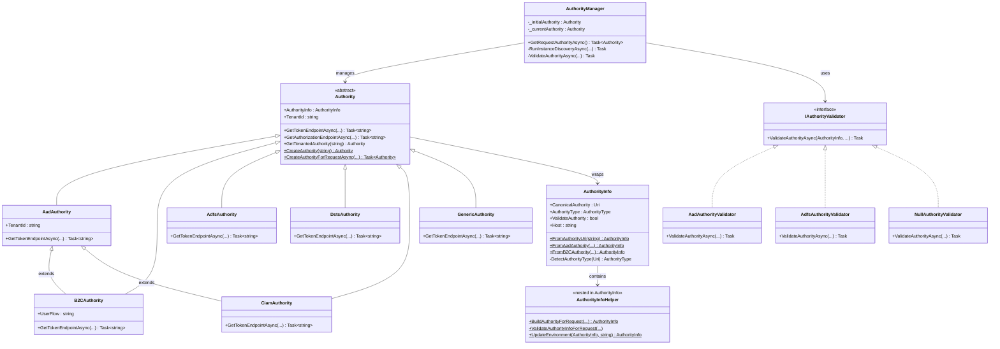
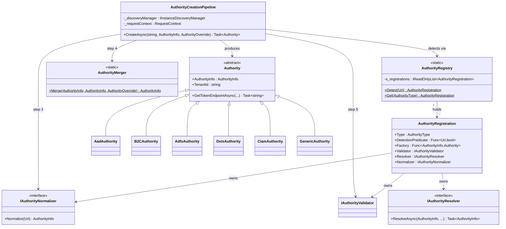
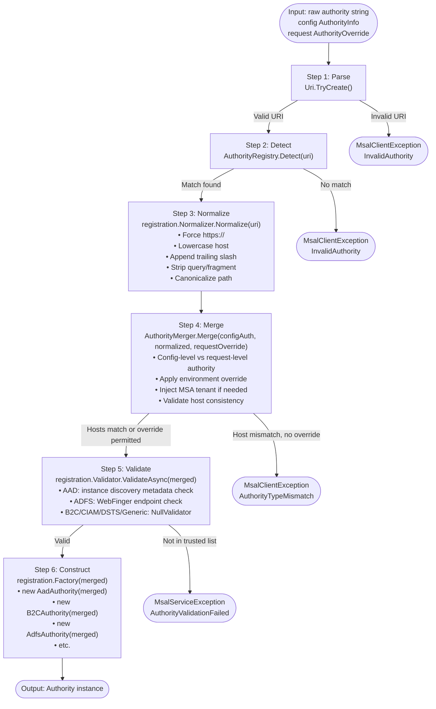
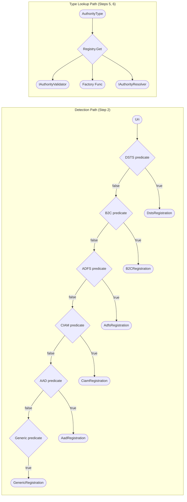
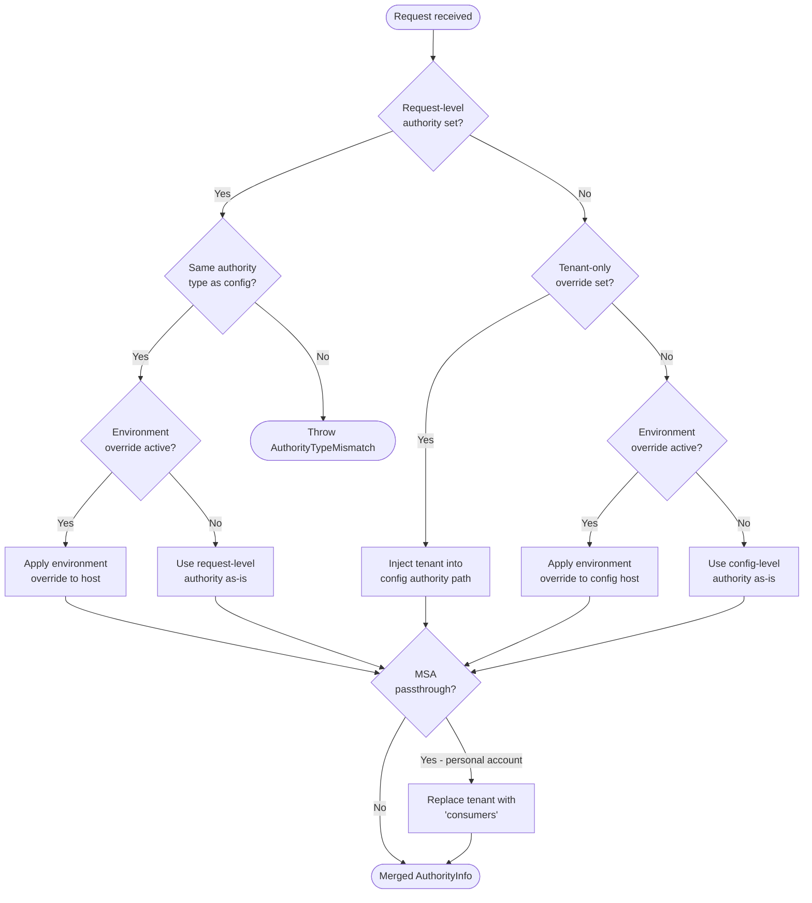

# Authority Refactoring — Architecture and Data Flow Diagrams

**Status:** Proposed  
**Authors:** MSAL.NET Team  
**Last Updated:** 2026-02-26  
**Companion document:** [AUTHORITY_REFACTORING_DESIGN.md](AUTHORITY_REFACTORING_DESIGN.md)

---

## Table of Contents

1. [Current Monolithic Architecture](#current-monolithic-architecture)
2. [Proposed Registry + Pipeline Architecture](#proposed-registry--pipeline-architecture)
3. [AuthorityCreationPipeline 6-Step Data Flow](#authoritycreationpipeline-6-step-data-flow)
4. [Registry Lookup Paths](#registry-lookup-paths)
5. [Key Decision Points in Authority Selection](#key-decision-points-in-authority-selection)
6. [Code Locations Affected](#code-locations-affected)

---

## Current Monolithic Architecture

The current design distributes authority creation, detection, and validation logic across multiple loosely-related classes. There is no single entry point or registry.



### Fragility Points

The diagram above highlights two fragility points (marked with `*` in the code):

1. **`AuthorityInfo.DetectAuthorityType(Uri)`** — A private method with a chain of `if/else` checks based on host and path heuristics. Adding a new authority type requires modifying this method.

2. **`Authority.CreateAuthority(AuthorityInfo)`** — A factory method with a `switch(authorityInfo.AuthorityType)` that instantiates the correct subclass. Adding a new authority type requires modifying this switch.

These two points must stay synchronized. There is no compile-time enforcement of that invariant.

---

## Proposed Registry + Pipeline Architecture

The proposed design introduces two new types that centralize authority metadata and creation:



### Key Improvements

| Concern | Before | After |
|---|---|---|
| Type detection | Inline `if/else` in `AuthorityInfo` | Registered predicate per type in `AuthorityRegistry` |
| Factory | `switch` statement in `Authority` | Registered `Func<AuthorityInfo, Authority>` per type |
| Validation | Manually selected in `AuthorityManager` | Registered `IAuthorityValidator` per type |
| Environment resolution | Mixed into `AuthorityInfoHelper` | Registered `IAuthorityResolver` per type |
| Adding a new type | Change 5+ files | Change 1 file (new registration) + 1 line in registry |

---

## AuthorityCreationPipeline 6-Step Data Flow



### Step Details

#### Step 1 — Parse

- Input: `string rawAuthorityUri`
- Uses `Uri.TryCreate()` with `UriKind.Absolute`
- Throws `MsalClientException(MsalError.InvalidAuthority)` if parsing fails
- Output: `Uri`

#### Step 2 — Detect

- Input: `Uri`
- Calls `AuthorityRegistry.Detect(uri)` which iterates registrations in order
- First registration whose `DetectionPredicate(uri)` returns `true` is selected
- Throws `MsalClientException(MsalError.InvalidAuthority)` if no predicate matches (impossible in practice since `GenericAuthority` is a catch-all)
- Output: `AuthorityRegistration`

#### Step 3 — Normalize

- Input: `Uri`, `AuthorityRegistration`
- Calls `registration.Normalizer.Normalize(uri)`
- Produces a canonical `AuthorityInfo` with normalized URI
- Output: `AuthorityInfo` (normalized)

#### Step 4 — Merge

- Input: config `AuthorityInfo`, normalized request `AuthorityInfo`, `AuthorityOverride`
- Logic (in priority order):
  1. If `requestOverride` contains an explicit authority URI, use it (request-level wins)
  2. If `requestOverride` contains a tenant-only override, inject tenant into config authority
  3. If an environment override is active (from instance discovery metadata), update host
  4. Inject `consumers` tenant for MSA passthrough scenarios
  5. Validate that config and request authority hosts are compatible
- Output: merged `AuthorityInfo`

#### Step 5 — Validate

- Input: merged `AuthorityInfo`, `AuthorityRegistration`, `IInstanceDiscoveryManager`, `RequestContext`
- AAD validator: checks that the authority host appears in instance discovery metadata for the configured cloud
- ADFS validator: issues a WebFinger request to `{authority}/.well-known/webfinger`
- All other validators: no-op (`NullAuthorityValidator`)
- Skip validation if `AuthorityInfo.ValidateAuthority == false`
- Output: void (throws on failure)

#### Step 6 — Construct

- Input: merged `AuthorityInfo`, `AuthorityRegistration`
- Calls `registration.Factory(merged)` to instantiate the concrete `Authority` subclass
- Output: `Authority` instance

---

## Registry Lookup Paths

The `AuthorityRegistry` provides two lookup paths:



### Detection Predicate Reference

| Registration | Predicate Logic | Example Match |
|---|---|---|
| `DstsAuthorityRegistration` | `host.Contains("dstsv2")` | `dsts.core.azure-test.net/dstsv2/...` |
| `B2CAuthorityRegistration` | `host.Contains(".b2clogin.com")` OR path contains `b2c_1_` | `contoso.b2clogin.com/...` |
| `AdfsAuthorityRegistration` | `path.StartsWith("/adfs", OrdinalIgnoreCase)` | `adfs.contoso.com/adfs` |
| `CiamAuthorityRegistration` | `host.EndsWith(".ciamlogin.com", OrdinalIgnoreCase)` | `contoso.ciamlogin.com/...` |
| `AadAuthorityRegistration` | Host in known AAD hosts list OR matches instance discovery aliases | `login.microsoftonline.com/...` |
| `GenericAuthorityRegistration` | Always returns `true` (catch-all) | `custom.idp.example.com/...` |

---

## Key Decision Points in Authority Selection

The following decision tree describes the logic in **Step 4 (Merge)** of the pipeline:



---

## Code Locations Affected

### Files to Be Replaced or Substantially Modified

| File | Change Type | Reason |
|---|---|---|
| `Instance/Authority.cs` | Modify | Remove factory `switch`; delegate to `AuthorityCreationPipeline` |
| `AppConfig/AuthorityInfo.cs` | Modify | Remove `DetectAuthorityType()` private method; remove `AuthorityInfoHelper` nested class |
| `Instance/AuthorityManager.cs` | Modify | Replace direct authority creation with `AuthorityCreationPipeline.CreateAsync()` |

### Files to Be Created

| File | Purpose |
|---|---|
| `Instance/AuthorityRegistration.cs` | The `AuthorityRegistration` record |
| `Instance/AuthorityRegistry.cs` | The static registry holding all registrations |
| `Instance/AuthorityCreationPipeline.cs` | The 6-step pipeline |
| `Instance/AuthorityMerger.cs` | Merge logic extracted from `AuthorityInfoHelper` |
| `Instance/IAuthorityNormalizer.cs` | Normalization interface |
| `Instance/IAuthorityResolver.cs` | Resolution interface |
| `Instance/Registrations/AadAuthorityRegistration.cs` | AAD-specific registration |
| `Instance/Registrations/B2CAuthorityRegistration.cs` | B2C-specific registration |
| `Instance/Registrations/AdfsAuthorityRegistration.cs` | ADFS-specific registration |
| `Instance/Registrations/DstsAuthorityRegistration.cs` | DSTS-specific registration |
| `Instance/Registrations/CiamAuthorityRegistration.cs` | CIAM-specific registration |
| `Instance/Registrations/GenericAuthorityRegistration.cs` | Generic/catch-all registration |

### Files Preserved Unchanged

| File | Reason |
|---|---|
| `Instance/AadAuthority.cs` | Concrete type; no change to endpoint construction logic |
| `Instance/B2CAuthority.cs` | Concrete type; no change |
| `Instance/AdfsAuthority.cs` | Concrete type; no change |
| `Instance/DstsAuthority.cs` | Concrete type; no change |
| `Instance/CiamAuthority.cs` | Concrete type; no change |
| `Instance/GenericAuthority.cs` | Concrete type; no change |
| `Instance/Validation/IAuthorityValidator.cs` | Interface; no change |
| `Instance/Validation/AadAuthorityValidator.cs` | Implementation; no change |
| `Instance/Validation/AdfsAuthorityValidator.cs` | Implementation; no change |
| `Instance/Validation/NullAuthorityValidator.cs` | Implementation; no change |
| `Instance/Discovery/` (all files) | Instance discovery subsystem; no change |
| `AppConfig/AuthorityType.cs` (enum) | Enum values unchanged; one new value added if extending |

### Dependency Graph (Current vs. Proposed)

**Before:**

```
AuthorityManager
  ├── AuthorityInfo (contains AuthorityInfoHelper)
  │     └── Authority (factory methods)
  │           ├── AadAuthority
  │           ├── B2CAuthority
  │           ├── AdfsAuthority
  │           ├── DstsAuthority
  │           ├── CiamAuthority
  │           └── GenericAuthority
  └── IAuthorityValidator (selected by switch in AuthorityManager)
        ├── AadAuthorityValidator
        ├── AdfsAuthorityValidator
        └── NullAuthorityValidator
```

**After:**

```
AuthorityManager
  └── AuthorityCreationPipeline
        ├── AuthorityRegistry
        │     └── AuthorityRegistration[]
        │           ├── DetectionPredicate (per type)
        │           ├── IAuthorityNormalizer (per type)
        │           ├── IAuthorityValidator (per type)
        │           ├── IAuthorityResolver (per type)
        │           └── Factory (per type)
        └── AuthorityMerger
              └── Authority instances
                    ├── AadAuthority
                    ├── B2CAuthority
                    ├── AdfsAuthority
                    ├── DstsAuthority
                    ├── CiamAuthority
                    └── GenericAuthority
```
