```mermaid
graph TD;
  
  A[IMDS Request] -->|Success| B[✅ Token Issued]
  A -->|4xx Error?| C{Identity Not Found?}
  C -- Yes --> D[🔄 Retry: 1s → 2s → 4s]
  C -- No --> E[❌ Do Not Retry]
  A -->|5xx Error?| F[🔄 Retry: 1s → 2s → 4s]
  A -->|429 Throttling?| G[🔄 Retry: 1s → 2s → 4s]
  A -->|410 IMDS Updating?| H[🔄 Retry: 1s → 2s → 4s]
```

# MSAL & MSI IMDS Error Handling and Retry Strategy Specification

## Overview
This document defines the error handling and retry strategy for MSAL when interacting with the IMDS (Instance Metadata Service) endpoint for Managed Identity (MSI) token acquisition.

---

## 1️⃣ HTTP Status Codes & Recommended Actions

| **HTTP Status Code** | **Error Reason**                               | **Recommended Action**                      | **Retry Delay Strategy**                 |
|----------------------|-----------------------------------------------|---------------------------------------------|-----------------------------------------|
| **400**             | Bad Request (Invalid Parameters)               | **Do not retry**, fix request               | **No retry**                             |
| **401**             | Unauthorized                                  | **Do not retry**, check authentication setup | **No retry**                             |
| **403**             | Forbidden                                     | **Do not retry**, verify permissions       | **No retry**                             |
| **404**             | IMDS endpoint is updating / Identity Not Found | Retry with Exponential Backoff (max 3 retries) | **1s → 2s → 4s (max 4s)**            |
| **408**             | Request Timeout                                | Retry with Exponential Backoff (max 3 retries) | **1s → 2s → 4s (max 4s)**            |
| **410**             | IMDS is undergoing updates                    | Wait up to **70 seconds**, then retry      | **1s → 2s → 4s (max 4s)**            |
| **429**             | IMDS Throttle limit reached                   | Retry with Exponential Backoff (max 3 retries) | **1s → 2s → 4s (max 4s)**            |
| **504**             | Gateway Timeout                               | Retry with Exponential Backoff (max 3 retries) | **1s → 2s → 4s (max 4s)**            |
| **5xx**             | Transient service error                        | Retry with Exponential Backoff (max 3 retries) | **1s → 2s → 4s (max 4s)**            |

---

## 2️⃣ Identity Propagation & Special Handling for "Identity Not Found" Errors
- **Scenario:** When an identity is newly assigned to a VM, it may take time for the IMDS service to recognize the identity.
- **Exception Handling:**  
  - If the **IMDS response contains "Identity Not Found"**, retry the request using **exponential backoff**.
  - **Error Code:** **404 (Identity Not Found)**
  - Recommended retry sequence: **1s → 2s → 4s** (max 3 retries)
  - If still failing, log an error and return the failure.

---

## 3️⃣ Updated Retry Strategy (Exponential Backoff)
The following retry strategy applies to **5xx errors, timeouts, and transient 4xx errors (e.g., Identity Not Found):**

| **Retry Attempt** | **Delay Before Retry** |
|------------------|----------------------|
| **1st**         | **1 second**         |
| **2nd**         | **2 seconds**         |
| **3rd**         | **4 seconds** (max 4s) |

🔹 **For 5xx Errors, 404 Identity Not Found, and Timeouts:** Retry **max 3 times** before failing.  
🔹 **For 410 (IMDS Updates):** Backoff **increases on each retry** (1s → 2s → 4s - max 4s).
🔹 **For 429 (Throttling):** Backoff **increases on each retry** (1s → 2s → 4s - max 4s).

---

---

**References:** 

1. https://learn.microsoft.com/en-gb/entra/identity/managed-identities-azure-resources/how-to-use-vm-token#error-handling
2. https://eng.ms/docs/cloud-ai-platform/azure-core/core-compute-and-host/general-purpose-host-arunki/azure-instance-metadata-service/compute-azlinux-metadataserver/troubleshooting/unable-to-reach-imds#mitigate-http-status-code-410

