```mermaid
graph TD;
  
  A[IMDS Request] -->|Success| B[✅ Token Issued]

  A -->|4xx Error?| C{Identity Not Found?}
  C -- Yes --> D[🔄 Retry: 1s → 2s → 4s]
  C -- No --> E[❌ Do Not Retry]

  A -->|5xx Error?| F[🔄 Retry: 1s → 2s → 4s]

  A -->|429 Throttling?| G[🔄 Retry: 2s → 4s → 8s → 16s]
  
  A -->|410 IMDS Updating?| H[⏳ Wait 70s, Then Retry]
```

# MSAL & MSI IMDS Error Handling and Retry Strategy Specification

## Overview
This document defines the error handling and retry strategy for MSAL when interacting with the IMDS (Instance Metadata Service) endpoint for Managed Identity (MSI) token acquisition.

---

## 1️⃣ HTTP Status Codes & Recommended Actions

| **HTTP Status Code** | **Error Reason**                               | **Recommended Action**                      | **Retry Delay Strategy**                 |
|----------------------|-----------------------------------------------|---------------------------------------------|-----------------------------------------|
| **404**             | IMDS endpoint is updating                     | Retry with Exponential Backoff              | **1s → 2s → 4s**                        |
| **410**             | IMDS is undergoing updates                    | Wait up to **70 seconds**, then retry      | **70s (fixed wait)**                    |
| **429**             | IMDS Throttle limit reached                    | Retry with Exponential Backoff              | **2s → 4s → 8s → 16s**                  |
| **408**             | Request Timeout                                | Retry with Exponential Backoff              | **1s → 2s → 4s**                        |
| **5xx**             | Transient service error                        | Retry with Exponential Backoff **(max 3 retries)** | **1s → 2s → 4s**             |
| **400**             | Bad Request (Invalid Parameters)               | **Do not retry**, fix request               | **No retry**                             |
| **401**             | Unauthorized                                  | **Do not retry**, check authentication setup | **No retry**                             |
| **403**             | Forbidden                                     | **Do not retry**, verify permissions       | **No retry**                             |
| **timeout**         | IMDS endpoint is updating                     | Retry with Exponential Backoff              | **1s → 2s → 4s**                        |

---

## 2️⃣ Identity Propagation & Special Handling for "Identity Not Found" Errors
- **Scenario:** When an identity is newly assigned to a VM, it may take time for the IMDS service to recognize the identity.
- **Exception Handling:**  
  - If the **IMDS response contains "Identity Not Found"**, retry the request using **exponential backoff**.
  - Recommended retry sequence: **1s → 2s → 4s**
  - **Maximum retries: 3**
  - If still failing, log an error and return the failure.

---

## 3️⃣ Updated Retry Strategy (Exponential Backoff)
The following retry strategy applies to **5xx errors, timeouts, and certain transient 4xx errors (e.g., Identity Not Found):**

| **Retry Attempt** | **Delay Before Retry** |
|------------------|----------------------|
| **1st**         | **1 second**         |
| **2nd**         | **2 seconds**         |
| **3rd**         | **4 seconds**         |

🔹 **For 5xx Errors:** Retry **max 3 times** before failing.  
🔹 **For 410 (IMDS Updates):** **Wait 70 seconds** before retrying.  
🔹 **For 429 (Throttling):** Backoff **increases on each retry** (2s → 4s → 8s → 16s).  

---

---

**References:** https://learn.microsoft.com/en-gb/entra/identity/managed-identities-azure-resources/how-to-use-vm-token#error-handling
