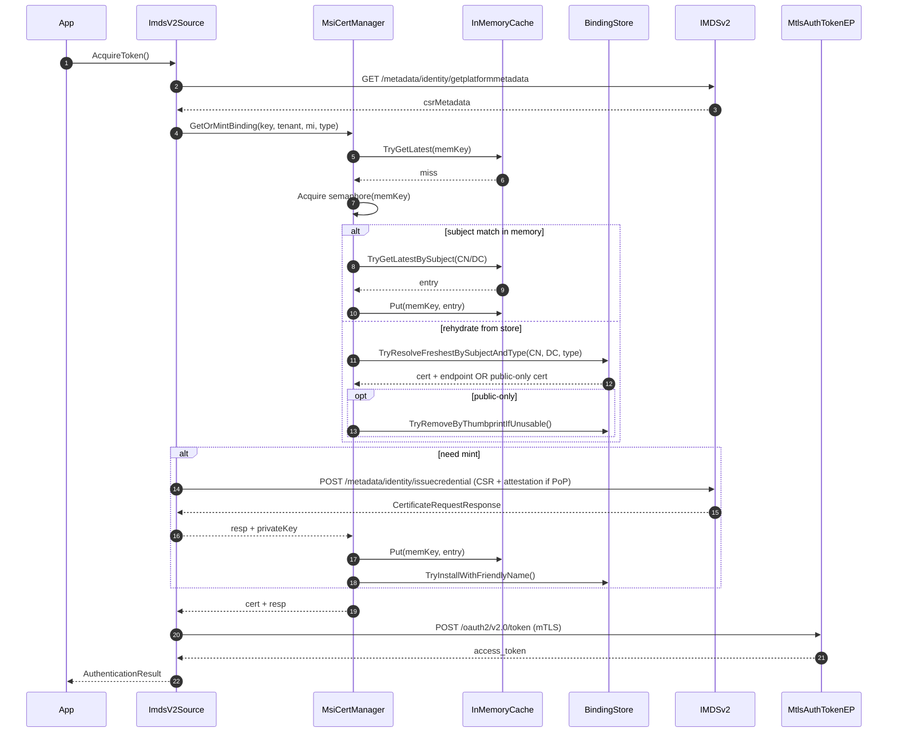
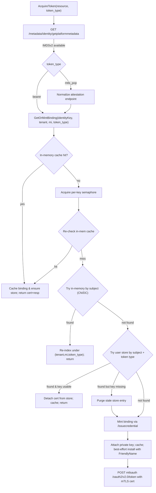

# 1) Concurrency + rehydrate + mint (sequence view)

## The flow:

- Semaphore collapses concurrent mints for the same (tenant, mi, token_type).
- We re-check the cache after acquiring the gate to avoid double work.
- Store rehydrate is attempted; public‑only certs trigger a purge path.
- Mint happens only on true misses; final step posts to the mTLS token endpoint.

# 2) IMDSv2 token acquisition (end‑to‑end flow)

## The Flow
- We always probe IMDSv2, then branch on token_type (mtls_pop vs bearer).
- Binding retrieval is cache-first, then subject-level, then store rehydrate, and finally mint.
- If store rehydrate yields a public‑only cert (no key) we purge it and mint.
- On success we cache and best‑effort install with a compact FriendlyName.

