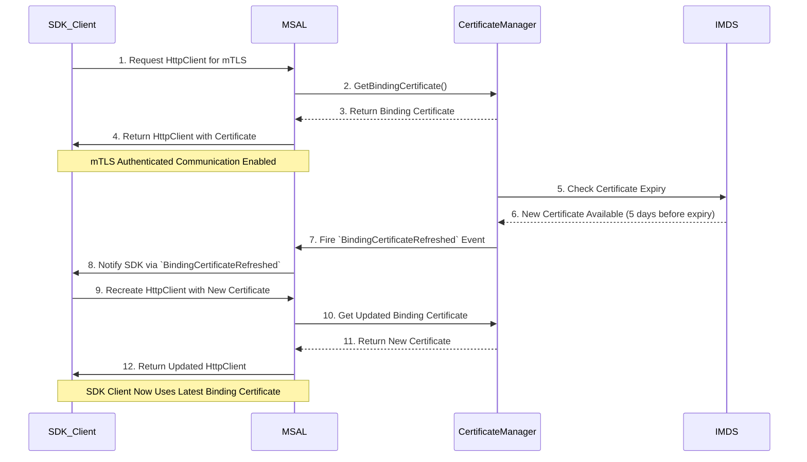

# Guidance for SDKs Consuming MSAL

## Overview



To support MSI V2 authentication with the `/credential` endpoint, the **Azure SDK** leverages the `IMsalMtlsHttpClientFactory` interface and **certificate management APIs** for secure communication with Azure AD using **mutual TLS (mTLS)**.

This section covers:
- How Azure SDK uses **`IMsalMtlsHttpClientFactory`** for MTLS authentication.
- How SDKs interact with the **certificate APIs** to obtain the binding certificate certificates.
- The **new `CertificateRefreshed` event**, which notifies when a binding certificate is updated.

---

## **Handling Certificate Rotation for Long-Lived Clients**

The Problem: Certificate Expiry and Rotation

- mTLS Proof of Possession (PoP) tokens are signed by a binding certificate.
- The binding certificate is valid for 90 days.
- A new certificate is made available 5 days before expiration.
- The SDKs consuming MSAL (customizing httpclient) must ensure that its HttpClient uses the latest certificate.

Proposed Solution
- SDK clients must monitor certificate updates and refresh their HttpClient dynamically.
- MSAL exposes an event-driven model to notify when the binding certificate is refreshed.

## **New Interface: `IMsalMtlsHttpClientFactory`**

MSAL introduces the `IMsalMtlsHttpClientFactory` interface to facilitate **mTLS-based authentication** in Azure SDKs. This ensures:
- Secure token acquisition by enabling **mTLS authentication**.
- **Reusable `HttpClient` instances** to prevent socket exhaustion.
- Optimized **Azure SDK integration** for managing identities securely.

### **Interface Definition**

```csharp
public interface IMsalMtlsHttpClientFactory : IMsalHttpClientFactory
{
    /// <summary>
    /// Returns an HttpClient configured with a certificate for mutual TLS authentication.
    /// </summary>
    /// <param name="x509Certificate2">The certificate to be used for MTLS authentication.</param>
    /// <returns>An HttpClient instance configured with the specified certificate.</returns>
    HttpClient GetHttpClient(X509Certificate2 x509Certificate2);
}
```

## **Binding Certificate**

SDKs customizing the httpclient factory will need a way to get the binding certificate for MTLS authentication. MSAL exposes a few different APIs to help SDKs manage certificates.

- Retrieving existing certificates from the OS store or memory.
- Notifying SDKs when a certificate is updated via the CertificateRefreshed event.

| API Name                         | Purpose                                                                            |
|----------------------------------|------------------------------------------------------------------------------------|
| `GetManagedIdentitySourceAsync()`| Will expose the MSI Source including the new `IMDSV2` source                       |
| `GetBindingCertificate()`        | Helper method to get the binding certificate when source is `IMDSV2`.              |
| `BindingCertificateRefreshed`    | Event to notify SDKs when the binding certificate is updated.                      |


