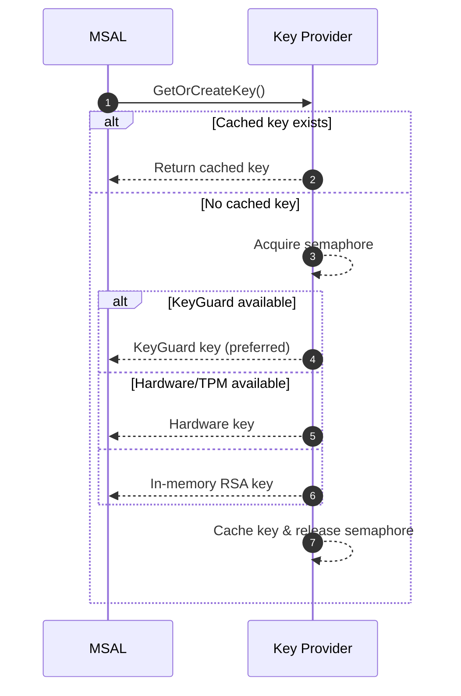

# MSI v2 — Key Logic

## Overview

In MSI v2, before MSAL can do anything with IMDS or ESTS, it needs a key pair. This private key is the root trust anchor for all subsequent operations (CSR, cert issuance, PoP binding).

## Key Responsibilities

- Generate and hold the RSA private key.
- Ensure the key is protected to the maximum capability of the platform.
- Provide the key for signing (CSR, PoP requests, mTLS handshakes).
- Never allow export if backed by hardware/KeyGuard.

## Key Selection Priority

MSAL implements a hierarchical key provider strategy:

### KeyGuard (awlays for PoP)
- Requires Virtualization-Based Security (VBS).
- Keys are isolated in a secure enclave.
- Strongest guarantee that the private key cannot be exfiltrated.
- Used for Proof-of-Possession (PoP).

### Hardware / TPM / KSP (fallback)

- Keys are backed by TPM or the Platform Crypto Provider.
- Non-exportable, tied to the device.
- Provides strong hardware-based protection, but not as strict as VBS isolation.

### In-memory RSA (last resort on Windows and only option in Linux)

- Keys are created and held in memory.
- Software-based only, weakest in terms of protection.
- Used only when platform protections are unavailable.

## Mermaid — Key Selection Flow

✅ Summary:

In MSI v2, everything starts with a key. MSAL enforces a secure-first fallback chain: KeyGuard → TPM → In-memory. For PoP tokens, KeyGuard is the preferred option since it offers the strongest binding guarantees.
