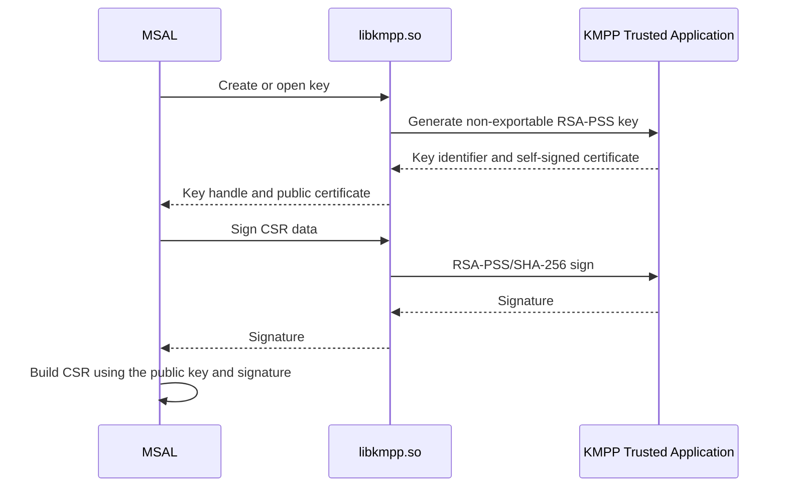

# Linux KMPP Managed Identity Key Provider

## Audience and purpose

This document is for MSAL maintainers and SDK engineers working on MSI V2
Managed Identity support. It supplements the
[MSI V2 `/issuecredential` design](msi_with_credential_design.md) by documenting
the Linux-specific key-provider architecture.

It answers the following questions:

- What Linux functionality exists today?
- How does Linux key handling differ from the Windows implementation?
- Which security properties does KMPP provide?
- What remains before Linux has an end-to-end MSI V2 mTLS-PoP flow?
- Which behaviors must not yet be treated as production contracts?

> [!IMPORTANT]
> Linux support is currently a proof of concept. The implementation creates a
> protected key and builds the certificate signing request (CSR). Linux key
> attestation and the complete MSI V2 mTLS-PoP token acquisition flow remain
> future work.

## Overview

The Linux Managed Identity key provider uses KMPP (KeyIso with OP-TEE and
TrustZone) to create a non-exportable RSA-PSS key. MSAL accesses KMPP through
`libkmpp.so`; private-key operations remain inside the trusted execution
environment.

KMPP is the Linux key-provider technology. It should not be described as Linux
Credential Guard or Linux KeyGuard.

## Current proof-of-concept scope

The current implementation covers:

- Native interoperability with `libkmpp.so`.
- Creating and opening an enclave-backed KMPP key.
- Reading the public key from the KMPP-generated self-signed certificate.
- Performing RSA-PSS/SHA-256 signing inside the enclave.
- Rejecting private-key export.
- Building the MSI V2 CSR with the KMPP-backed key.

The following work is not yet complete:

- Attesting the KMPP key.
- Sending the Linux attestation evidence to Microsoft Azure Attestation.
- Completing the `/issuecredential` and regional ESTS token-acquisition flow.
- Defining production fallback, recovery, and key-lifecycle behavior.

## Key-provider architecture

## Windows and Linux comparison

| Aspect | Windows | Linux |
|---|---|---|
| Key provider | KeyGuard KSP | KMPP/KeyIso through `libkmpp.so` |
| Protection boundary | Credential Guard and the Windows key-storage provider | OP-TEE/TrustZone trusted execution environment |
| Key properties | Non-exportable, hardware-backed RSA key | Non-exportable RSA-PSS key |
| Native integration | Windows CNG/KSP APIs | P/Invoke into `libkmpp.so` |
| Public-key source | Windows key provider | KMPP-generated self-signed certificate |
| Private-key operations | Performed by the Windows key provider | Performed inside the KMPP trusted application |
| CSR ownership | MSAL builds and signs the CSR using the protected key | MSAL builds and signs the CSR using the protected key |
| Key attestation | Implemented through Microsoft Azure Attestation | Not yet implemented |
| End-to-end token flow | Implemented | Not yet implemented |
| E2E validation | Existing Windows flow | No Linux E2E flow yet |
| Current status | Supported implementation | POC: key creation and CSR generation only |

The existence of the KMPP key provider does not indicate that Linux MSI V2
mTLS-PoP is ready for production use. Linux support should be advertised only
after attestation and the remaining token-acquisition stages are implemented
and validated.
