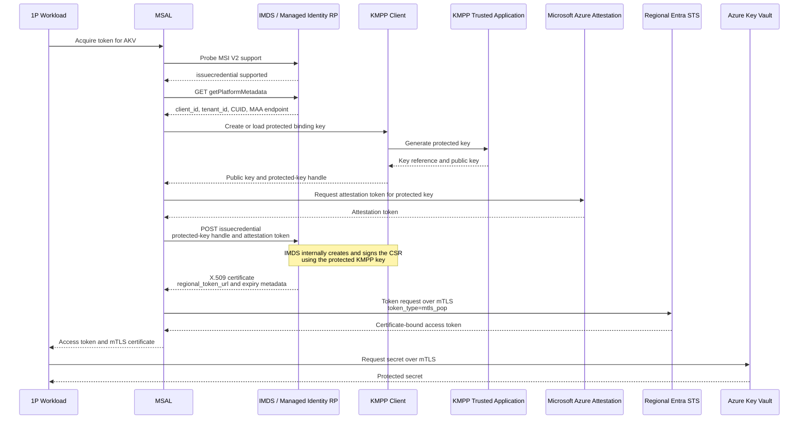

## Linux Attested Managed Identity Flow

This flow extends MSI V2 on Linux by using KMPP to generate and retain a protected, non-exportable private key. MSAL attests that key, obtains a short-lived managed identity certificate through IMDS, and uses the certificate to acquire an mTLS-bound access token from regional ESTS.

