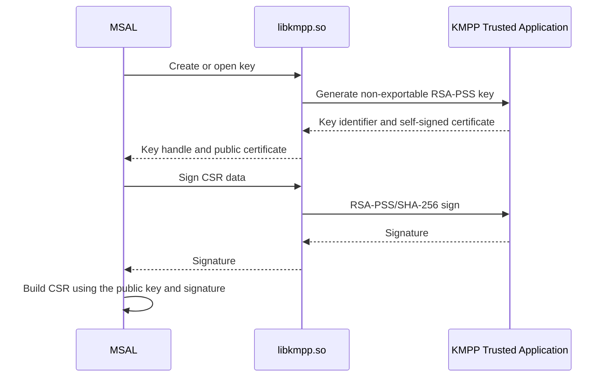

## Linux KMPP Managed Identity Key Provider

> [!IMPORTANT]
> Linux support is currently a proof of concept. The implementation creates a
> protected key and builds the certificate signing request (CSR). Linux key
> attestation and the complete MSI V2 mTLS-PoP token acquisition flow remain
> future work.

### Overview

The Linux Managed Identity key provider uses KMPP (KeyIso with OP-TEE and
TrustZone) to create a non-exportable RSA-PSS key. MSAL accesses KMPP through
`libkmpp.so`; private-key operations remain inside the trusted execution
environment.

KMPP is the Linux key-provider technology. It should not be described as Linux
Credential Guard or Linux KeyGuard.

### Current proof-of-concept scope

The current implementation covers:

- Native interoperability with `libkmpp.so`.
- Creating and opening an enclave-backed KMPP key.
- Reading the public key from the KMPP-generated self-signed certificate.
- Performing RSA-PSS/SHA-256 signing inside the enclave.
- Rejecting private-key export.
- Building the MSI V2 CSR with the KMPP-backed key.

The following work is not yet complete:

- Attesting the KMPP key.
- Sending the Linux attestation evidence to Microsoft Azure Attestation.
- Completing the `/issuecredential` and regional ESTS token-acquisition flow.
- Defining production fallback, recovery, and key-lifecycle behavior.

### Key-provider architecture

### Platform comparison

| Platform | Key provider | Key properties | Status |
|---|---|---|---|
| Windows | KeyGuard KSP | Non-exportable, hardware-backed RSA key | Implemented |
| Linux | KMPP/KeyIso through `libkmpp.so` | Non-exportable RSA-PSS key held in an OP-TEE/TrustZone enclave | POC: key creation and CSR generation only |

The existence of the KMPP key provider does not indicate that Linux MSI V2
mTLS-PoP is ready for production use. Linux support should be advertised only
after attestation and the remaining token-acquisition stages are implemented
and validated.
