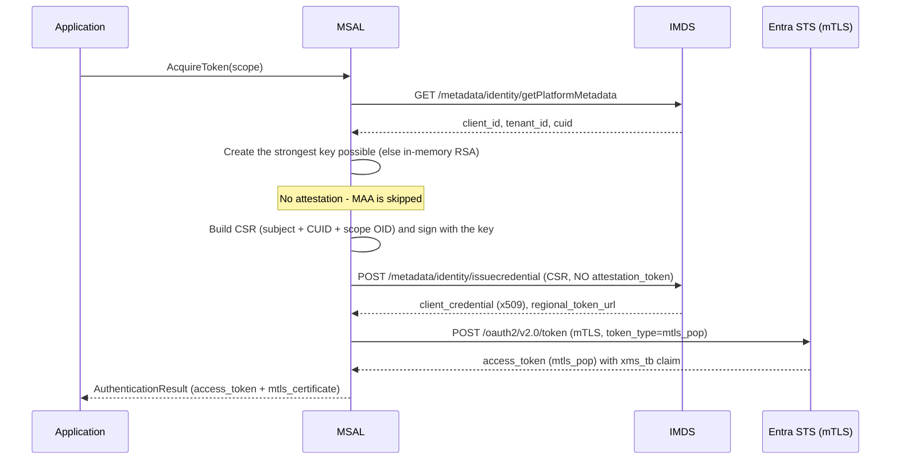

# MSAL MSI V2 — Unattested mTLS PoP Flow (Scoped CSR) high level design document

## Overview

This document describes a new **unattested** variant of the MSI V2 `/issuecredential` flow.

As in the attested flow, the compute unit (CU) creates the **strongest key it can**. When no strong key store is available — for example on **Gen1 VMs or Linux** — MSAL falls back to an **in-memory RSA** key. The difference is:

- MSAL **does not** obtain an attestation token from Azure MAA.
- The requested **scope is carried inside the CSR** via a dedicated attribute OID.
- ESTS still returns an **`mtls_pop`** access token bound to the key.

This differs from the original design (`msi_with_credential_design.md`), where an **unattested** CU could only receive a **bearer** token. This flow upgrades that path to **`mtls_pop`** without requiring attestation.

## Goals

- Allow CUs that can create a strong key but **cannot attest it** to still obtain an **mTLS PoP** token.
- Carry the **scope** inside the CSR so the issued credential / token is correctly scoped **without** an attestation token.
- Keep the rest of the MSI V2 flow (`getPlatformMetadata` -> `issuecredential` -> ESTS mTLS) unchanged.
- Work on **Windows and Linux** VMs / VMSS.

## Why unattested + PoP?

- Attestation (MAA) may be **unavailable or not supported** on some platforms or hardware.
- **Hardware does not support attested flows** (for example, Gen1 VMs).
- The key is still used to establish a **PoP binding** over mTLS, so the token is bound to the key even without a formal attestation proof.
- The **CSR-embedded scope** lets the Resource Provider / ESTS issue a **scoped** credential without the attestation token that previously carried this context.

## How this differs from the attested flow

| Aspect | Attested flow | **Unattested PoP flow (this doc)** |
|---|---|---|
| Key strength | KeyGuard | **strongest available, else in-memory RSA** |
| MAA attestation token | **Required** | **Not requested / omitted** |
| Scope location | Token request (ESTS) | **CSR attribute (new OID)** + token request |
| `attestation_token` in `/issuecredential` | Present | **Absent** |
| Returned token type | `mtls_pop` | **`mtls_pop`** (still PoP) |

## Token Acquisition Process



## Steps for MSI V2 Unattested Authentication

### 1. Retrieve Platform Metadata

`GET /metadata/identity/getPlatformMetadata?cred-api-version=2.0`

Returns `client_id`, `tenant_id`, and `cuid`. For attestable CUs an MAA endpoint is also returned; in this flow it is **ignored**.

### 2. Create the strongest key (no attestation)

MSAL sources the **strongest key the platform supports**. When no strong key store is available — for example on **Gen1 VMs or Linux** — MSAL falls back to an **in-memory RSA** key. **No** MAA attestation is performed.

| Platform | Key store | Persistence |
|---|---|---|
| Strong key store available | Strongest available key | Depends on store |
| No strong key store (e.g. Gen1 VMs, Linux) | **In-memory RSA** | Process-lifetime |

### 3. Generate the CSR (with scope OID)

- **Subject:** `CN={client_id}, DC={tenant_id}`
- **CUID attribute:** OID `1.3.6.1.4.1.311.90.2.10`, `UTF8String` = JSON `{ "vmId": "{cuid}" }` (as implemented in `Csr.cs`)
- **NEW — Scope attribute:** OID `{SCOPE_OID}` (**TBD**), value = the requested **scope / resource** (e.g. `https://management.azure.com/.default`)
- **Signature:** `RSA 2048`, **PSS + SHA-256**

> :warning: **TODO** — confirm the exact **scope attribute OID** and its value encoding (`PrintableString` vs `UTF8String`, single scope vs list).

### 4. Request the certificate (unattested)

The request body contains **only** the CSR - there is **no `attestation_token`**, because the scope is carried inside the CSR.

```http
POST /metadata/identity/issuecredential?cred-api-version=2.0 HTTP/1.1
Content-Type: application/json

{
  "csr": "<Base64 CSR>"
}
```

Response supplies the `client_credential` (x509 certificate, valid 7 days) and the `regional_token_url`.

### 5. Acquire the Entra token (mTLS PoP)

```http
POST {regional_token_url}/{tenant_id}/oauth2/v2.0/token   (mTLS)

grant_type=client_credentials
client_id={client_id}
scope={scope}
token_type=mtls_pop
```

Even though the CU is **unattested**, ESTS returns an **`mtls_pop`** token: the token is PoP-bound to the key via the presented mTLS certificate, and the scope was established in the CSR. The response may include the `xms_tb` (token binding) claim.

MSAL returns the **access token** and the **mTLS certificate** to the caller; the caller uses the token against the target resource **over mTLS** using that certificate.

## Notes & open items

- **Scope OID (TBD):** the exact OID and value encoding for the new scope attribute must be finalized before implementation.
- **Contrast with the original design:** in `msi_with_credential_design.md` an unattested CU receives a **bearer** token only. This flow upgrades that to **`mtls_pop`** by carrying the scope in the CSR.
- **Certificate lifetime & rotation** are unchanged (7-day certificate; rotate 3 days before expiry).
- **Retry policy** is unchanged (default Managed Identity retry: 3 retries, 1s pause, on retryable status codes).
- **Docs to reconcile on implementation:** `token-binding-demo.html` (and any other MSI V2 docs) currently state that unattested compute receives a **bearer** token; update them to reflect this `mtls_pop` flow when it ships.
