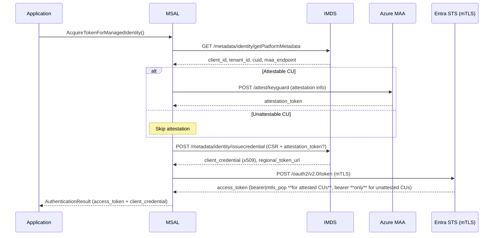

# MSAL MSI V2 /issuecredential Endpoint high level design document

## Overview

This document provides high level guidance for SDK developers to implement MSI V2 `/issuecredential` endpoint support. It focuses on the **token acquisition process**, ensuring seamless interactions with Managed Identity Resource Providers (MIRPs) on **Azure Virtual Machines (VMs) and Virtual Machine Scale Sets (VMSS)**.

## Goals

The primary objective is to enable seamless token acquisition in MSI V2 for VM/VMSS, utilizing the new `/issuecredential` endpoint.

- Define the **MSI V2 token acquisition process**.
- Describe how MSAL interacts with the `/issuecredential` and the ESTS regional token endpoint.
- Ensure compatibility with **Windows and Linux** VMs and VMSS.

## Token Acquisition Process

In **MSI V1**, IMDS or any other Managed Identity Resource Provider (MIRP) directly returns an **access token**. However, in **MSI V2**, the process involves two steps:



### The new CSR + Attested flow 

- MSAL needs to create a CSR with a sourced key 
- Azure RP will provide a `getPlatformMetadata` which will provide the info needed to create the CSR.
- MSAL will source a key from CredentialGuard (where available) or in-memory to form the CSR
- For keys from CredentialGuard, MSAL will perform a key attestation with MAA (Microsoft Attestation Service)
- MSAL will then send the CSR and the attestation token (where applicable) to the MIRP 

### Certificate Retrieval from `/issuecredential` Endpoint

- Azure Managed Identity Resource Providers host the `/issuecredential` endpoint.
- The client (MSAL) calls the `/issuecredential` endpoint to retrieve a **Certificate** by providing a CSR (Certificate Signing Request).
- This certificate is valid only for 7 days.
- Azure RP will also provide a `getPlatformMetadata` which will provide the info needed to create the CSR.
 
### Access Token Acquisition via ESTS

- The client presents the **certificate** to **ESTS** over **MTLS**.
- ESTS validates the certificate and issues an **access token**.
- The access token is then used to authenticate with Azure services.
- The access token can be bearer / pop depending upon the key that was sourced. 

## Certificate Handling

To start the flow, MSAL requires a certificate. MSAL follows these steps:

1. **Check for an existing certificate (Windows only)**: MSAL looks for a platform certificate (`devicecert.mtlsauth.local`) in the given Azure resource (In both local machine and local user store). 
2. **Create a new certificate, if none is found**: If a platform certificate is not available, MSAL generates one (self signed) for authentication.
3. **Linux Only**: MSAL will always generate a self signed certificate on Linux.

## Source Detection Logic

MSAL follows a source detection process to determine how to interact with MSI endpoints and acquire tokens.

### Environment Variable Check

MSAL checks for Azure resource type based on specific environment variables to determine if the application is running on:

- **Service Fabric**
- **App Service**
- **Machine Learning**
- **Cloud Shell**
- **Azure Arc**

If identified, MSAL will use the appropriate legacy MSI endpoint for that resource.

### Fallback to IMDS

- If no specific Azure resource is identified from the environment variables, MSAL will fall back to IMDS (VMs and VMSS).
- This fallback is the MSI v1 design or the legacy fallback mechanism.
- In this new MSI v2 design, Before fully falling back to IMDS, MSAL will now **probe for the IssueCredential Endpoint**.
- MSAL probes to see if the `/issuecredential` endpoint exists.
- If the `/issuecredential` endpoint is unavailable, it falls back to the legacy `/token` endpoint.
- If probe is succesful then we can assume the current Azure Resource is a VM/VMSS or supports the new MSI V2 flow.

## MSI V2 /credential Endpoint Details

### Certificate Retrieval

- The `/issuecredential` endpoint provides a **certificate** instead of an access token.
- This certificate is only valid for 7 days and must be used **over MTLS** to acquire an access token from ESTS.
- ESTS uses the MTLS cert as the credential
- This mechanism improves security by reducing the lifetime of sensitive authentication materials.

### Retry Logic

MSAL uses the **default Managed Identity [retry](https://github.com/AzureAD/microsoft-authentication-library-for-dotnet/blob/651b71c7d1dcaf3261e598e01e017dfd3672bb25/src/client/Microsoft.Identity.Client/Http/HttpManagerFactory.cs#L28) policy** for MSI V2 credential/token requests, whether calling the ESTS endpoint or the new `/issuecredential` endpoint. i.e. MSAL performs 3 retries with a 1 second pause between each retry. Retries are performed on certain error [codes](https://github.com/AzureAD/microsoft-authentication-library-for-dotnet/blob/651b71c7d1dcaf3261e598e01e017dfd3672bb25/src/client/Microsoft.Identity.Client/Http/HttpRetryCondition.cs#L12) only.

## Steps for MSI V2 Authentication

This section outlines the necessary steps to acquire an access token using the MSI V2 `/issuecredential` endpoint. 

### 1. Retrieve Platform Metadata

`GET /metadata/identity/getPlatformMetadata?api-version=2025-05-01&cid={CUID}&uaid={client_id}`

Response supplies the UAID/client_id, tenant_id, CUID, and (for attestable VMs) the regional MAA endpoint

### 2. Generate / Load Key & CSR

MSAL will load a pre-exisitng key, if none available MSAL will try creating one in KSP (Key Storage Provider) 

| OS                     | Key Store        | Persistence       |
|------------------------|------------------|-------------------|
| Windows (attested)     | KeyGuard KSP     | Durable           |
| Windows (unattested)   | Software KSP     | Durable           |
| Linux                  | In-memory → KMPP (future) | Process-lifetime |

#### CSR requirements

- **Subject:** `CN={client_id}, DC={tenant_id}`
- **Attribute OID 1.2.840.113549.1.9.7:** `PrintableString = {CUID}`
- **Signed with:** new key (`RSA 2048` / `EC P-256`)

#### (Optionally) Attest Key

If they Key is from KeyGuard, MSAL will then get an attestation token for this key. 

#### Request Certificate

```http
POST /metadata/identity/issuecredential?cid={CUID}&uaid={client_id}&api-version=2025-05-01 HTTP/1.1
Content-Type: application/json

{
  "csr": "<Base64 CSR>",
  "attestation_token": "<jwt>" // Optional on unattested compute units
}
```

#### Acquire Entra Token

MSAL will then call ESTS-R to get an access token

`POST {regional_token_url}/{tenant_id}/oauth2/v2.0/token (mTLS)`

```
grant_type=client_credentials
client_id=<UAID>
scope=https://management.azure.com/.default
token_type=mtls_pop   // **Only valid for attested CUs**; omit (default bearer) for unattested
```
Response identical to AAD v2 but may include token_type":"mtls_pop".

#### Certificate Creation Requirements
- **Subject Name:** CN=mtls-auth (subject name not final).
- **Validity Period:** 7 days.
- **Key Export Policy:** Private key must be exportable to allow use for MTLS authentication.
- **Key Usage must include:** Digital Signature, Key Encipherment and TLS Client Authentication.
- **Storage:** The certificate will be stored in the certificate store. 

#### Certificate Rotation Strategy
- **Track Expiry:** The expiration of the certificate must be monitored at runtime.
- **Rotation Trigger:** 3 days before expiry

## End-to-End Script

```powershell
# Define certificate subject names
$searchSubject = "CN=devicecert.mtlsauth.local"  # Existing cert to look for
$newCertSubject = "CN=mtls-auth"  # Subject for new self-signed cert

# Step 1: Search for an existing certificate in LocalMachine\My
$cert = Get-ChildItem -Path "Cert:\LocalMachine\My" | Where-Object { $_.Subject -eq $searchSubject -and $_.NotAfter -gt (Get-Date) }

# Step 2: If not found, search in CurrentUser\My
if (-not $cert) {
    Write-Output "🔍 No valid certificate found in LocalMachine\My. Checking CurrentUser\My..."
    $cert = Get-ChildItem -Path "Cert:\CurrentUser\My" | Where-Object { $_.Subject -eq $searchSubject -and $_.NotAfter -gt (Get-Date) }
}

# Step 3: If found, use it
if ($cert) {
    Write-Output "✅ Found valid certificate: $($cert.Subject)"
} else {
    Write-Output "❌ No valid certificate found in both stores. Creating a new self-signed certificate in `CurrentUser\My`..."

    # Step 4: Generate a new self-signed certificate in `CurrentUser\My`
    # For POC we are creating the cert in the user store. But in Product this will be a in-memory cert
    $cert = New-SelfSignedCertificate `
        -Subject $newCertSubject `
        -CertStoreLocation "Cert:\CurrentUser\My" `
        -KeyExportPolicy Exportable `
        -KeySpec Signature `
        -KeyUsage DigitalSignature, KeyEncipherment `
        -TextExtension @("2.5.29.37={text}1.3.6.1.5.5.7.3.2") `
        -NotAfter (Get-Date).AddDays(90)

    Write-Output "✅ Created certificate in CurrentUser\My: $($cert.Thumbprint)"
}

# Ensure `$cert` is valid
if (-not $cert) {
    Write-Error "❌ No certificate found or created. Exiting."
    exit
}

# Step 5: Compute SHA-256 of the Public Key for `kid`
$publicKeyBytes = $cert.GetPublicKey()
$sha256 = New-Object System.Security.Cryptography.SHA256Managed
$certSha256 = [BitConverter]::ToString($sha256.ComputeHash($publicKeyBytes)) -replace "-", ""

Write-Output "🔐 Using SHA-256 Certificate Identifier (kid): $certSha256"

# Step 6: Convert certificate to Base64 for JWT (x5c field)
$x5c = [System.Convert]::ToBase64String($cert.RawData)
Write-Output "📜 x5c: $x5c"

# Step 7: Construct the JSON body properly
$bodyObject = @{
    cnf = @{
        jwk = @{
            kty = "RSA"
            use = "sig"
            alg = "RS256"
            kid = $certSha256  # Use SHA-256 instead of Thumbprint
            x5c = @($x5c)  # Ensures correct array formatting
        }
    }
    latch_key = $false  # Final version of the product should not have this. IMDS team is working on removing this. 
}

# Convert JSON object to a string
$body = $bodyObject | ConvertTo-Json -Depth 10 -Compress
Write-Output "🔹 JSON Payload: $body"

# Step 8: Request MSI credential
$headers = @{
    "Metadata" = "true"
    "X-ms-Client-Request-id" = [guid]::NewGuid().ToString()
}

$imdsResponse = Invoke-WebRequest -Uri "http://169.254.169.254/metadata/identity/credential?cred-api-version=1.0" `
    -Method POST `
    -Headers $headers `
    -Body $body

$jsonContent = $imdsResponse.Content | ConvertFrom-Json

$regionalEndpoint = $jsonContent.regional_token_url + "/" + $jsonContent.tenant_id + "/oauth2/v2.0/token"
Write-Output "✅ Using Regional Endpoint: $regionalEndpoint"

# Step 9: Authenticate with Azure
$tokenHeaders = @{
    "Content-Type" = "application/x-www-form-urlencoded"
    "Accept" = "application/json"
}

$tokenRequestBody = "grant_type=client_credentials&scope=https://management.azure.com/.default&client_id=$($jsonContent.client_id)&client_assertion=$($jsonContent.credential)&client_assertion_type=urn:ietf:params:oauth:client-assertion-type:jwt-bearer"

try {
    $tokenResponse = Invoke-WebRequest -Uri $regionalEndpoint `
        -Method POST `
        -Headers $tokenHeaders `
        -Body $tokenRequestBody `
        -Certificate $cert  # Use the full certificate object

    $tokenJson = $tokenResponse.Content | ConvertFrom-Json
    Write-Output "🔑 Access Token: $($tokenJson.access_token)"
} catch {
    Write-Error "❌ Failed to retrieve access token. Error: $_"
}
```

## Summary of New APIs on Managed Identity Builder

| API Name                         | Purpose                                                                            |
|----------------------------------|------------------------------------------------------------------------------------|
| `GetBindingCertificate()`        | Helper method to get the binding certificate when a credential endpoint exist.     |
| `GetManagedIdentitySourceAsync()`| Helper method to get the managed identity source.                                  |
| `WithCorrelationID(GUID id)`     | Sets the correlation id for the managed identity requests (v2 source only)         |    

## Client-Side Telemetry

To improve observability and diagnostics of Managed Identity (MSI) scenarios within MSAL, we propose introducing a **new telemetry counter** named `MsalMsiCounter`. This counter will be incremented (or otherwise recorded) whenever MSI token acquisition activities occur, capturing the most relevant context in the form of tags.

### Counter Name
- **`MsalMsiCounter`**

### Tags
Each time we increment `MsalMsiCounter`, we include the following tags:

1. **MsiSource**  
   Describes which MSI path or resource is used.  
   - Possible values: `"AppService"`, `"CloudShell"`, `"AzureArc"`, `"ImdsV1"`, `"ImdsV2"`, `"ServiceFabric"`

2. **TokenType**  
   Specifies the type of token being requested or used.  
   - Possible values: `"Bearer"`, `"POP"`, `"mtls_pop"`

3. **bypassCache**  
   Indicates whether the MSAL cache was intentionally bypassed.  
   - Possible values: `"true"`, `"false"`

4. **CertType**  
   Identifies which certificate was used during the MSI V2 flow.  
   - Possible values: `"Platform"`, `"inMemory"`, `"UserProvided"`

5. **CredentialOutcome**  
   If using the `/credential` endpoint (ImdsV2) log the outcome.  
   - Not found
   - Retry Failed
   - Retry Succeeded
   - Success

6. **MsalVersion**  
   The MSAL library version in use.  
   - Example: `"4.51.2"`

7. **Platform**  
   The runtime/OS environment.  
   - Examples: `"net6.0-linux"`, `"net472-windows"`

## Related Documents

- **[SLC Design Document](https://microsoft.sharepoint.com/:w:/t/AzureMSI/EURnTEtFXPlDngpYhCUioqUBvbSUWEX7vZjP0nm8bxUsQA?e=Ejok1n&wdLOR=cE6820299-49AF-4D7A-B7F7-F58D65C232B6)**
- **[MSAL EPIC](https://identitydivision.visualstudio.com/Engineering/_workitems/edit/3027078)**

## Glossary

- **MSAL (Microsoft Authentication Library):** SDK for authentication with Azure AD.
- **IMDS (Instance Metadata Service):** Metadata service for Azure VMs.
- **PoP (Proof of Possession) Token:** Token tied to a specific key.
- **SAMI (System Assigned Managed Identity):** Auto-managed identity for Azure resources.
- **UAMI (User Assigned Managed Identity):** Manually created and assigned identity.

This specification serves as a reference for SDK developers integrating MSI V2 features into MSAL.
