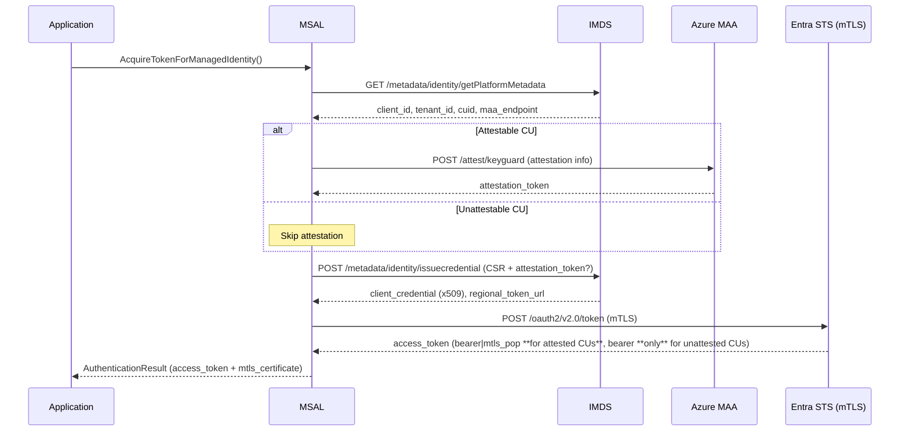

# MSAL MSI V2 /issuecredential Endpoint high level design document

## Overview

This document provides high level guidance for SDK developers to implement MSI V2 `/issuecredential` endpoint support. It focuses on the **token acquisition process**, ensuring seamless interactions with Managed Identity Resource Providers (MIRPs) on **Azure Virtual Machines (VMs) and Virtual Machine Scale Sets (VMSS)**.

## Goals

The primary objective is to enable seamless token acquisition in MSI V2 for VM/VMSS, utilizing the new `/issuecredential` endpoint.

- Define the **MSI V2 token acquisition process**.
- Describe how MSAL interacts with the `/issuecredential` and the ESTS regional token endpoint.
- Ensure compatibility with **Windows and Linux** VMs and VMSS.

## Token Acquisition Process

In **MSI V1**, IMDS or any other Managed Identity Resource Provider (MIRP) directly returns an **access token**. However, in **MSI V2**, the process involves few more steps:



### The new CSR + Attested flow 

- MSAL needs to create a CSR (Certificate Signing Request) with a sourced key.
- Azure RP will add a new `PlatformMetadata` endpoint which will provide the info needed to create the CSR.
- MSAL will source a key from CredentialGuard (where available) or in-memory to form the CSR
- For keys from CredentialGuard, MSAL will perform a key attestation with MAA (Microsoft Attestation Service) - POP only
- MSAL will then send the CSR and the attestation token (where applicable) to the MIRP 

### Certificate Retrieval from `/issuecredential` Endpoint

- Azure Managed Identity Resource Providers host the `/issuecredential` endpoint.
- The client (MSAL) calls the `/issuecredential` endpoint to retrieve a **Certificate** by providing a CSR.
- This certificate is valid only for 7 days.
- Azure RP will also provide a `getPlatformMetadata` which will provide the info needed to create the CSR.
 
### Access Token Acquisition via ESTS

- The client (MSAL) presents the **certificate** to **ESTS** over **MTLS**.
- ESTS validates the certificate and issues an **access token**.
- The access token is then used to authenticate with Azure services.
- The access token can be bearer / pop depending upon the key that was sourced.
- MSAL will then return the access token and the certificate obtained from MIRP back to the caller.
- The caller will need to use the access token to call the target resource over mTLS using the cert. 

## Certificate Handling

To start the flow, MSAL requires a certificate. MSAL follows these steps:

1. **Check for an existing certificate (Windows only)**: MSAL looks for a certificate (`devicecert.mtlsauth.local`) in the given Azure resource (In the local user store). 
2. **Create a new certificate, if none is found**: If a certificate is not available, MSAL generates one (self signed) for authentication.

## Source Detection Logic

MSAL follows a source detection process to determine how to interact with MSI endpoints and acquire tokens.

### Environment Variable Check

MSAL checks for Azure resource type based on specific environment variables to determine if the application is running on:

- **Service Fabric**
- **App Service**
- **Machine Learning**
- **Cloud Shell**
- **Azure Arc**

If identified, MSAL will use the appropriate legacy MSI endpoint for that resource.

### Fallback to IMDS

- If no specific Azure resource is identified from the environment variables, MSAL will fall back to IMDS (VMs and VMSS).
- This fallback is the MSI v1 design or the legacy fallback mechanism.
- In this new MSI v2 design, Before fully falling back to IMDS, MSAL will now **probe for the IssueCredential Endpoint**.
- MSAL probes to see if the `/issuecredential` endpoint exists.
- If the `/issuecredential` endpoint is unavailable, it falls back to the legacy `/token` endpoint.
- If probe is succesful then we can assume the current Azure Resource is a VM/VMSS or supports the new MSI V2 flow.

> Note - for the probe, either the `issuecredential` or the `platformmetadata` endpoint can be used.

## MSI V2 /credential Endpoint Details

### Certificate Retrieval

- The `/issuecredential` endpoint provides a **certificate** instead of an access token.
- This certificate is only valid for 7 days and must be used **over MTLS** to acquire an access token from ESTS.
- ESTS uses the MTLS cert as the credential and exchanges the certificate for an access token.
- This mechanism improves security by reducing the lifetime of sensitive authentication materials.

### Retry Logic

MSAL uses the **default Managed Identity [retry](https://github.com/AzureAD/microsoft-authentication-library-for-dotnet/blob/651b71c7d1dcaf3261e598e01e017dfd3672bb25/src/client/Microsoft.Identity.Client/Http/HttpManagerFactory.cs#L28) policy** for MSI V2 credential/token requests, whether calling the ESTS endpoint or the new `/issuecredential` endpoint. i.e. MSAL performs 3 retries with a 1 second pause between each retry. Retries are performed on certain error [codes](https://github.com/AzureAD/microsoft-authentication-library-for-dotnet/blob/651b71c7d1dcaf3261e598e01e017dfd3672bb25/src/client/Microsoft.Identity.Client/Http/HttpRetryCondition.cs#L12) only.

## Steps for MSI V2 Authentication

This section outlines the necessary steps to acquire an access token using the MSI V2 `/issuecredential` endpoint. 

### 1. Retrieve Platform Metadata

`GET /metadata/identity/getPlatformMetadata?api-version=2025-05-01&cid={CUID}&uaid={client_id}`

Response supplies the UAID/client_id, tenant_id, CUID, and (for attestable VMs) the regional MAA endpoint

### 2. Generate / Load Key & CSR

MSAL will load a pre-exisitng key, if none available MSAL will try creating one in KSP (Key Storage Provider) 

| OS                     | Key Store        | Persistence       |
|------------------------|------------------|-------------------|
| Windows (attested)     | KeyGuard KSP     | Durable           |
| Windows (unattested)   | Software KSP     | Durable           |
| Linux                  | In-memory → KMPP (future) | Process-lifetime |

#### CSR requirements

- **Subject:** `CN={client_id}, DC={tenant_id}`
- **Attribute OID 1.2.840.113549.1.9.7:** `PrintableString = {CUID}`
- **Signed with:** new key (`RSA 2048` / `EC P-256`)

#### (Optionally) Attest Key

If they Key is from KeyGuard, MSAL will then get an attestation token for this key. 

#### Request Certificate

```http
POST /metadata/identity/issuecredential?cid={CUID}&uaid={client_id}&api-version=2025-05-01 HTTP/1.1
Content-Type: application/json

{
  "csr": "<Base64 CSR>",
  "attestation_token": "<jwt>" // Optional on unattested compute units
}
```

#### Acquire Entra Token

MSAL will then call ESTS-R to get an access token

`POST {regional_token_url}/{tenant_id}/oauth2/v2.0/token (mTLS)`

```
grant_type=client_credentials
client_id=<UAID>
scope=https://management.azure.com/.default
token_type=mtls_pop   // **Only valid for attested CUs**; omit (default bearer) for unattested
```
Response identical to AAD v2 but may include token_type":"mtls_pop".

#### Certificate Rotation Strategy
- **Track Expiry:** The expiration of the certificate must be monitored at runtime.
- **Rotation Trigger:** 3 days before expiry

## End-to-End Script

```powershell
<#
.SYNOPSIS
    Offline-friendly PowerShell proof‑of‑concept for the **Managed Identity v2 /issuecredential** flow.

.DESCRIPTION
    • When **-Mock** is supplied (or when IMDS is unreachable) the script fabricates realistic
      JSON responses so you can validate the end‑to‑end logic with *no Azure resources*.
    • Otherwise the script calls live IMDS/MAA/ESTS endpoints on a VM/VMSS that supports MI v2.

.PARAMETERS
    -Scope        Resource scope (default: ARM).
    -Unattested   Skip attestation token; forces bearer token.
    -Mock         Use mocked responses (auto‑fallback if IMDS is not reachable).

.NOTES
    Tested on Windows PowerShell 5.1 & PowerShell 7.x
#>

param(
    [string]$Scope = "https://management.azure.com/.default",
    [switch]$Unattested,
    [switch]$Mock
)

# Helper: console coloring (use ASCII hyphens)
function Info($msg) { Write-Host "[INFO] $msg" -ForegroundColor Cyan }
function Warn($msg) { Write-Host "[WARN] $msg" -ForegroundColor Yellow }
function Err ($msg) { Write-Host "[ERR ] $msg" -ForegroundColor Red }
function Throw-IfError($resp, [string]$step) {
    if ($null -ne $resp -and $resp.StatusCode -ge 400) {
        Err "[$step] HTTP $($resp.StatusCode) – $($resp.StatusDescription)"; exit 2
    }
}

$ErrorActionPreference = 'Stop'

# ------------------------------------------------------------
# 1. Platform metadata (auto‑mock if unreachable)
# ------------------------------------------------------------
try {
    if (-not $Mock) {
        $metaUri  = "http://169.254.169.254/metadata/identity/getPlatformMetadata?api-version=2025-05-01"
        $metaResp = Invoke-WebRequest -Uri $metaUri -Headers @{ Metadata = 'true' } -UseBasicParsing -TimeoutSec 3
        Throw-IfError $metaResp 'getPlatformMetadata'
        $metaObj  = $metaResp.Content | ConvertFrom-Json
    }
} catch {
    Warn "IMDS unreachable – switching to mock mode."; $Mock = $true
}

if ($Mock) {
    $metaObj = [pscustomobject]@{
        client_id            = [guid]::NewGuid().Guid
        tenant_id            = [guid]::NewGuid().Guid
        CUID                 = [guid]::NewGuid().Guid
        attestation_endpoint = if ($Unattested) { $null } else { "https://mock.maa.contoso.com" }
    }
    Info "Generated mock platform metadata."
}

$clientId = $metaObj.client_id
$tenantId = $metaObj.tenant_id
$cuid     = $metaObj.CUID
$maaEp    = $metaObj.attestation_endpoint

Info "client_id = $clientId"
Info "tenant_id = $tenantId"
Info "CUID      = $cuid"

# ------------------------------------------------------------
# 2. Key / certificate for CSR
# ------------------------------------------------------------
$subject  = "CN=$clientId, DC=$tenantId"
$certPath = "Cert:\\CurrentUser\\My"
$existing = Get-ChildItem $certPath | Where-Object Subject -eq $subject
if ($existing) {
    Info "Reusing existing key for $subject"; $keyCert = $existing
} else {
    Info "Creating new RSA-2048 key for $subject"
    $keyCert = New-SelfSignedCertificate -Subject $subject -KeyExportPolicy Exportable -KeySpec Signature -KeyAlgorithm RSA -KeyLength 2048 -KeyUsage DigitalSignature,KeyEncipherment -CertStoreLocation $certPath
}

# ------------------------------------------------------------
# 3. Build CSR with CUID attribute
# ------------------------------------------------------------
# Compatible across PS versions / older .NET
$rsa = [System.Security.Cryptography.X509Certificates.RSACertificateExtensions]::GetRSAPrivateKey($keyCert)
$csrReq   = [System.Security.Cryptography.X509Certificates.CertificateRequest]::new($subject, $rsa, [System.Security.Cryptography.HashAlgorithmName]::SHA256, [System.Security.Cryptography.RSASignaturePadding]::Pkcs1)
$oid      = [System.Security.Cryptography.Oid]::new("1.2.840.113549.1.9.7")
$attrExt = [System.Security.Cryptography.X509Certificates.X509Extension]::new($oid, [System.Text.Encoding]::ASCII.GetBytes($cuid), $false)
$csrReq.CertificateExtensions.Add($attrExt)
$csrBytes  = $csrReq.CreateSigningRequest()
$csrBase64 = [Convert]::ToBase64String($csrBytes)
Info "CSR ready (len=$($csrBytes.Length))"

# ------------------------------------------------------------
# 4. Attestation token (mock or real)
# ------------------------------------------------------------
$attToken = $null
if (-not $Unattested) {
    if ($Mock) {
        $attToken = "eyMock.Token"; Info "Mock attestation token generated."
    } elseif ($maaEp) {
        Info "Requesting attestation token from $maaEp …"
        $maaResp = Invoke-WebRequest -Uri "$maaEp/attest/keyguard?api-version=2023-04-01-preview" -Method POST -Body (@{ AttestationInfo = '<bin>' } | ConvertTo-Json -Compress) -ContentType 'application/json'
        Throw-IfError $maaResp 'attest/keyguard'
        $attToken = ($maaResp.Content | ConvertFrom-Json).token
    }
}

# ------------------------------------------------------------
# 5. /issuecredential (mock or real)
# ------------------------------------------------------------
if ($Mock) {
    Info "Generating mock MI credential locally."
    $clientCredential = [Convert]::ToBase64String($keyCert.RawData)
    $regionalTokenUrl = "https://eastus2.mock.mtlsauth.microsoft.com"
} else {
    $issueUri  = "http://169.254.169.254/metadata/identity/issuecredential?api-version=2025-05-01&cid=$cuid&uaid=$clientId"
    $issueHdr  = @{ Metadata = 'true'; 'X-ms-Client-Request-id' = [guid]::NewGuid() }
    $bodyObj   = @{ csr = $csrBase64 }; if ($attToken) { $bodyObj.attestation_token = $attToken }
    $issueResp = Invoke-WebRequest -Uri $issueUri -Method POST -Headers $issueHdr -Body ($bodyObj | ConvertTo-Json -Compress) -ContentType 'application/json'
    Throw-IfError $issueResp 'issuecredential'
    $cred      = $issueResp.Content | ConvertFrom-Json
    $clientCredential = $cred.client_credential
    $regionalTokenUrl = $cred.regional_token_url
}

# Import credential certificate for mTLS (mock → reuse keyCert)
if ($Mock) { $miCert = $keyCert }
else {
    $miCert = [System.Security.Cryptography.X509Certificates.X509Certificate2]::new([Convert]::FromBase64String($clientCredential), $null, [System.Security.Cryptography.X509Certificates.X509KeyStorageFlags]::MachineKeySet)
}
Info "MI credential thumbprint = $($miCert.Thumbprint)"

# ------------------------------------------------------------
# 6. Token request (mock or real)
# ------------------------------------------------------------
if ($Mock) {
    $tokenJson = [pscustomobject]@{ access_token = "mock_access_token"; expires_in = 3600 }
    Info "Mock access token generated."
} else {
    $regional = "$regionalTokenUrl/$tenantId/oauth2/v2.0/token"
    $bodyStr  = "grant_type=client_credentials&scope=$([Uri]::EscapeDataString($Scope))&client_id=$clientId"
    if (-not $Unattested) { $bodyStr += "&token_type=mtls_pop" }
    $tokResp  = Invoke-WebRequest -Uri $regional -Method POST -Body $bodyStr -Headers @{ 'Accept'='application/json'; 'Content-Type'='application/x-www-form-urlencoded' } -Certificate $miCert
    Throw-IfError $tokResp 'token'
    $tokenJson = $tokResp.Content | ConvertFrom-Json
}

$kind = if ($Unattested) { 'Bearer' } else { 'mTLS-PoP' }
Info "$kind token acquired – expires_in = $($tokenJson.expires_in)s"
```

## Summary of New APIs on Managed Identity Builder

| API Name                         | Purpose                                                                            |
|----------------------------------|------------------------------------------------------------------------------------|
| `GetBindingCertificate()`        | Helper method to get the binding certificate when a credential endpoint exist.     |
| `GetManagedIdentitySourceAsync()`| Helper method to get the managed identity source.                                  |
| `WithCorrelationID(GUID id)`     | Sets the correlation id for the managed identity requests (v2 source only)         |    

## Client-Side Telemetry

To improve observability and diagnostics of Managed Identity (MSI) scenarios within MSAL, we propose introducing a **new telemetry counter** named `MsalMsiCounter`. This counter will be incremented (or otherwise recorded) whenever MSI token acquisition activities occur, capturing the most relevant context in the form of tags.

### Counter Name
- **`MsalMsiCounter`**

### Tags
Each time we increment `MsalMsiCounter`, we include the following tags:

1. **MsiSource**  
   Describes which MSI path or resource is used.  
   - Possible values: `"AppService"`, `"CloudShell"`, `"AzureArc"`, `"ImdsV1"`, `"ImdsV2"`, `"ServiceFabric"`

2. **TokenType**  
   Specifies the type of token being requested or used.  
   - Possible values: `"Bearer"`, `"POP"`, `"mtls_pop"`

3. **bypassCache**  
   Indicates whether the MSAL cache was intentionally bypassed.  
   - Possible values: `"true"`, `"false"`

4. **CertType**  
   Identifies which certificate was used during the MSI V2 flow.  
   - Possible values: `"Platform"`, `"inMemory"`, `"UserProvided"`

5. **CredentialOutcome**  
   If using the `/credential` endpoint (ImdsV2) log the outcome.  
   - Not found
   - Retry Failed
   - Retry Succeeded
   - Success

6. **MsalVersion**  
   The MSAL library version in use.  
   - Example: `"4.51.2"`

7. **Platform**  
   The runtime/OS environment.  
   - Examples: `"net6.0-linux"`, `"net472-windows"`

## Related Documents

- **[SLC Design Document](https://microsoft.sharepoint.com/:w:/t/AzureMSI/EURnTEtFXPlDngpYhCUioqUBvbSUWEX7vZjP0nm8bxUsQA?e=Ejok1n&wdLOR=cE6820299-49AF-4D7A-B7F7-F58D65C232B6)**
- **[MSAL EPIC](https://identitydivision.visualstudio.com/Engineering/_workitems/edit/3027078)**

## Glossary

- **MSAL (Microsoft Authentication Library):** SDK for authentication with Azure AD.
- **IMDS (Instance Metadata Service):** Metadata service for Azure VMs.
- **PoP (Proof of Possession) Token:** Token tied to a specific key.
- **SAMI (System Assigned Managed Identity):** Auto-managed identity for Azure resources.
- **UAMI (User Assigned Managed Identity):** Manually created and assigned identity.

This specification serves as a reference for SDK developers integrating MSI V2 features into MSAL.
