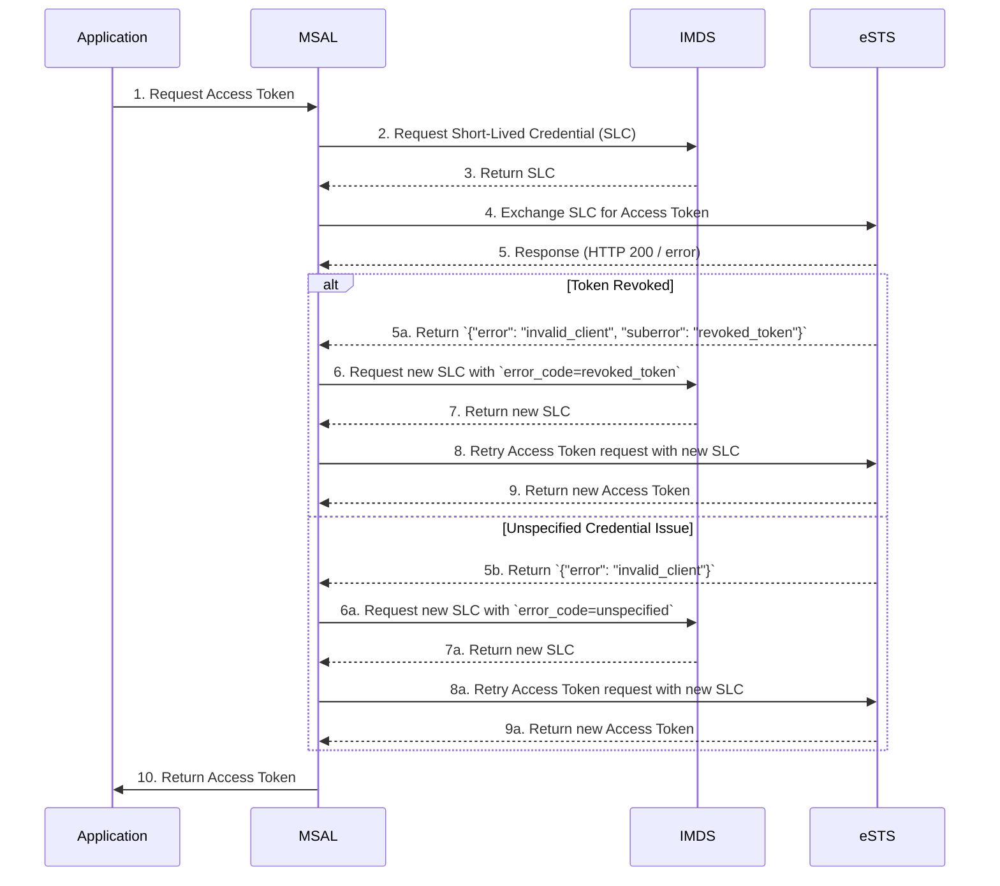
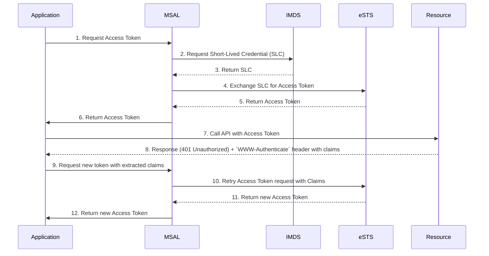

# Short-Lived Credential (SLC) Revocation Specification

## Overview

This document outlines the design and implementation details for short-lived credential (SLC) revocation in MSI V2 scenarios. 

In the MSI v2 authentication flow, MSAL first obtains a credential from IMDS and uses it to request a token from eSTS. In some cases, eSTS may respond with an error code indicating that the credential is no longer valid. When this occurs, MSAL must pass the error code back to IMDS to request a new credential before retrying the token request with eSTS. 





## SLC Revocation Scenarios

- **Revoked Token Scenario:** The token issued by an SLC has been revoked. In this case, Entra ID considers the SLC as invalid.

- **Unspecified Credential Issue Scenario:** When eSTS returns an invalid_client error without a suberror code, MSAL treats it as an unspecified credential issue.

- **Claims Challenge Scenario:** An API rejects an access token due to insufficient claims, requiring MSAL to retrieve a new token with the necessary claims.

## **eSTS Response to Indicate Specific Error**

| Scenario                         | eSTS/Resource Response                                                                                 |
|----------------------------------|--------------------------------------------------------------------------------------------------------|
| Revoked Token                    | `{ "error": "invalid_client", "suberror": "revoked_token" }`                                           |
| Unspecified Credential Issue     | `{ "error": "invalid_client" }`                                                                        |

## **Resource Token Rejection Scenario**

A resource may reject a token due to various reasons, such as token expiration, or security policy violations. When this occurs:

- The resource will respond with `insufficient_claims`.
- MSAL will detect the resource rejection based on the claims API.
- MSAL will call IMDS with `error_code=revoked_token` to obtain a fresh credential before making a new token request to eSTS.

## **MSAL Behavior to Relay the Signal to IMDS**

- MSAL can only determine that an `{ "error": "invalid_client" }` response is caused by a credential issue but cannot handle suberrors explicitly.
- For SLC-related errors, MSAL will retry obtaining a new SLC from IMDS and retry with eSTS.
- For claims challenges, MSAL does not get a signal from eSTS but rather from the app developer when passing claims to MSAL.
- MSAL will **relay the response to IMDS as-is**, ensuring support for future suberror codes without requiring modifications.

### **MSAL Pseudo Code Implementation**

```csharp
var tokenResponse = HttpClient.post("https://ests-r/token", clientCredential=currentSLC);

if (tokenResponse.get("error") == "invalid_client") {
    if (tokenResponse.get("suberror") != empty) {
        suberror = tokenResponse.get("suberror");
    } else {
        suberror = "unspecified";
    }
    currentSLC = HttpClient.post(
        "http://169.254.169.254/.../credential?...&error_code=" + suberror
    );
    
    tokenResponse = HttpClient.post("https://ests-r/token", clientCredential=currentSLC);
}

return tokenResponse;
```

## Acceptance Tests

### Test Scenarios and Expected Behavior

The following acceptance tests validate the behavior of MSAL when handling SLC revocation scenarios. Each test case ensures that MSAL correctly interacts with IMDS and eSTS when an invalid credential is detected.

| **Test Case**                         | **Description**                                                                                          | **Expected Outcome** |
|----------------------------------------|----------------------------------------------------------------------------------------------------------|----------------------|
| **Revoked Token Scenario**             | Simulate eSTS returning `{"error": "invalid_client", "suberror": "revoked_token"}` when MSAL requests a token. | MSAL calls IMDS with `error_code=revoked_token`, retrieves a new SLC, and retries the token request with eSTS. |
| **Unspecified Credential Issue**       | Simulate eSTS returning `{"error": "invalid_client"}` without a suberror.                                 | MSAL calls IMDS with `error_code=unspecified`, retrieves a new SLC, and retries the token request with eSTS. |
| **Claims Challenge Handling**          | Simulate an API rejecting an access token due to missing claims (`insufficient_claims`).                 | MSAL does not retry automatically; the app developer must pass claims, triggering a new token request. |
| **Successful Token Retry**             | Simulate eSTS initially rejecting the token but accepting a new token after IMDS issues a fresh SLC.     | MSAL successfully retries and obtains a valid token. |
| **IMDS Fails to Issue New Credential** | Simulate IMDS failing to provide a new SLC after receiving an `error_code` parameter.                    | MSAL logs an error and returns failure, ensuring that telemetry captures the failure reason. |
| **Telemetry Validation**               | Ensure `MsalMsiCounter` correctly logs telemetry tags such as `MsiSource`, `TokenType`, `bypassCache`, and `CredentialOutcome`. | Telemetry records correct values for each token acquisition attempt, including failures. |

## Client-Side Telemetry

To improve observability and diagnostics of Managed Identity (MSI) scenarios within MSAL, we propose introducing a **new telemetry counter** named `MsalMsiCounter`. This counter will be incremented (or otherwise recorded) whenever MSI token acquisition activities occur, capturing the most relevant context in the form of tags.

### Counter Name
- **`MsalMsiCounter`**

### Tags
Each time we increment `MsalMsiCounter`, we include the following tags:

1. **MsiSource**  
   Describes which MSI path or resource is used.  
   - Possible values: `"AppService"`, `"CloudShell"`, `"AzureArc"`, `"ImdsV1"`, `"ImdsV2"`, `"ServiceFabric"`

2. **TokenType**  
   Specifies the type of token being requested or used.  
   - Possible values: `"Bearer"`, `"POP"`, `"mtls_pop"`

3. **bypassCache**  
   Indicates whether the MSAL cache was intentionally bypassed.  
   - Possible values: `"true"`, `"false"`

4. **CertType**  
   Identifies which certificate was used during the MSI V2 flow.  
   - Possible values: `"Platform"`, `"inMemory"`, `"UserProvided"`

5. **CredentialOutcome**  
   If using the `/credential` endpoint (ImdsV2) log the outcome.  
   - Not found
   - Retry Failed
   - Retry Succeeded
   - Success

6. **MsalVersion**  
   The MSAL library version in use.  
   - Example: `"4.51.2"`

7. **Platform**  
   The runtime/OS environment.  
   - Examples: `"net6.0-linux"`, `"net472-windows"`
