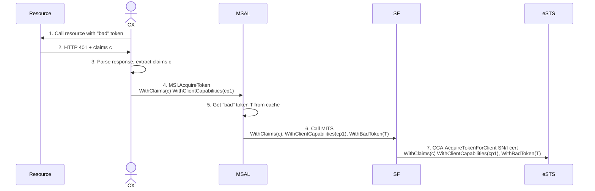

# Goal

This proposal captures the requirements for Service Fabric. 

Open question: Can we use the same approach for App Service ? Or for all MSIv1 sources (?) ?

## Proposed token revocation flow

At step 6, MSAL calls the SF endpoint (MITS) with 3 parameters: claims (from the CX), client capabilities (from the CX) and a SHA256 thumbprint of the bad token. The "bad token" comes from MSAL's cache. If a cached token doesn't exist, 

> [!Open Question]
> If a token isn't found in the cache, then MSAL will not relay the claims and client capabilties to MITS when requesting the token.

Service Fabric, on the RP side, will use `ConfidentialClientApplication` with an SN/I certificate to get a new token from eSTS. It will add the 3 parameters from the previous step. 

### New MSAL API proposed

To support Service Fabric, MSAL will add a new API to `AcquireTokenForClient` -  `.WithAccessTokenToRefresh(string thumbprintOfAccessTokenToRefresh)`. This can be extended to other flows too in the future.
This API will be in a namespace that indicates it is supposed to be used by RPs - `Microsoft.Identity.Client.Rp`

#### Behavior:

- MSAL will look in the cache first for a non-expired token. If it exists:
-- If it matches the "Bad" token thumbprint, then MSAL will ignore it and it will call eSTS for a new token, using the claims and client_capabilities.
-- If it doesn't match, it means that a new token was already updated. Return it (ignore the claims).
- If it doesn't exist, call eSTS with the claims and client_capabilities
