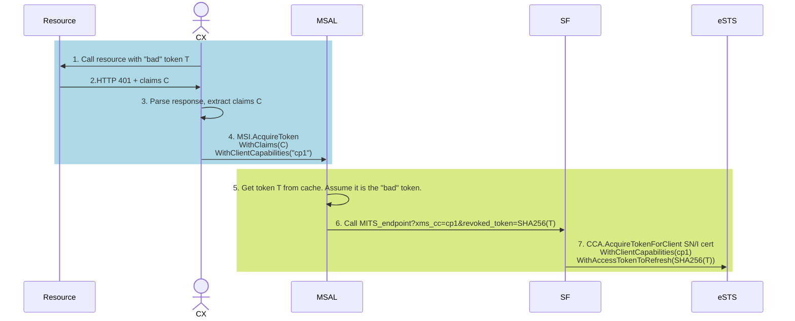
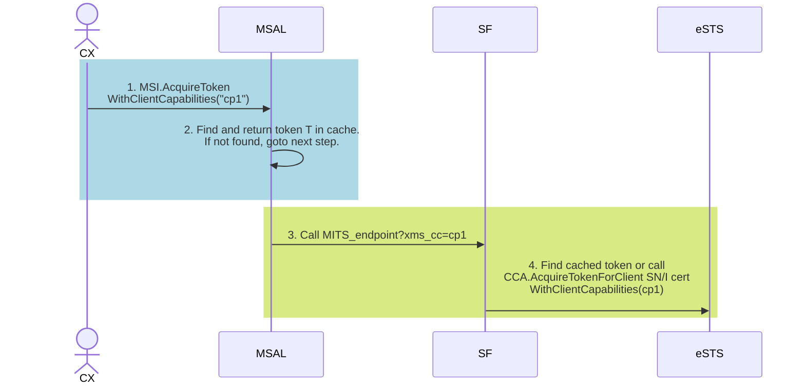

# MSAL Support for MSI v1 Token Revocation and Capabilities

---

## Goals

1. App developers and higher level SDKs like Azure SDK rely on the [CAE protocol](https://learn.microsoft.com/en-us/entra/identity-platform/app-resilience-continuous-access-evaluation?tabs=dotnet) for token revocation scenarios (`WithClaims`, `WithClientCapabilities`). 
1. RPs are enabled to perform token revocation.
1. A telemetry signal for eSTS exists to differentiate which apps are CAE enlightened.

## Flow diagram - revocation event

Steps 1-4 fall to the Client (i.e. application using MSI directly or higher level SDK like Azure KeyVault). This is the **standard CAE flow**.
Steps 5-7 are new and show how the RP propagates the revocation signal.

> [!NOTE]  
>  ClientCapabilities is an array of capabilities. In case the app developer sends multiple capabilities, these will be sent to the RP as `MITS_endpoint?xms_cc=cp1,cp2,cp3`. The RP MUST pass "cp1" (i.e. the CAE capabilitiy) if it is included.

## Flow diagram - non-revocation event

The client "enlightment" status is still propagated via the client capability "cp1".

### New MSAL API - WithAccessTokenToRefresh()

To support the RP, MSAL will add a new API for `ConfidentialClientApplication.AcquireTokenForClient` -  `.WithAccessTokenToRefresh(string thumbprintOfAccessTokenToRefresh)`. This may be extended to other flows too in the future.

This API will be in a namespace that indicates it is supposed to be used by RPs - `Microsoft.Identity.Client.RP`.

#### Behavior

- MSAL will look in the cache first, for a non-expired token. If it exists:
  - If it matches the "Bad" token SHA256 thumbprint, then MSAL will log this event, ignore the token, and get another token from the STS
  - If it doesn't match, it means that a new token was already updated. Return it.
- If it doesn't exist, call eSTS

#### Motivation

The *internal protocol* between the client and the RP (i.e. calling the MITS endpoint in case of Service Fabric), is a simplified version of CAE. This is because CAE is claims driven and involves JSON operations such as JSON doc merges. The RP doesn't need the actual claims to perform revocation, it just needs a signal to bypass the cache. As such, it was decided to not use the full claims value internally.

## End to End testing

Given the complexity of the scenario, it may not be easy to automate this. Here is the [guideline](https://microsoft.sharepoint.com/:w:/t/AzureMSI/ESBeuafJLZdNlSxkBKvjcswBD4FGVz0o6YJcf4mfDRSH-Q?e=2hJRUt).

## Reference

[Token Revocation docs](https://microsoft.sharepoint.com/:w:/t/AzureMSI/ETSZ_FUzbcxMrcupnuPC8r4BV0dFQrONe1NdjATd3IceLA?e=n72v65)
