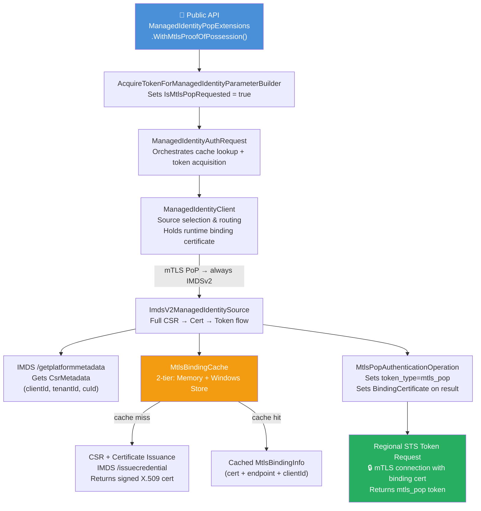
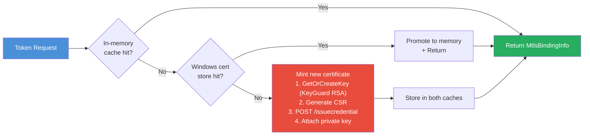
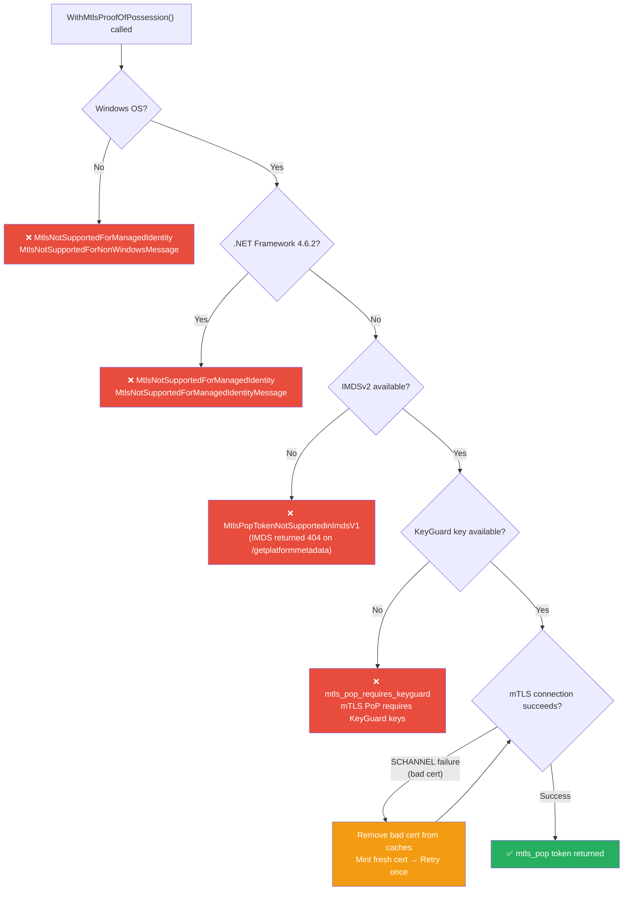

# MTLSPoP (Managed Identity) – Architecture Diagram

## Full Token Acquisition Flow

```mermaid
sequenceDiagram
    autonumber
    participant App as Your Application
    participant MSAL as MSAL.NET
    participant MIClient as ManagedIdentityClient
    participant IMDSv2 as ImdsV2ManagedIdentitySource
    participant CertCache as MtlsCertificateCache<br/>(Memory + Windows Store)
    participant IMDS as Azure IMDS<br/>(169.254.169.254)
    participant MAA as Microsoft Azure Attestation<br/>(MAA)
    participant STS as Regional STS<br/>(mtlsauth.microsoft.com)

    App->>MSAL: AcquireTokenForManagedIdentity(resource)<br/>.WithMtlsProofOfPossession()<br/>.ExecuteAsync()

    Note over MSAL: ManagedIdentityAuthRequest.ExecuteAsync()<br/>Check token cache first

    alt Token is in MSAL token cache (not expired)
        MSAL-->>App: Return cached AuthenticationResult<br/>(token_type=mtls_pop, BindingCertificate)
    else Cache miss — need a fresh token
        MSAL->>MIClient: SendTokenRequestForManagedIdentityAsync()
        MIClient->>IMDSv2: Route (mTLS PoP → always IMDSv2)

        rect rgb(230, 240, 255)
            Note over IMDSv2,IMDS: Step A — Get Platform Metadata
            IMDSv2->>IMDS: GET /metadata/identity/getplatformmetadata<br/>?cred-api-version=2.0<br/>Header: Metadata: true
            IMDS-->>IMDSv2: CsrMetadata<br/>{ clientId, tenantId, cuId, attestationEndpoint }
        end

        rect rgb(230, 255, 230)
            Note over IMDSv2,CertCache: Step B — Get or Mint Binding Certificate
            IMDSv2->>CertCache: GetOrCreateMtlsBindingAsync(cacheKey)

            alt Certificate is cached (memory or Windows store)
                CertCache-->>IMDSv2: MtlsBindingInfo<br/>{ Certificate, Endpoint, ClientId }
            else Cache miss — mint a new cert
                Note over IMDSv2: GetOrCreateKeyAsync() → KeyGuard RSA key
                Note over IMDSv2: Csr.Generate(key, clientId, tenantId, cuId)<br/>→ CSR (PEM) + private key

                opt KeyGuard key type + WithAttestationSupport() configured
                    Note over IMDSv2: GetAttestationJwtAsync()<br/>calls AttestationClientLib.dll (native)
                    IMDSv2->>MAA: POST {csrMetadata.attestationEndpoint}/attest/keyguard<br/>TPM logs + VBS evidence
                    MAA-->>IMDSv2: MAA JWT (proves key is hardware-backed)
                end

                IMDSv2->>IMDS: POST /metadata/identity/issuecredential<br/>Body: { csr: "&lt;raw base64, PEM headers stripped&gt;", attestation_token: MAA JWT or omitted }
                IMDS-->>IMDSv2: CertificateRequestResponse<br/>{ certificate (Base64 X.509),<br/>mtls_authentication_endpoint,<br/>client_id, tenant_id }

                Note over IMDSv2: Attach private key to certificate<br/>Store in memory + Windows cert store
                IMDSv2->>CertCache: Store MtlsBindingInfo
                CertCache-->>IMDSv2: MtlsBindingInfo<br/>{ Certificate, Endpoint, ClientId }
            end
        end

        rect rgb(255, 245, 220)
            Note over IMDSv2,STS: Step C — Acquire mTLS PoP Token
            IMDSv2->>STS: POST {regional_endpoint}/{tenantId}/oauth2/v2.0/token<br/>🔒 mTLS — binding certificate used for TLS handshake<br/>Body: { client_id, grant_type=client_credentials,<br/>scope=resource/.default, token_type=mtls_pop }
            STS-->>IMDSv2: Token response<br/>{ access_token, token_type="mtls_pop", expires_in }
        end

        Note over MSAL: Apply MtlsPopAuthenticationOperation<br/>Cache token (keyed by scope + attestation mode)<br/>Set AuthenticationResult.BindingCertificate
        MSAL-->>App: AuthenticationResult<br/>{ AccessToken (mtls_pop), BindingCertificate,<br/>TokenType="mtls_pop", ExpiresOn }
    end
```

---

## Component Relationships



---

## Certificate Cache Architecture



---

## Error Handling & Fallback


