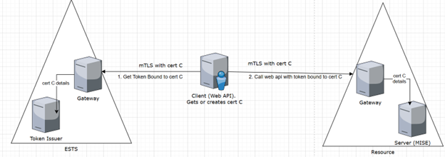

# Overview

Bearer tokens are vulnerable to theft. Proof-of-Possession (PoP) tokens mitigate this by binding tokens to a specific client certificate. mTLS PoP tokens enhance this security by using mutual TLS (mTLS) to ensure the token is tied to the certificate used for authentication.

## Key Points

- mTLS PoP tokens are compliant with [RFC 8705](https://datatracker.ietf.org/doc/html/rfc8705).
- Tokens are bound to certificates used in mTLS connections with both the ESTS and the resource server.

## SNI Certificate Scenario

[Subject Name Issuer (SNI)](https://review.learn.microsoft.com/en-us/azure-usage-billing/howto/emission-setup/sdk-auth-sni) certificates are issued by MSFT trusted certificate authorities ([OneCert](https://eng.ms/docs/products/onecert-certificates-key-vault-and-dsms/onecert-customer-guide/onecert/docs)) and provide a secure way to bind tokens to certificates. This method requires setting the `sendX5C` property when using MSAL.

## Token Flow

### Certificate Acquisition

1. The client sends an SNI certificate associated with a 1P application in the token request (cert C).
2. The certificate is used to establish mTLS with ESTS.

### Token Binding

1. ESTS uses the mTLS certificate also as the authentication certificate.
2. A token bound to cert C is issued by ESTS.

### API Call with Bound Token

- The client makes a call to the resource server using the token over mTLS with cert C.

## MSAL Design Details for SNI

### New API Additions

#### `WithMtlsProofOfPossession()` at CCA request level

- Adds support for mTLS PoP tokens and uses the certificate from the CCA application level `.WithCertificate(certificate, true)`.
- Token type will be `mtls_pop`.
- Grant Type will be `ClientCredentials`.
- Request **should not** contain `client_assertion_type` or `client_assertion`.

### Implementation Details

#### Developer Guidance for `WithMtlsProofOfPossession()`

##### Certificate Validation

- Ensure the certificate provided has a private key as part of the ClientCredential configuration.
- If a certificate is missing, MSAL will throw `MsalClientException` with the error `MsalError.MtlsCertificateNotProvided`.

##### Authority Type Validation

- Flow is applicable only to AAD and DSTS authorities.
- Unsupported authority types (e.g., B2C) will result in `MsalClientException` with the error `MsalError.InvalidAuthorityType`.

##### Authority URL Validation

- Avoid using `/common` in the authority URL. Use a tenanted authority instead.
- If `/common` is used, MSAL will throw `MsalClientException` with the error `MsalError.MissingTenantedAuthority`.

##### Azure Region Validation

- Specify the Azure region when using `WithMtlsProofOfPossession()`.
- If the region is missing, MSAL will throw `MsalClientException` with the error `MsalError.MtlsPopWithoutRegion`.
- Region is not required if the authority is DSTS.

##### Grant Type Validation

- Ensure the grant type is `ClientCredentials`.
- Do not include `client_assertion` or `client_assertion_type` parameters in the request.

##### `SendX5C` Setting

- Scenario is supported only when `X5C` is sent along with the certificate.

## Tests to Validate mTLS PoP Tokens

### Certificate Validation Tests

- Verify that `MsalClientException` is thrown when no certificate is provided.
- Ensure that the correct exception message (`MsalErrorMessage.MtlsCertificateNotProvidedMessage`) is returned.
- Ensure that the certificate has a private key when used in the `WithCertificate()` method.

### Authority Tests

- Test with a valid tenanted authority URL (e.g., `https://login.microsoftonline.com/tenant_id`).
- Ensure an exception (`MsalError.MissingTenantedAuthority`) is thrown for `/common` authority usage.
- Verify that unsupported authority types (e.g., B2C) throw `MsalError.InvalidAuthorityType`.

### Region Validation Tests

- Ensure `MsalClientException` is thrown when no region is set and `WithMtlsProofOfPossession()` is called.
- Validate successful token acquisition with a specified region.
- Test auto-detected region functionality and confirm the expected region is used.

### Token Acquisition Tests

- Ensure tokens are bound to the specified certificate and the token type is `mtls_pop`.
- Test caching behavior: validate that a token is retrieved from the cache on subsequent requests.

### Integration Tests

- Get token from ESTS using an mTLS certificate.
- Simulate calls to the resource server using mTLS and verify successful authentication. *(No resource support yet.)*
- Test telemetry data: validate that both client-side and server-side metrics are captured.

**Integration test should include:**

- User sets authority to `login.microsoftonline.com/tid` and `validateAuthority=true`.
- Specifies region `X`.
- Uses mTLS authentication.

Expected behavior:

1. MSAL validates the original authority.
2. MSAL calls the token endpoint on `mtlsauth.X.login.microsoft.com/tid/`.

## Note for Developers

When implementing this feature, ensure both client-side and server-side telemetry are captured for the new token type (`mtls_pop`). Telemetry should include:

- Token acquisition success and failure metrics.
- Certificate usage in the Client Credentials flow.
- Regional endpoint usage.

This telemetry will aid in diagnosing issues and optimizing performance.

## Appendix: References

- **[RFC 8705: Mutual TLS](https://tools.ietf.org/html/rfc8705)**
- **[API specifications](https://identitydivision.visualstudio.com/DevEx/_git/MiseDocumentation?path=/articles/using-mise/how-to-use-mtls-pop.md&version=GBmain)**
- **MSAL .NET Integration tests** *(Uses LabAuth Certificate)*
