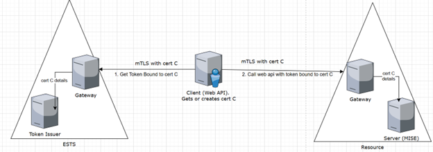

# Overview

Bearer tokens are vulnerable to theft. Proof-of-Possession (PoP) tokens mitigate this by binding tokens to a specific client certificate. mTLS PoP tokens enhance this security by using mutual TLS (mTLS) to ensure the token is tied to the certificate used for authentication.



## Key Points

- mTLS PoP tokens are compliant with [RFC 8705](https://datatracker.ietf.org/doc/html/rfc8705).
- Tokens are bound to certificates used in mTLS connections with both the ESTS and the resource server.

## SNI Certificate Scenario

[Subject Name Issuer (SNI)](https://review.learn.microsoft.com/en-us/azure-usage-billing/howto/emission-setup/sdk-auth-sni) certificates are issued by MSFT trusted certificate authorities ([OneCert](https://eng.ms/docs/products/onecert-certificates-key-vault-and-dsms/onecert-customer-guide/onecert/docs)) and provide a secure way to bind tokens to certificates. This method requires setting the `sendX5C` property when using MSAL.

## Token Flow

### Certificate Acquisition

1. The client sends an SNI certificate associated with a 1P application in the token request (cert C).
2. The certificate is used to establish mTLS with ESTS.

### Token Binding

1. ESTS uses the mTLS certificate also as the authentication certificate.
2. A token bound to cert C is issued by ESTS.

### API Call with Bound Token

- The client makes a call to the resource server using the token over mTLS with cert C.

## MSAL Design Details for SNI

### New API Additions

#### `WithMtlsProofOfPossession()` at CCA request level

- Adds support for mTLS PoP tokens and uses the certificate from the CCA application level `.WithCertificate(certificate, true)`.
- Token type will be `mtls_pop`.
- Grant Type will be `ClientCredentials`.
- Request **should not** contain `client_assertion_type` or `client_assertion`.

### MTLS Endpoint Usage

The mTLS PoP flow relies on tenanted endpoints. A region is **optional** — it is recommended for performance, but when no region is configured (or auto-detection yields none) MSAL falls back to the **global** mTLS endpoint, which is production-ready. The behavior varies based on the cloud environment:

#### Region is optional (global fallback)

- **Regional (recommended):** `https://{region}.mtlsauth.microsoft.com/{tenant_id}` — set via `.WithAzureRegion(...)`.
- **Global (no region):** `https://mtlsauth.microsoft.com/{tenant_id}` (public cloud) — used automatically when no region is set. Sovereign clouds use their own `mtlsauth.<cloud-suffix>` host instead (e.g. `mtlsauth.microsoftonline.us`, `mtlsauth.partner.microsoftonline.cn`); the global host is derived from the authority by swapping the `login.` prefix for `mtlsauth`. There is **no "region required" error**; the earlier `RegionRequiredForMtlsPop` message is stale and retained only for API compatibility.

#### Public Cloud

The base endpoint for public clouds is:

`https://{region}.mtlsauth.microsoft.com/{tenant_id}`

Example: Specifying the `westus` region results in:

`https://westus.mtlsauth.microsoft.com/{tenant_id}`

#### Sovereign Clouds

For sovereign clouds, the base endpoint is adjusted for the cloud-specific environment. For instance:

- Azure Government: `https://{region}.mtlsauth.microsoftonline.us/{tenant_id}`
- Azure China: `https://{region}.mtlsauth.partner.microsoftonline.cn/{tenant_id}`

#### DSTS Cloud

DSTS does not use regions. The standard DSTS endpoint format is:

Azure DSTS: https://dsts.core.azure-test.net/{tenant_id}

#### Non-Standard Clouds

For non-standard clouds, the endpoint is formed by adding `{region}.mtlsauth` to the authority URL

Note: In MSAL .NET, this functionality is implemented in the [RegionAndMtlsDiscoveryProvider class](https://github.com/AzureAD/microsoft-authentication-library-for-dotnet/blob/main/src/client/Microsoft.Identity.Client/Instance/Discovery/RegionAndMtlsDiscoveryProvider.cs). Developers can refer to its unit [tests](https://github.com/AzureAD/microsoft-authentication-library-for-dotnet/blob/eb39be7b002b38d7c2885078c4e506160014e458/tests/Microsoft.Identity.Test.Unit/PublicApiTests/MtlsPopTests.cs#L556) to gain further clarity on the logic and expected behavior.

Note: App developers create an MSAL Confidential Client Application (CCA) object with a certificate, which is used both to authenticate the app and to initiate the HTTP mTLS connection to the regional ESTS endpoint. ESTS validates the certificate during the mTLS handshake and also uses it as the authentication certificate to issue the token.

#### Sample usage in MSAL .NET

```csharp
string clientId = "163ffef9-a313-45b4-ab2f-c7e2f5e0e23e";
string authority = "https://login.microsoftonline.com/bea21ebe-8b64-4d06-9f6d-6a889b120a7c";
string[] scopes = new string[] { "https://graph.microsoft.com/.default" };

X509Certificate2 certificate = GetCertificateFromStore("Use The Lab Auth Cert");

IConfidentialClientApplication app = ConfidentialClientApplicationBuilder.Create(clientId)
    .WithAuthority(authority)
    .WithAzureRegion("westus")
    .WithCertificate(certificate, true)
    .WithExperimentalFeatures(true)
    .Build();

AuthenticationResult result = await app.AcquireTokenForClient(scopes).WithMtlsProofOfPossession()
    .WithExtraQueryParameters("dc=ESTSR-PUB-WUS3-AZ1-TEST1&slice=TestSlice") //Feature in test slice 
    .WithSendX5C(true)
    .ExecuteAsync();
```

## Two-Leg S2S (App) FIC over mTLS PoP

A confidential-client app can use its SNI certificate as the **first leg** of a Federated Identity
Credential (FIC) exchange and obtain an **mTLS-bound PoP** token at the **second leg**. This reuses the
existing `WithClientAssertion(...)` seam that accepts a `ClientSignedAssertion` carrying an optional
`TokenBindingCertificate` — no new public API.

> **Scope:** FIC over mTLS PoP is supported for **S2S / app (client-credentials)** flows only.
> **`user_fic` (a user-delegated FIC) is _not_ supported over mTLS.**

- **Leg 1 — SNI cert → federated assertion (cert-bound PoP).** `AcquireTokenForClient` against the
  exchange audience with `WithMtlsProofOfPossession()`. Leg 1 being cert-bound PoP is what produces the
  `cnf`. The result exposes `AuthenticationResult.BindingCertificate` — the `X509Certificate2` the token
  is bound to (surfaced in `cnf` as `x5t#S256`). It is the same cert used on the wire, so it may carry a
  private key.
- **Leg 2 — federated assertion → final app token (bound to the Leg-1 cert).** `AcquireTokenForClient`
  against the final resource, supplying the Leg-1 assertion **and** the Leg-1 binding certificate via
  `ClientSignedAssertion.TokenBindingCertificate`, again with `WithMtlsProofOfPossession()`. MSAL sends
  `client_assertion` + `client_assertion_type = urn:ietf:params:oauth:client-assertion-type:jwt-pop`
  over mTLS, and the returned token is `mtls_pop`, bound to the **same** certificate as Leg 1.

```csharp
X509Certificate2 sniCert = GetCertificateFromStore("Use The Lab Auth Cert");

// Leg 1: SNI cert -> federated assertion (mtls_pop)
var leg1App = ConfidentialClientApplicationBuilder.Create(clientId)
    .WithAuthority(authority)
    .WithCertificate(sniCert, sendX5C: true)
    .Build();

AuthenticationResult leg1 = await leg1App
    .AcquireTokenForClient(new[] { "api://AzureADTokenExchange/.default" })
    .WithMtlsProofOfPossession()
    .ExecuteAsync();
// leg1.TokenType == "mtls_pop"; leg1.BindingCertificate == the SNI cert (X509Certificate2; may carry a private key).

// Leg 2: carry the Leg-1 assertion + binding cert -> resource token (mtls_pop)
var leg2App = ConfidentialClientApplicationBuilder.Create(clientId)
    .WithAuthority(authority)
    .WithClientAssertion((options, ct) => Task.FromResult(new ClientSignedAssertion
    {
        Assertion = leg1.AccessToken,                 // the federated assertion
        TokenBindingCertificate = leg1.BindingCertificate // carry the SAME cert forward
    }))
    .Build();

AuthenticationResult leg2 = await leg2App
    .AcquireTokenForClient(new[] { "https://vault.azure.net/.default" })
    .WithMtlsProofOfPossession()
    .ExecuteAsync();
// leg2.TokenType == "mtls_pop", bound to leg1.BindingCertificate.Thumbprint.
```

### Exchange audience is caller-supplied

MSAL does **not** hardcode the exchange audience — it passes through whatever scope the caller requests
at Leg 1:

- **Generic S2S FIC:** `api://AzureADTokenExchange/.default`.
- **FMI variant:** `api://AzureFMITokenExchange/.default`, using the reserved client id
  `urn:microsoft:identity:fmi`.

Both produce the same PoP outcome; the choice is the caller's.

### Transport ownership (mTLS requires MSAL's built-in handler)

mTLS requires MSAL to **own the HTTP transport handler** so it can attach the client certificate to the
outbound TLS connection. The built-in factory (`IMsalMtlsHttpClientFactory` / `SimpleHttpClientFactory`,
which is the default) does this. A caller-supplied **plain** `IMsalHttpClientFactory` (a bare
`HttpClient`) **cannot** carry the mTLS certificate — supply an mTLS-capable factory or rely on the
built-in transport.

## Tests to Validate mTLS PoP Tokens

### Certificate Validation Tests

- Verify that `MsalClientException` is thrown when no certificate is provided.
- Ensure that the correct exception message (`MsalErrorMessage.MtlsCertificateNotProvidedMessage`) is returned.
- Ensure that the certificate has a private key when used in the `WithCertificate()` method.
- Ensure X5C is sent along with the certificate. 

### Authority Tests

- Test with a valid tenanted authority URL (e.g., `https://login.microsoftonline.com/tenant_id`).
- Ensure an exception (`MsalError.MissingTenantedAuthority`) is thrown for `/common` or `/organizations` authority usage.
- Flow is applicable only to AAD and DSTS authorities. Verify that unsupported authority types (e.g., B2C) throw `MsalError.InvalidAuthorityType`.

### Region Validation Tests

- Ensure a **no-region** `WithMtlsProofOfPossession()` request succeeds against the **global** `mtlsauth.microsoft.com` endpoint (region is optional; there is no "region required" failure).
- Validate successful token acquisition with a specified region.
- Test auto-detected region functionality and confirm the expected region is used.
- Region is not required if the authority is DSTS.

### Grant Type Validation

- Ensure the grant type is `ClientCredentials`.
- Do not include `client_assertion` or `client_assertion_type` parameters in the request.

### Token Acquisition Tests

- Ensure tokens are bound to the specified certificate and the token type is `mtls_pop`.
- Test caching behavior: validate that a token is retrieved from the cache on subsequent requests.

### Integration Tests

- Get token from ESTS using an mTLS certificate.
- Simulate calls to the resource server using mTLS and verify successful authentication. *(No resource support yet.)*
- Test telemetry data: validate that both client-side and server-side metrics are captured.

**Integration test should include:**

- User sets authority to `login.microsoftonline.com/tid` and `validateAuthority=true`.
- Specifies region `X`.
- Uses mTLS authentication.

Expected behavior:

1. MSAL validates the original authority.
2. MSAL calls the token endpoint on `mtlsauth.X.login.microsoft.com/tid/`.

## Note for Developers

When implementing this feature, ensure both client-side and server-side telemetry are captured for the new token type (`mtls_pop`). Telemetry should include:

- Token acquisition success and failure metrics.
- Certificate usage in the Client Credentials flow.
- Regional endpoint usage.

This telemetry will aid in diagnosing issues and optimizing performance.

## Task List

### [EPIC 3127989](https://identitydivision.visualstudio.com/Engineering/_workitems/edit/3127989) - Public Preview - SDK support for MTLS-POP tokens for SN/I certificates

<details>
<summary>Features</summary>

- **[3127991](https://identitydivision.visualstudio.com/Engineering/_workitems/edit/3127991)** Public Preview - SDK support for MTLS-POP tokens for SN/I certificates (MSAL .NET)

  <details>
  <summary>Product Backlog</summary>

  - **[3128002](https://identitydivision.visualstudio.com/Engineering/_workitems/edit/3128002)** Add support for MTLS-POP tokens for SN/I certificates
  - **[3128009](https://identitydivision.visualstudio.com/Engineering/_workitems/edit/3128009)** Add Unit tests for MTLS-POP tokens for SN/I Certificates
  - **[3128017](https://identitydivision.visualstudio.com/Engineering/_workitems/edit/3128017)** Add client-side telemetry for MTLS-POP tokens for SN/I Certificates
  - **[3128015](https://identitydivision.visualstudio.com/Engineering/_workitems/edit/3128015)** Add Integration tests for MTLS-POP tokens for SN/I Certificates

  </details>

- **[3127992](https://identitydivision.visualstudio.com/Engineering/_workitems/edit/3127992)** Public Preview - SDK support for MTLS-POP tokens for SN/I certificates (MSAL JAVA)

  <details>
  <summary>Product Backlog</summary>

  - **[3128048](https://identitydivision.visualstudio.com/Engineering/_workitems/edit/3128048)** Add support for MTLS-POP tokens for SN/I certificates
  - **[3128052](https://identitydivision.visualstudio.com/Engineering/_workitems/edit/3128052)** Add Unit tests for MTLS-POP tokens for SN/I Certificates
  - **[3128055](https://identitydivision.visualstudio.com/Engineering/_workitems/edit/3128055)** Add client-side telemetry for MTLS-POP tokens for SN/I Certificates
  - **[3128054](https://identitydivision.visualstudio.com/Engineering/_workitems/edit/3128054)** Add Integration tests for MTLS-POP tokens for SN/I Certificates

  </details>

- **[3127993](https://identitydivision.visualstudio.com/Engineering/_workitems/edit/3127993)** Public Preview - SDK support for MTLS-POP tokens for SN/I certificates (MSAL NODE)

  <details>
  <summary>Product Backlog</summary>

  - **[3128059](https://identitydivision.visualstudio.com/Engineering/_workitems/edit/3128059)** Add support for MTLS-POP tokens for SN/I certificates
  - **[3128060](https://identitydivision.visualstudio.com/Engineering/_workitems/edit/3128060)** Add Unit tests for MTLS-POP tokens for SN/I Certificates
  - **[3128057](https://identitydivision.visualstudio.com/Engineering/_workitems/edit/3128057)** Add client-side telemetry for MTLS-POP tokens for SN/I Certificates
  - **[3128058](https://identitydivision.visualstudio.com/Engineering/_workitems/edit/3128058)** Add Integration tests for MTLS-POP tokens for SN/I Certificates

  </details>

- **[3127994](https://identitydivision.visualstudio.com/Engineering/_workitems/edit/3127994)** Public Preview - SDK support for MTLS-POP tokens for SN/I certificates (MSAL PYTHON)

  <details>
  <summary>Product Backlog</summary>

  - **[3128065](https://identitydivision.visualstudio.com/Engineering/_workitems/edit/3128065)** Add support for MTLS-POP tokens for SN/I certificates
  - **[3128066](https://identitydivision.visualstudio.com/Engineering/_workitems/edit/3128066)** Add Unit tests for MTLS-POP tokens for SN/I Certificates
  - **[3128061](https://identitydivision.visualstudio.com/Engineering/_workitems/edit/3128061)** Add client-side telemetry for MTLS-POP tokens for SN/I Certificates
  - **[3128064](https://identitydivision.visualstudio.com/Engineering/_workitems/edit/3128064)** Add Integration tests for MTLS-POP tokens for SN/I Certificates

  </details>

- **[3128075](https://identitydivision.visualstudio.com/Engineering/_workitems/edit/3128075)** Public Preview - SDK support for MTLS-POP tokens for SN/I certificates in DSTS (MSAL .NET)

</details>

## Appendix: References

- **[RFC 8705: Mutual TLS](https://tools.ietf.org/html/rfc8705)**
- **[MTLS API specifications / MISE Doc](https://identitydivision.visualstudio.com/DevEx/_git/MiseDocumentation?path=/articles/using-mise/how-to-use-mtls-pop.md&version=GBmain)**
- **MSAL .NET Integration tests** *(Uses LabAuth Certificate)*
