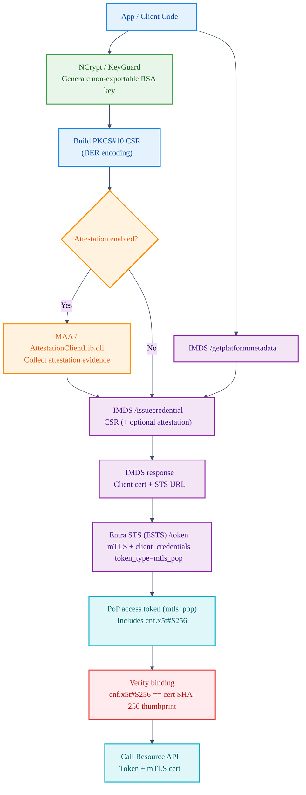
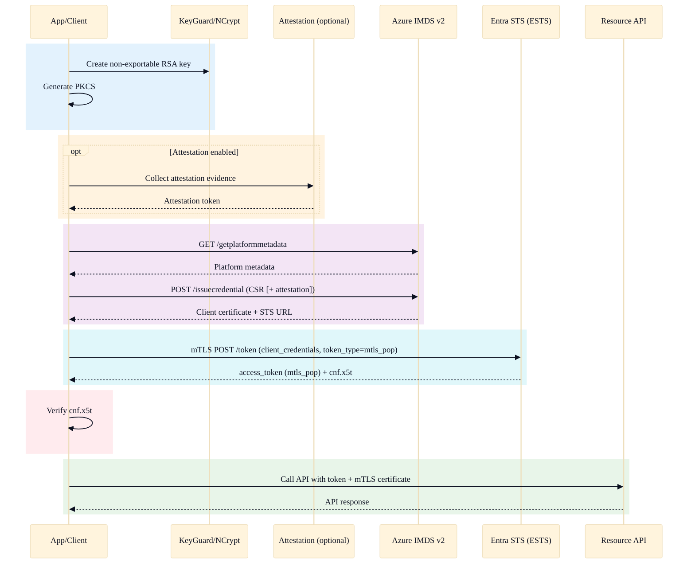

# Managed Identity v2 Multi‑Language Implementation Hackathon

---

## Hackathon Title
**Multi‑Language Managed Identity v2 Implementation: PowerShell Script + AI‑Generated Python Code**

> [!IMPORTANT]
> **Key achievement:** GitHub Copilot generated a **production-ready Python implementation** from an existing [PowerShell](https://github.com/AzureAD/microsoft-authentication-library-for-dotnet/tree/main/prototype/MsiV2UsingPowerShell) reference implementation. The Python package is published on PyPI as **`msal-msiv2==1.35.0rc3`**.

---

## Executive Summary

This hackathon project demonstrates the capability of **GitHub Copilot** to generate production-ready code across multiple programming languages for advanced Azure cloud authentication scenarios.

We delivered complete implementations of **Managed Identity v2 (MSI v2)** with **mTLS Proof-of-Possession (PoP)** token support in:
- **PowerShell** (Windows-native script)
- **Python** (installable package integrated with MSAL)

**Outcome:** The Python implementation is published on PyPI as **`msal-msiv2` version `1.35.0rc3`**, with unit tests and Azure Pipelines E2E validation.

---

## Project Overview

### What is Managed Identity v2 (MSI v2)?

**MSI v1:** Azure IMDS returns an **access token** directly.

**MSI v2:** Azure IMDS returns a **client certificate** (bound to a protected key). The client then uses **mTLS** to exchange that certificate for an access token from Entra STS using `token_type=mtls_pop` (Proof of Possession).

### Security Benefits
- ✅ Certificate-bound tokens prevent token theft
- ✅ Keys remain in hardware/VBS (KeyGuard/Credential Guard) and are not extractable
- ✅ Optional attestation can validate platform integrity
- ✅ Token binding via `cnf.x5t#S256` prevents token replay

---

## Hackathon Objectives (All Completed)

| Objective | Status | Details |
|-----------|--------|---------|
| Create PowerShell MSI v2 Script | ✅ **DONE** | Windows-native implementation with KeyGuard support |
| Generate Python MSI v2 using Copilot | ✅ **DONE** | Production-ready Python package integration |
| Publish to PyPI | ✅ **DONE** | `msal-msiv2==1.35.0rc3` publicly available |
| Validate Token Security | ✅ **DONE** | Certificate binding verification across languages |
| Integrate into CI/CD Pipeline | ✅ **DONE** | Azure Pipeline templates for E2E testing |
| Windows VM Testing | ✅ **DONE** | Manual + pipeline jobs (as applicable) |

---

## Deliverables

### 1) PowerShell Implementation
**Location:** `prototype/MsiV2UsingPowerShell/`  
Repository: https://github.com/AzureAD/microsoft-authentication-library-for-dotnet/tree/main/prototype/MsiV2UsingPowerShell

**Files**
- `get-token.ps1` — Main script implementing complete MSI v2 flow
- `readme.md` — Documentation + quickstart

**Features**
- Windows KeyGuard/Credential Guard key creation (non-exportable RSA)
- PKCS#10 CSR generation with custom OID for composition unit ID
- Azure Attestation (MAA) integration for key attestation
- IMDS `/getplatformmetadata` and `/issuecredential` endpoints
- WinHTTP/SChannel mTLS token request to ESTS
- Token binding verification (`cnf.x5t#S256`)
- Logging + error handling
- Support for custom resource scopes and endpoints

**Execution**
```powershell
.\get-token.ps1
.\get-token.ps1 -Scope "https://management.azure.com/.default"
.\get-token.ps1 -ResourceUrl "https://mtlstb.graph.microsoft.com/v1.0/applications?$top=5"
```

---

### 2) Python Implementation (PyPI Package) 🎉

**Package:** `msal-msiv2`  
**Version:** `1.35.0rc3` (Release Candidate)  
PyPI: https://pypi.org/project/msal-msiv2/1.35.0rc3/  
GitHub PR: https://github.com/AzureAD/microsoft-authentication-library-for-python/pull/882

**Install**
```bash
pip install msal-msiv2==1.35.0rc3
```

**8 New Files (≈2,250 lines added)**

| File | Lines | Purpose |
|------|------:|---------|
| `msal/msi_v2.py` | 1,595 | End-to-end Windows MSI v2 flow: NCrypt → CSR → IMDS → mTLS |
| `msal/msi_v2_attestation.py` | 182 | ctypes bindings to AttestationClientLib.dll for KeyGuard attestation |
| `msal/managed_identity.py` | 46 | Core integration + `MsiV2Error` exception |
| `sample/msi_v2_sample.py` | 175 | Full E2E sample with logging and endpoint calls |
| `run_msi_v2_once.py` | 56 | Minimal one-shot MSI v2 example |
| `tests/test_msi_v2.py` | 321 | Unit tests (thumbprint, binding, gating behavior) |
| `msi-v2-sample.spec` | 45 | PyInstaller spec for standalone executable |
| `msal/__init__.py` | — | Exports `MsiV2Error` |

**Core API**
```python
import msal

client = msal.ManagedIdentityClient(
    msal.SystemAssignedManagedIdentity(),
)

# Acquire mTLS PoP token with certificate binding
result = client.acquire_token_for_client(
    resource="https://graph.microsoft.com",
    mtls_proof_of_possession=True,        # triggers MSI v2 flow
    with_attestation_support=True,        # KeyGuard attestation
)

# result["token_type"] == "mtls_pop"
# result["cert_pem"] - client certificate
# result["cert_thumbprint_sha256"] - certificate thumbprint
```

**Implementation Highlights**
- Pure `ctypes` (no PythonNet dependency)
- Windows-only: NCrypt (key generation), Crypt32 (cert binding), WinHTTP (mTLS)
- Strict error handling: `MsiV2Error` on failure (no silent fallback to v1)
- Token validation: strict `mtls_pop` type checking
- Certificate binding verification: compares `cnf.x5t#S256` with certificate SHA256 thumbprint
- Token caching support
- Comprehensive logging

---

### 3) Azure Pipeline Integration

Repo: https://github.com/AzureAD/microsoft-authentication-library-for-dotnet

**Pipeline files**
- `build/template-run-mi-e2e-imdsv2-python.yaml` — E2E test template for Python MSI v2
- `build/template-build-and-run-all-tests.yaml` — Main pipeline orchestration updated

**What the pipeline validates**
- Installs `msal-msiv2==1.35.0rc3` from PyPI
- Runs full MSI v2 token acquisition
- Validates `mtls_pop` token type
- Verifies certificate binding (`cnf.x5t#S256`)
- Tests token caching
- Emits detailed logs for debugging

**E2E results (example run)**
```text
Build ID: 1597011
Status: ✅ PASSED
Duration: 44 seconds (Python MSI v2 job)
Environment: MSALMSIV2 pool (Windows 2022 VM)
Package Tested: msal-msiv2==1.35.0rc3 (from PyPI)
```

---

## How Copilot Achieved This

### The Copilot Workflow
1. **Context provided**
   - PowerShell script demonstrating the complete MSI v2 flow
   - Key creation, CSR generation, IMDS integration, mTLS token request, cert-binding validation

2. **Requirements specified**
   - Python API parameters (`mtls_proof_of_possession`, `with_attestation_support`)
   - Strict `mtls_pop` token validation
   - Certificate binding verification
   - Explicit failure behavior (no silent downgrade)

3. **Copilot generated**
   - Win32 API bindings via `ctypes`
   - DER helpers for PKCS#10 CSR
   - IMDS communication logic
   - mTLS token request plumbing
   - Unit tests + samples + documentation

4. **Validation & publishing**
   - Unit tests + E2E pipeline validation
   - Published to PyPI as an installable package

### Key Capabilities Demonstrated
✅ Cross-language translation (PowerShell → Python)  
✅ Low-level Windows API bindings (NCrypt, Crypt32, WinHTTP)  
✅ Cryptographic structures (DER, CSR, thumbprints)  
✅ Security-first design (strict validation, no silent fallbacks)  
✅ Testing (unit + E2E) and packaging for distribution

---

## Testing & Validation

### Unit Tests (Python) ✅
- Certificate thumbprint calculation
- CNF (confirmation) claim binding verification
- Token type validation
- ManagedIdentityClient gating behavior
- Error handling and fallback prevention
- All tests mocked (no external dependencies required)

### E2E Tests (Azure Pipeline) ✅
- Real Azure VM with Managed Identity (IMDSv2 enabled)
- Real IMDS `/getplatformmetadata` + `/issuecredential`
- Real certificate acquisition + real mTLS token request
- Token binding verification (`cnf.x5t#S256`)
- Token caching validation
- Resource endpoint call (Graph API)

---

## Architecture & Security (Mermaid)

> [!NOTE]
> The diagrams below use **custom Mermaid styling** for a clean, presentation-friendly look.

### MSI v2 Flow



### End-to-End Sequence


---

## Security Properties

| Property | Implementation | Benefit |
|----------|----------------|---------|
| Key protection | VBS KeyGuard isolation | Keys never leave secure enclave |
| Certificate binding | SHA256 thumbprint in token claims | Prevents token theft + replay |
| Attestation (optional) | Azure MAA integration | Validates platform integrity |
| Token type enforcement | Strict `mtls_pop` validation | Enforces PoP semantics |
| No fallback | Fail fast via `MsiV2Error` | Prevents downgrade attacks |
| Binding verification | `cnf.x5t#S256` matching | Proves token bound to cert |

---

## Comparison: PowerShell vs Python

| Aspect | PowerShell | Python |
|--------|-----------|--------|
| Location | Standalone script | PyPI package |
| Installation | Copy `get-token.ps1` | `pip install msal-msiv2` |
| Key creation | NCrypt (native) | NCrypt (ctypes) |
| CSR generation | .NET API | ctypes + DER encoding |
| Attestation | AttestationClientLib.dll | ctypes binding |
| IMDS calls | WinHTTP | WinHTTP (ctypes) |
| mTLS token | SChannel | SChannel (WinHTTP) |
| Logging | Write-Host | Python logging |
| Error handling | Exception + exit code | `MsiV2Error` exception |
| Testing | Manual/documented | Unit tests + E2E |
| Integration | Standalone | MSAL library |
| Distribution | GitHub | PyPI (official) |

---

## Impact & Results

- **~2,250 lines** of production-ready Python code generated across **8 files**
- Integrated into MSAL Python codebase (PR #882)
- Published on PyPI as **`msal-msiv2==1.35.0rc3`**
- Unit tests + E2E tests in Azure Pipelines (real IMDSv2 environment)
- Demonstrates multi-language parity with consistent security validation

---

## Hackathon Learnings (Expanded)

### 1) MSI v2 is “certificate issuance + PoP exchange”, not “token fetch”
- MSI v2 shifts the workflow from **IMDS → token** to **key → CSR → cert → mTLS → PoP token**.
- This changes what “correctness” means: you must validate **certificate binding** (the PoP property), not just successful token retrieval.

### 2) Security depends on small engineering choices
- **Strict failure behavior** (no silent fallback to MSI v1) is a security feature: it prevents downgrade-by-accident.
- **PoP semantics must be enforced explicitly**:
  - Validate `token_type == "mtls_pop"`
  - Validate `cnf.x5t#S256` matches the certificate SHA-256 thumbprint
  - Ensure resource calls are actually done with **mTLS + the same certificate**

### 3) Cross-language parity is about invariants, not syntax
- The biggest risk in translation isn’t syntax errors; it’s losing **security invariants**:
  - binding verification
  - token_type enforcement
  - no fallback behavior
  - consistent error handling and logging signals

### 4) Copilot works best when the reference implementation acts as an executable spec
What worked well:
- Using the PowerShell implementation as a **ground-truth flow**
- Writing requirements as **non-negotiable constraints** (e.g., “no fallback”, “must verify cnf”)
- Asking for tests while generating code (not as a last step)

Where human review mattered most:
- Win32 API boundary correctness (`ctypes` signatures, lifetime/memory rules)
- Security assertions (ensuring validations are not weakened during refactors)

### 5) Testing strategy: separate deterministic checks from real-world integration
- **Unit tests** validated deterministic security logic (thumbprints, claim comparisons, gating).
- **E2E tests** validated the environment reality (IMDS responses, certificate issuance, mTLS negotiation).
- Together, they prevented the common failure mode: “works in mocks but breaks on real IMDSv2.”

### 6) CI/CD is part of the feature for identity systems
- MSI v2 depends on specific runtime conditions (IMDSv2, KeyGuard behaviors, network access to STS).
- Automating E2E validation turns identity flows into something **repeatable, reviewable, and regression-safe**.

### 7) Packaging + samples are what make hackathon output usable
- Publishing a package + shipping minimal and full samples reduced adoption friction.
- This made it possible to validate the entire user journey: **install → run → verify PoP → call resource**.

### 8) Recommended next steps
- Promote RC → stable with a clear support matrix (OS / MI type / attestation support)
- Expand negative-path testing (binding mismatch, attestation unavailable, IMDS throttling)
- Add a short security checklist for downstream adopters (enforce `mtls_pop`, verify `cnf`, avoid fallback)

---

## Quick Start Guide

### Install
```bash
pip install msal-msiv2==1.35.0rc3
```

### Use in Code
```python
import msal

client = msal.ManagedIdentityClient(
    msal.SystemAssignedManagedIdentity(),
)

result = client.acquire_token_for_client(
    resource="https://graph.microsoft.com",
    mtls_proof_of_possession=True,
    with_attestation_support=True,
)

print(f"Token Type: {result['token_type']}")        # mtls_pop
print(f"Certificate: {result['cert_pem']}")
print(f"Thumbprint: {result['cert_thumbprint_sha256']}")
```

### Requirements
- Windows Server 2022+ with Credential Guard enabled
- Azure Managed Identity assigned to the VM
- Network access to IMDS (`169.254.169.254`)
- Network access to Entra STS token endpoint

---

## Files & References
- PowerShell: https://github.com/AzureAD/microsoft-authentication-library-for-dotnet/tree/main/prototype/MsiV2UsingPowerShell
- Python PR: https://github.com/AzureAD/microsoft-authentication-library-for-python/pull/882
- PyPI: https://pypi.org/project/msal-msiv2/1.35.0rc3/
- Pipeline run: https://identitydivision.visualstudio.com/IDDP/_build/results?buildId=1597011&view=results

---

## Hackathon Team
- @gladjohn — Requirement definition, PowerShell implementation
- @Copilot + @gladjohn — Python code generation (Phase 1), removal of PythonNet dependency, testing, publishing

**Date:** February 25, 2026  
**Status:** ✅ COMPLETE & PUBLISHED  
**Package:** `msal-msiv2==1.35.0rc3`
