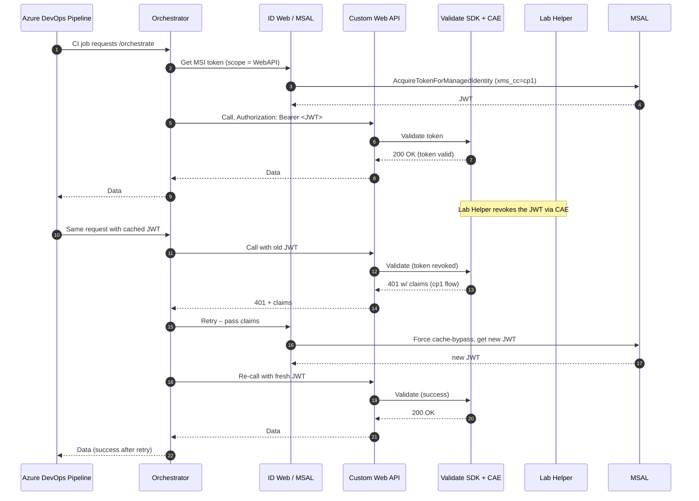

# The Orchestrator – High‑Level Specification

## Purpose

*Provide a single service/ci pipeline (“The Orchestrator”)* that – for every internal micro‑service – centralises token acquisition (via ID Web + MSAL) and token validation / revocation (via token validation and cae modules).

At runtime the Orchestrator handles:

- Acquire a Continuous‑Access‑Evaluation‑ready token (cp1) using Managed Identity.

- Call custom Web APIs, passing the token.

- Validate inbound tokens through Validation SDKs + CAE modules.

- React to revocations by issuing claim‑challenges; ID Web/MSAL transparently refresh.

## Components & Relationships

| Layer                | Role                                                             | Technology                               |
|----------------------|------------------------------------------------------------------|------------------------------------------|
| **Token Acquisition**| Generates outbound tokens                                        | **Microsoft.Identity.Web** → **MSAL**    |
| **Token Validation** | Validates inbound tokens; triggers revocation via CAE            | **Validate SDK** + CAE module                    |
| **Lab Helper Service**| Control-plane utility that forcibly revokes tokens in test labs | Internal helper service                  |
| **Custom Web API**   | Resource server that trusts MISE validation                      | Runs behind the Orchestrator             |

## 4 CI / CD Integration

| Stage        | Action                                                                                                              |
|--------------|---------------------------------------------------------------------------------------------------------------------|
| **Build**    | **Orchestrator** builds **MSAL**, **ID Web**, **Validate SDK** and pusblishes a **Custom Web API**. |
| **Test (CI)** | Ensures token has xms_cc claims on **MSAL** and **ID Web**. |
| **Test (CI)** | Uses the token and calls in to the DownStream API. |
| **Test (CI)** | Validate SDKs does header validations. |
| **Test (Lab)** | Lab Helper service forcibly revokes the token via CAE modules. |
| **Test (CI)** | Validate SDKs does header validations. |
| **Test (CI)** | Uses the token and calls in to the DownStream API and gets a 401. |
| **Test (CI)** | Gets a new token using claims on DownStream API. **Microsoft.Identity.Web** → **MSAL** |
| **Test (CI)** | Uses the token and calls in to the DownStream API. |
| **Deploy**   | Helm chart publishes Orchestrator and Web API behind the internal gateway with **mTLS** enforced.                   |

## End‑to‑End Token Lifecycle

