# Testing managed identities on Azure resources for MSAL .Net and other Auth SDKs

## Overview

Managed service identities (MSI) allow applications hosted on certain Azure resources to authenticate to any service that supports Azure AD authentication. Managed identities provide an automatically managed identity in Azure Active Directory (Azure AD) for applications to use when connecting to resources that support Azure AD authentication. Applications can use managed identities to obtain Azure AD tokens without having to manage any credentials.


## Challenges in Testing Managed Identities

To test managed identities, code needs to be deployed in MI supported Azure Resource so the Managded Identity endpoint can be reached from within an Azure Resource. This creates a challenge when testing these apps, because the code needs to run from within an Azure resources, so that the application under test is able to retrieve tokens via managed identity endpoints. While this may be feasible for a manual end-to-end testing scenario, it could be difficult to run integration tests on CI pipelines or on a local dev box; or when an app must run on different Azure services that support Managed Identity.


## Solution

To eliminate this problem, MSAL.NET team has built a MSI helper service ([https://service.msidlab.com](https://service.msidlab.com)) that acts as a proxy for several managed identity sources and allows to retrieve the managed identity token responses via a web API. This API accepts the same query params on a request to a managed identity endpoint which allows your test(s) to call the API just like how you would make a HTTP request to the managed identity endpoint while your code runs inside of a managed identity source.   

This protected web service is able to send http requests to Managed Identity endpoints (for e.g. Azure Web App, Function App or a Virtual machine) and transfer the managed identity response back to you. Since Identity Labs manages all the azure resources there will be zero cost and zero maintenance for you and your service. 

Developers / Applications wanting to test managed identity can use this test service and take advantage of the same features of testing on a managed identity source. **To use this test service you will need to be part of the MSAL .Net team or the Identity for Services (ID4S) team or one of it's partner teams.** 

To gain access to the MSI Helper service you will need access to [Identity Labs](https://docs.msidlab.com/)


## How Auth SDKs teams can take advantage of this service for testing? 

Your code running from any dev box or CI pipeline will get service credentials from the lab vault and connect to the protected helper service, and then proxy all environment variable reads and http requests to this web service hosted on an Azure Web App. Depending upon what resource is being testing the Helper service will make calls to the Azure Resources under test and get the Managed Identity token response back to MSAL.

**Need Client Credentials info to connect to the helper service?** [Visit the lab docs for more details](https://docs.msidlab.com/accounts/apiaccess.html)  

## Managed identity types support

There are two types of managed identities, and both are supported by this service:

- **System-assigned**. Some Azure resources, such as virtual machines allow you to enable a managed identity directly on the resource. When you enable a system-assigned managed identity: 
    - A service principal of a special type is created in Azure AD for the identity. The service principal is tied to the lifecycle of that Azure resource. When the Azure resource is deleted, Azure automatically deletes the service principal for you. 
    - By design, only that Azure resource can use this identity to request tokens from Azure AD.
    - Using the MSI Helper service you will be able to test this type

- **User-assigned**. You may also create a managed identity as a standalone Azure resource. You can [create a user-assigned managed identity](https://learn.microsoft.com/en-us/azure/active-directory/managed-identities-azure-resources/how-to-manage-ua-identity-portal) and assign it to one or more Azure Resources. When you enable a user-assigned managed identity:      
    - A service principal of a special type is created in Azure AD for the identity. The service principal is managed separately from the resources that use it. 
    - User-assigned identities can be used by multiple resources.
    - MSI Helper service uses a single user identity shared across all azure resources

Identity Labs has setup a [single shared User Assigned Identity](https://github.com/AzureAD/microsoft-authentication-library-for-dotnet/blob/main/tests/Microsoft.Identity.Test.Integration.netfx/HeadlessTests/ManagedIdentityTests.cs#L36) and assigned to all the supported Managed Identity Sources. 

## What Azure services support the feature?<a name="which-azure-services-support-managed-identity"></a>

Managed identities for Azure resources can be used to authenticate to services that support Azure AD authentication. For a list of supported Azure services, see [services that support managed identities for Azure resources](https://learn.microsoft.com/en-us/azure/active-directory/managed-identities-azure-resources/services-support-managed-identities).


## What managed identity sources does MSAL .Net support?

MSAL .Net supports the following Managed Identity sources: 

1. App Service (version : 2019-08-01)
2. Virtual Machine (IMDS)
3. Service Fabric
4. Azure ARC
5. Cloud Shell


## How can I test these different sources?

MSAL .Net team has deployed a Managed Identity helper service called the [MSIHelper service](https://service.msidlab.com/EnvironmentVariables?resource=WebApp), using which you should be able to test the following sources by passing the relevant source as a query parameter.

1. Web App (version : 2019-08-01)
2. Function App (version : 2019-08-01)
3. Virtual Machine (IMDS)
4. Service Fabric (wil be available soon)
5. Azure ARC 


## Where is this service deployed?

The protected test service can be accessed by going to [https://service.msidlab.com/](https://service.msidlab.com/).


## What are the different endpoints, the MSI Helper service exposes?

MSI Helper Service exposes two endpoints : 

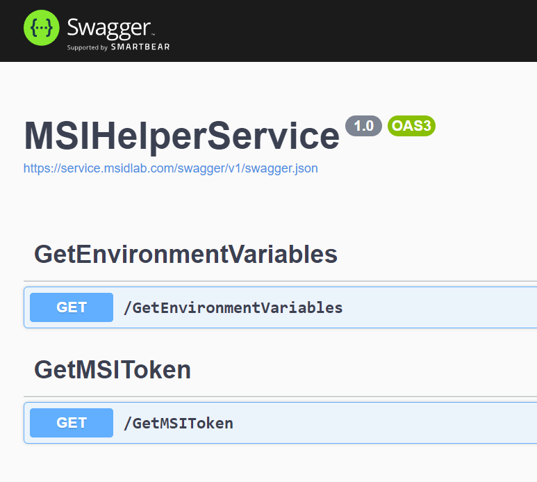

- EnvironmentVariables, and 
- MSIToken

A sample request to the `EnvironmentVariables` 

```http
curl -X 'GET' \
  'https://service.msidlab.com/EnvironmentVariables?resource=WebApp' \
  -H 'accept: text/plain'
```

And here is a successful response from the service. 

```http
{
    "IDENTITY_HEADER":"DFD8834E6E754712A405D48C23160297",
    "IDENTITY_ENDPOINT":"http://127.0.0.1:41872/msi/token/",
    "IDENTITY_API_VERSION":"2019-08-01"
}
```

> **_NOTE:_**  

- The `EnvironmentVariables` api, accepts a MSI supported Azure resource as a query parameter and returns all the environment variables needed for you to form a http request.  
- Once you have formed the URI you can use the `MSIToken` endpoint and send the request to the Helper Service, this will inturn call the MSI endpoint and return a MSI token response.  
- `IDENTITY_API_VERSION` environment variable is not a MSI resource based environment variable. MSAL SDKs hardcode this value or fetch it from the MSI version endpoint. This is returned by the API for ease of use while testing.  

```http
"{\"statusCode\":500,\"message\":\"An unexpected error occured while fetching the AAD Token.\",\"correlationId\":\"91acf506-d323-4bdd-a5f5-b5b71a09e1dc\"}"
```

You should also be able to test for exceptions that the MSI endpoint throws

```http
"An attempt was made to access a socket in a way forbidden by its access permissions. (127.0.0.1:41292) \n\nAn attempt was made to access a socket in a way forbidden by its access permissions."
```


## How to get a token from the MSI Helper service

From the earlier example, you saw how to send an environment variable request for an Azure resource using the `EnvironmentVariables` endpoint. Once you get the environment variables, you will need to form the URI as how you would send the request to the actual MSI endpoint. Let's take a look at the below example to understand this better. We have used the environment variables we received from the earlier request to form the URI below and send the request to the `MSIToken` endpoint

```http
curl -X 'GET' \
  'https://service.msidlab.com/MSIToken?uri=http%3A%2F%2F127.0.0.1%3A41872%2Fmsi%2Ftoken%2F%3Fapi-version%3D2019-08-01%26resource%3Dhttps%3A%2F%2Fmanagement.azure.com&azureResource=WebApp' \
  -H 'accept: text/plain' \
  -H 'X-IDENTITY-HEADER: DFD8834E6E754712A405D48C23160297'
```

And here is a successful response from the service. 

```http
{
  "access_token": "eyJ0eXAiOiJKV1QiLCJh-trimmed",
  "expires_on": "1670868725",
  "resource": "https://vault.azure.net",
  "token_type": "Bearer",
  "client_id": "D67DE30B-1051-4254-909E-85AF7E28C98E"
}
```


## How does this service work?

The service is deployed to an Azure Web App and it exposes the Azure Web Apps MSI endpoint for testing. i.e. it exposes it's own MSI endpoint so the Web App resource can be tested. In addition to that it also calls into other Azure resources like Azure Function, ServiceFabric, AzureARC and IMDS and exposes their MSI endpoints as well. 


## How to build and deploy the helper service (exposes Web App MSI)

Build the current project (The MSI Helper Service - MSIHelperService.csproj) and deploy to the Azure Web App. 

- Once you have built the MSIHelperService.csproj 
- Right click on the project and select the `publish` option
<br>
  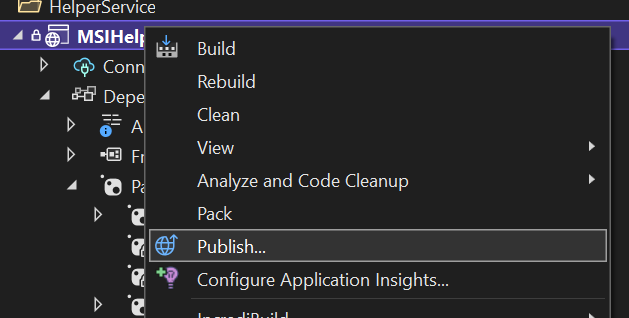

- Select the appropriate [Web App](https://ms.portal.azure.com/#@microsoft.onmicrosoft.com/resource/subscriptions/c1686c51-b717-4fe0-9af3-24a20a41fb0c/resourceGroups/MSAL_MSI/providers/Microsoft.Web/sites/msihelperservice/appServices) under the Lab Subscription and click `publish` 
<br>
  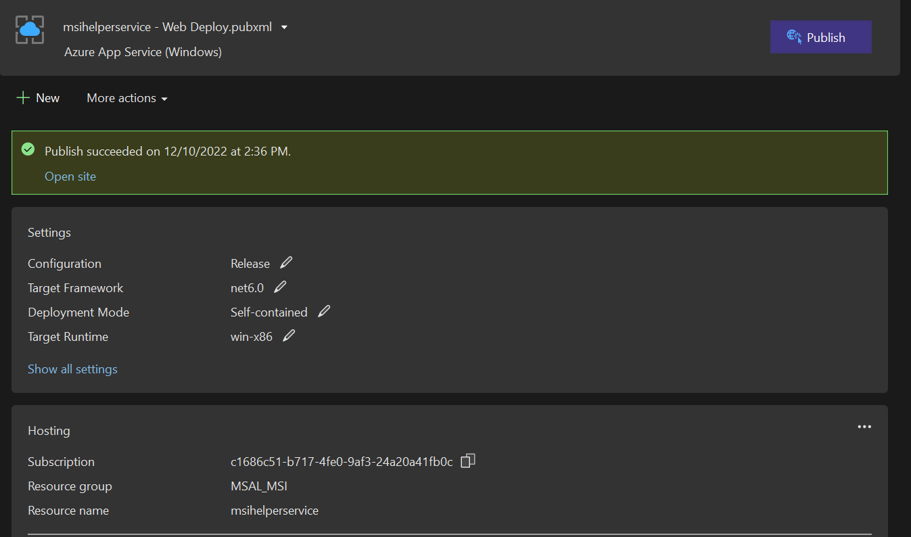

- make sure you are publishing to the staging slot of the app service so you do not break the existing CI runs. Also, select the `Deploy as a Zip Package` checkbox
<br>
  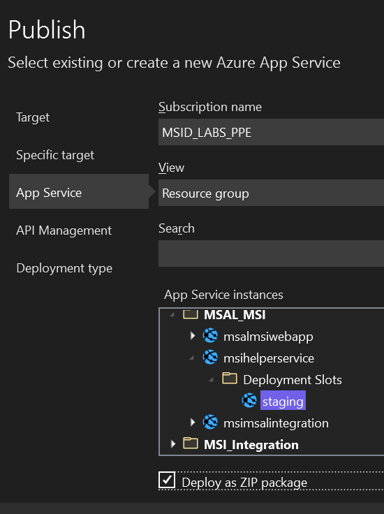


> **_NOTE:_**  You will need to have Identity Lab permissions to deploy to the helper service. Make sure to keep the settings same as how it is shown in the above screenshot

- Once the service has been deployed you can test the service using MSAL integration tests pointing to the staging slot 

- To test the service under the staging slot, we recommend testing using MSAL integration tests as this will tests all endpoints for all resources. To do so, edit the service base URL in the MSI integration test and change it from [https://service.msidlab.com](https://service.msidlab.com) to [https://msihelperservice-staging.azurewebsites.net/](https://msihelperservice-staging.azurewebsites.net/) and run the the tests 
<br>
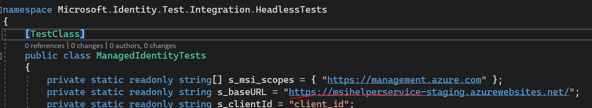

<br>

- After validation go to [Azure Portal](https://ms.portal.azure.com/#@microsoft.onmicrosoft.com/resource/subscriptions/c1686c51-b717-4fe0-9af3-24a20a41fb0c/resourceGroups/MSAL_MSI/providers/Microsoft.Web/sites/msihelperservice/deploymentSlotsV2) and from under the deployment slot, swap the services

<br>
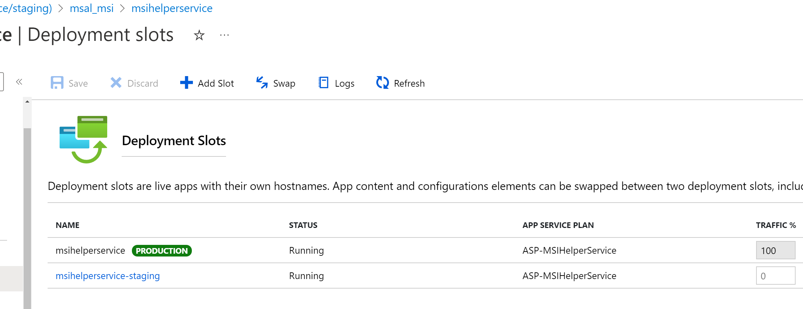
<br>

> **_NOTE:_**  Once you have swapped the slot make sure to point the base url to the production slot again in your code and test it again with the production endpoint from the MSAL integration testing

> **_NOTE:_**  The service uses [Azure Web App's Environment variables](https://learn.microsoft.com/en-us/azure/app-service/reference-app-settings?tabs=kudu%2Cdotnet) to store Application ID's and Secrets needed to connect to other Azure Resources and the Operations Management suite to execute runbooks. You will see more about runbooks and how they are used under the Virtual Machine and Azure ARC sections 

## How to build and deploy the Function App 

Function app deployment is easy but can also be risky. There is no failover mechanism here since we do not have a staging slot for the Azure functions. But there shouldn't be a need ever to deploy to the function app or to any other Azure resources (VM / Azure ARC / Service Fabric) after MSAL MSI has gone live. The function app code can be found in the `AzureFunction` folders 

<br>
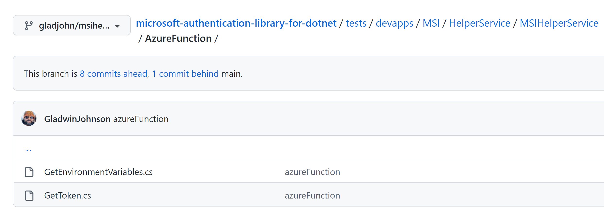
<br>

- The [function app](https://ms.portal.azure.com/#@microsoft.onmicrosoft.com/resource/subscriptions/c1686c51-b717-4fe0-9af3-24a20a41fb0c/resourceGroups/MSAL_MSI/providers/Microsoft.Web/sites/msalmsifunction/appServices) also exposes two protected endpoints. These endpoints are called internally by the MSI Helper service. 

<br>
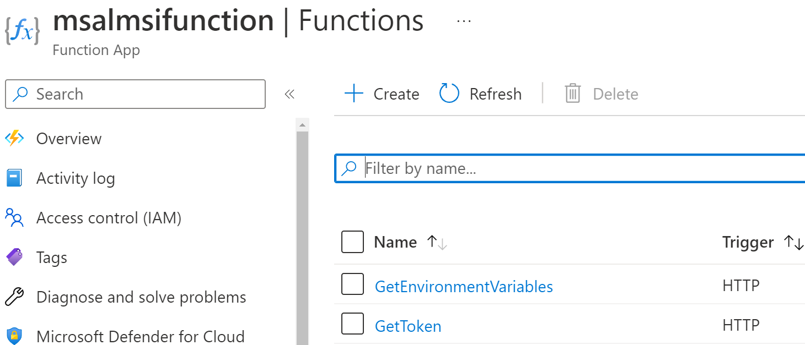
<br>

- To make changes simply copy paste the code from the appropriate Get*.cs files into these endpoints in the function app
<br>

> **_NOTE:_**  Any changes made to this function app will affect both the production and the staging slot of the MSI Helper Service. There are several ID4S teams that are dependent on these services, so before making any change please ensure that you have tested the code in a sample azure function app. 


## How does the VM and AzureArC work in the Helper Service 

It's a little tricky when it comes to executing code within a VM, especially from a Web API like the MSI Helper Service.

To overcome this unique situation, we have used OMS (Operations Manangement Suite)

Operations Management Suite (also known as OMS) is a collection of cloud-based services for managing your on-premises and cloud environments from one single place. Rather than deploying and managing on-premises resources, OMS components are entirely hosted in Azure. In simple words, what basically happens is that OMS goes and talks to different servers, applications in your environment, collects information about how they're doing, consolidates this information in the form of nice colorful graphics and searchable records, after that presents it to you in one single, convenient place, and it doesn't matter where your servers or applications are running, Azure, AWS, on-premises or which operating system they're running on, Windows or Linux, it just works. Configuration is minimal, and you can be up and running literally in a matter of minutes. OMS help administrator manage their hybrid IT environments more efficiently by giving them a greater visibility into their operational infrastructure. This tool aims to fill the current gap of not having a single point of management for your hybrid, multi-cloud and on premises environments. The most important data out of that is visualized and the other part of it can be searched by writing search queries in a highly scalable log search engine. 

OMS contain four main services:

- Log Analytics
- Azure Automation
- Azure Backup
- Azure Site Recovery

***Pre-Req :*** We used an OMS Automation Account in the Azure portal. This Automation Account will also need jobs which have been created and which have run. Automation Account is a Run As Account. Run As accounts in Azure Automation provide authentication for managing resources on the Azure Resource Manager or Azure Classic deployment model using Automation runbooks and other Automation features. 

Identity Labs has an extensive OMS solution. The MSI Helper Service takes advantage of this existing setup from the Labs to execute code inside of Virtual machines. 

***Access to Azure Runbooks and Logs :*** You need to be an admin in the Lab to access these resources. Please file a ticket with lab if there are any issues.

<br>
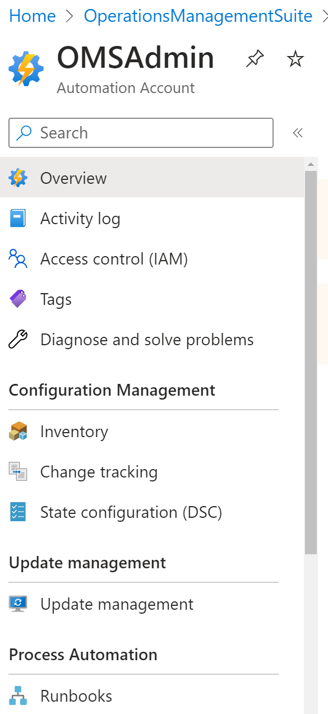
<br>

The OMS Admin Account executes pre-created Azure Runbooks. You can learn more about Runbooks [here](https://learn.microsoft.com/en-us/azure/automation/manage-runbooks)

There are two runbooks created to be used with the Helper Service. One to execute code in a Virtual Machine and the other for Azure ARC. 

## Azure Virtual Machine Setup 

The Azure Virtual Machine runbook simply executes the following lines of code in a Lab Owned Virtual Machine (VM Name: IDANLENG1). This VM has been setup to acquire a Managed Identity token for both System Assigned and User Assigned Identities. 

```powershell
        try 
        {
            #Form the URI 
            $uri = $RunbookHeaders.MSI_URI;
            $MSIResponse = Invoke-WebRequest -UseBasicParsing -Uri $uri -Method GET -Headers @{Metadata="TRUE"}
            #$MSIResponse
            $MSIContent = $MSIResponse.Content;
            $MSIContent;
        }
        catch [System.Net.WebException] {
            $ErrorMessage = $_.ErrorDetails
            $ErrorMessage

        }
```

And here is the [code](https://github.com/AzureAD/microsoft-authentication-library-for-dotnet/blob/main/tests/devapps/Managed%20Identity%20apps/MSIHelperService/Helper/MSIHelper.cs#L253) in the MSI Helper Service that executes the [Runbook](https://ms.portal.azure.com/#@microsoft.onmicrosoft.com/resource/subscriptions/c1686c51-b717-4fe0-9af3-24a20a41fb0c/resourceGroups/OperationsManagementSuite/providers/Microsoft.Automation/automationAccounts/OMSAdmin/runbooks/GetMSITokenFromVM/overview) code using the Automation Account. 

When the runbook code is executed it runs within the Virtual machine to send a http request to the Managed Identity endpoint and retrives the Managed Identity Response. Below is a sample successful response from the VM. 

<br>
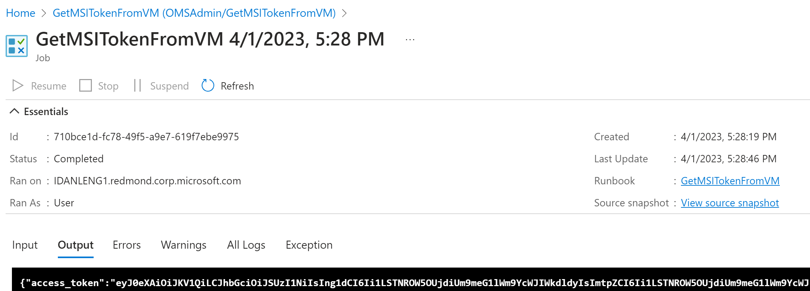
<br>

This result is read by the MSI Helper Service and given back to the app that is calling it. 

## Azure Virtual Machine Setup 

Azure ARC setup uses the same logic as described above for the Virtual Machine. For, Azure ARC we need an on-premise machine. Currently there is a physical machine in Studio A that is corp connected. 

The Azure ARC Machine runbook simply executes the following lines of code in a the physically CORP connected machine (VM Name: Gladwin-Backup). This Machine has been setup with the [Azure ARC Agent](https://learn.microsoft.com/en-us/azure/azure-arc/servers/agent-overview) which will help in getting a System Assigned Managed Identity Token on the On-Premise server. Learn more about Azure Arc [here](https://learn.microsoft.com/en-us/azure/azure-arc/servers/managed-identity-authentication)

```powershell
        try 
        {
            Invoke-WebRequest -Method GET -Uri $endpoint -Headers @{Metadata='TRUE'} -UseBasicParsing
        }
        catch {

            $wwwAuthHeader = $_.Exception.Response.Headers["WWW-Authenticate"]

            if ($wwwAuthHeader -match "Basic realm=.+")
            {
                $secretFile = ($wwwAuthHeader -split "Basic realm=")[1]
            }

            $secret = cat -Raw $secretFile

            try
            {
                $response = Invoke-WebRequest -Method GET -Uri $endpoint -Headers @{Metadata='True'; Authorization="Basic $secret"} -UseBasicParsing

                #$MSIResponse
                $MSIContent = $response.Content;
                $MSIContent;
            }
            catch [System.Net.WebException] {
                $ErrorMessage = $_.ErrorDetails
                $ErrorMessage
            }
        }
```

And here is the [code](https://github.com/AzureAD/microsoft-authentication-library-for-dotnet/blob/main/tests/devapps/Managed%20Identity%20apps/MSIHelperService/Helper/MSIHelper.cs#L332) in the MSI Helper Service that executes the [Runbook](https://ms.portal.azure.com/#@microsoft.onmicrosoft.com/resource/subscriptions/c1686c51-b717-4fe0-9af3-24a20a41fb0c/resourceGroups/OperationsManagementSuite/providers/Microsoft.Automation/automationAccounts/OMSAdmin/runbooks/GetMSITokenFromAzureArc/overview) code using the Automation Account. 

When the runbook code is executed it runs within the Virtual machine to send a http request to the Managed Identity endpoint and retrives the Managed Identity Response. Below is a sample successful response from the VM. 

<br>
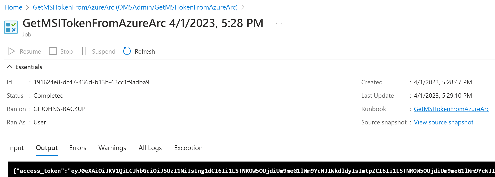
<br>

This result is read by the MSI Helper Service and given back to the app that is calling it. 

## User Assigned Identity

This helper service also exposed the [User Identity](https://ms.portal.azure.com/#@microsoft.onmicrosoft.com/resource/subscriptions/c1686c51-b717-4fe0-9af3-24a20a41fb0c/resourceGroups/MSAL_MSI/providers/Microsoft.ManagedIdentity/userAssignedIdentities/MSAL_MSI_USERID/overview) for testing. 


<br>
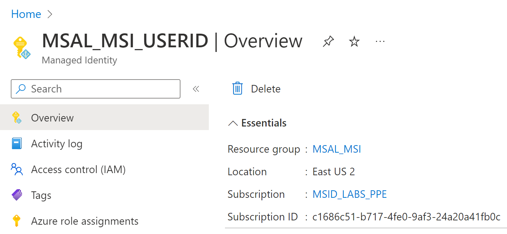
<br>
<br>

Following are some useful information to test the User Identity. 

| Syntax      | Description |
| ----------- | ----------- |
| Resource ID      | /subscriptions/c1686c51-b717-4fe0-9af3-24a20a41fb0c/resourcegroups/MSAL_MSI/providers/Microsoft.ManagedIdentity/userAssignedIdentities/MSAL_MSI_USERID       |
| Name   | MSAL_MSI_USERID        |
| Type      | Microsoft.ManagedIdentity/userAssignedIdentities       |
| Location   | eastus2        |
| Tenant Id      | 72f988bf-86f1-41af-91ab-2d7cd011db47       |
| Principal Id   | 3b57c42c-3201-4295-ae27-d6baec5b7027        |
| Client Id      | 3b57c42c-3201-4295-ae27-d6baec5b7027       |

# Troubleshooting the test service

This section will cover the troubleshooting steps involved with the Helper Service

## Troubleshooting with logs

The MSI Helper Service has been deployed with Application Insights and a good amount of logging for troubleshooting. You can go to the Azure Portal and select the [MSI Helper Service App Insights](https://ms.portal.azure.com/#view/AppInsightsExtension/DetailsV2Blade/ComponentId~/%7B%22SubscriptionId%22%3A%22c1686c51-b717-4fe0-9af3-24a20a41fb0c%22%2C%22ResourceGroup%22%3A%22MSAL_MSI%22%2C%22Name%22%3A%22msihelperservice%22%2C%22LinkedApplicationType%22%3A0%2C%22ResourceId%22%3A%22%252Fsubscriptions%252Fc1686c51-b717-4fe0-9af3-24a20a41fb0c%252FresourceGroups%252FMSAL_MSI%252Fproviders%252Fmicrosoft.insights%252Fcomponents%252Fmsihelperservice%22%2C%22ResourceType%22%3A%22microsoft.insights%252Fcomponents%22%2C%22IsAzureFirst%22%3Afalse%7D/DataModel~/%7B%22eventId%22%3A%22e83141d4-78ec-11ed-9983-000d3a54144f%22%2C%22timestamp%22%3A%222022-12-11T00%3A43%3A16.617Z%22%2C%22cacheId%22%3A%2283de9b73-774b-4ec7-94cf-2663b362e6f6%22%2C%22eventTable%22%3A%22requests%22%2C%22timeContext%22%3A%7B%22durationMs%22%3A86400000%2C%22endTime%22%3A%222022-12-11T01%3A13%3A14.404Z%22%7D%7D) and see the transaction logs 


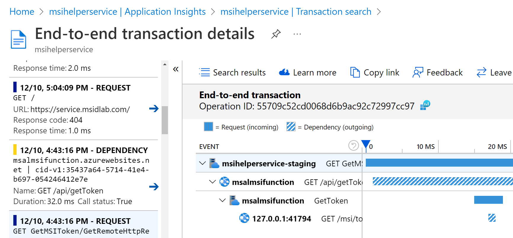
<br>
<br>

For, the Function App. Go to Azure Portal and select [Monitor](https://ms.portal.azure.com/#view/WebsitesExtension/FunctionMenuBlade/~/monitor/resourceId/%2Fsubscriptions%2Fc1686c51-b717-4fe0-9af3-24a20a41fb0c%2FresourceGroups%2FMSAL_MSI%2Fproviders%2FMicrosoft.Web%2Fsites%2Fmsalmsifunction%2Ffunctions%2FGetEnvironmentVariables) under the Function App Endpoints and this will give you the invocations and logs 

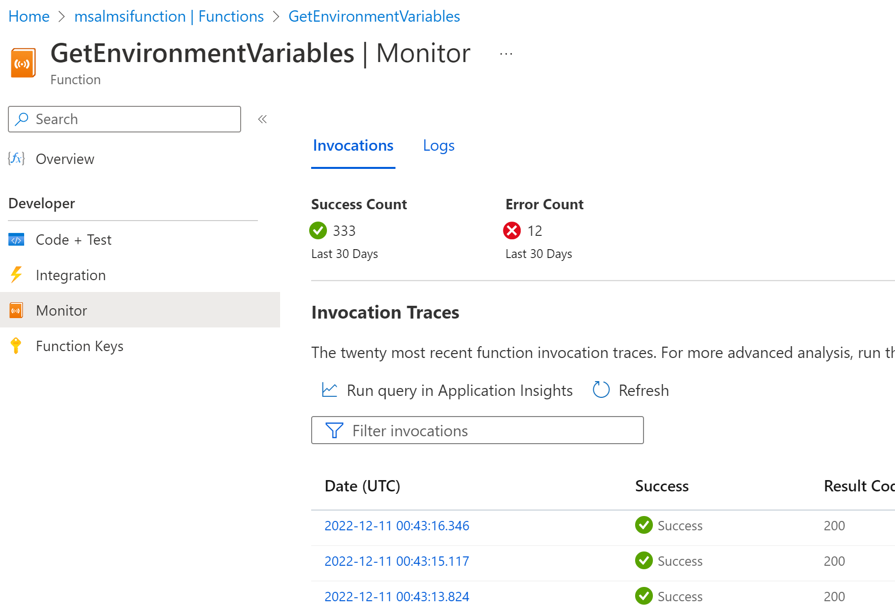
<br>

For Azure ARC and Virtual Machine there are no logs in the Application Insights. If there you see any issues during test then please contact the Identity Lab team. Azure Arc and Azure VM scripts are invoked using [Webhooks](https://github.com/AzureAD/microsoft-authentication-library-for-dotnet/blob/main/tests/devapps/Managed%20Identity%20apps/MSIHelperService/Helper/MSIHelper.cs#L37) and authentication to the Webhooks are done using the [Lab Owned OMS Client](https://github.com/AzureAD/microsoft-authentication-library-for-dotnet/blob/main/tests/devapps/Managed%20Identity%20apps/MSIHelperService/Helper/MSIHelper.cs#L39). When you file a service ticket with the lab, adding these additional information will help speed up the troubleshooting process.

## Need Help? 

Contact Neha Bhargava / Gladwin Johnson / Bogdan Gavril for further assistance.
